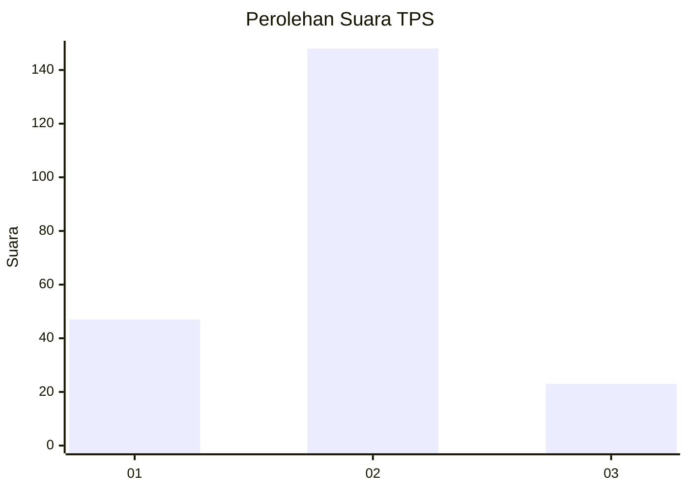

# Hasil

## Grafik

## Tabel

| No. | Nama Paslon    | Suara | Suara (raw) | Persentase |
|:--- |:-------------- | -----:| -----------:| ----------:|
| 1   | ANIES MUHAIMIN | 47    | [47][p-1]   | 21,56      |
| 2   | PRABOWO GIBRAN | 148   | [148][p-2]  | 67,89      |
| 3   | GANJAR MAHFUD  | 23    | [23][p-3]   | 10,55      |

[p-1]: https://github.com/gigit-pemilu/pemilu-2024-15-jambi/blob/main/pilpres/hitung-suara/sub/15-jambi/sub/05--muaro-jambi/sub/08-sungai-gelam/sub/2001-kebon-ix/sub/008-tps/sub/paslon-1.txt
[p-2]: https://github.com/gigit-pemilu/pemilu-2024-15-jambi/blob/main/pilpres/hitung-suara/sub/15-jambi/sub/05--muaro-jambi/sub/08-sungai-gelam/sub/2001-kebon-ix/sub/008-tps/sub/paslon-2.txt
[p-3]: https://github.com/gigit-pemilu/pemilu-2024-15-jambi/blob/main/pilpres/hitung-suara/sub/15-jambi/sub/05--muaro-jambi/sub/08-sungai-gelam/sub/2001-kebon-ix/sub/008-tps/sub/paslon-3.txt

## Foto C Plano

https://sirekap-obj-formc.kpu.go.id/53b6/pemilu/ppwp/15/05/08/20/01/1505082001008-20240216-202943--050a5f64-929d-4243-b952-616038513299.jpg

https://sirekap-obj-formc.kpu.go.id/53b6/pemilu/ppwp/15/05/08/20/01/1505082001008-20240215-004415--bc5f24c3-4eaf-4180-a90a-1a1bfa91a0ba.jpg

https://sirekap-obj-formc.kpu.go.id/53b6/pemilu/ppwp/15/05/08/20/01/1505082001008-20240215-004716--a92a6270-8f94-4b38-ad3d-fd82c0c6d75f.jpg

## Metadata

| Key        | Value               |
| ---------- | ------------------- |
| Time Stamp | 2024-02-20 13:00:00 |

