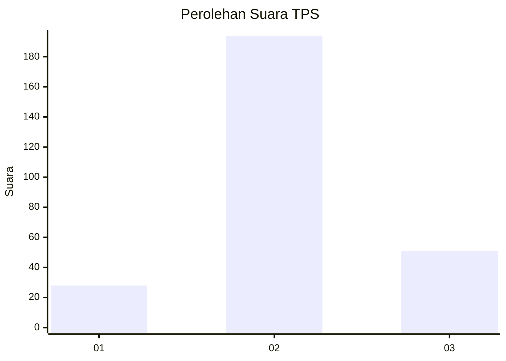
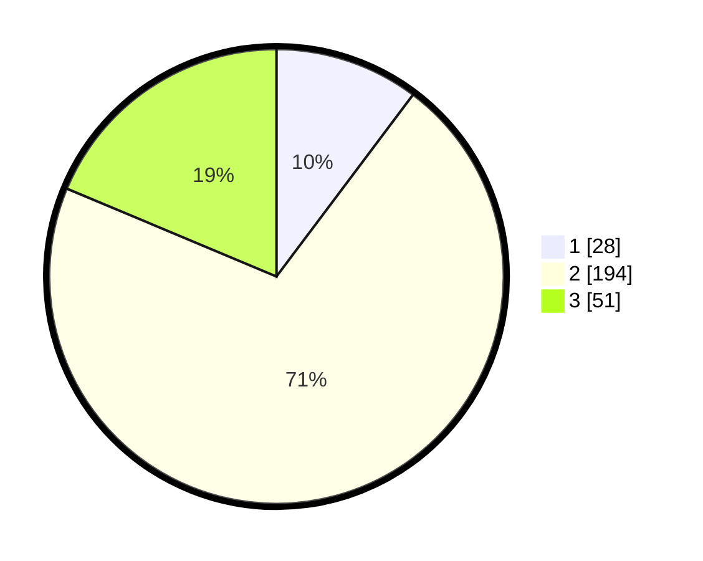

# Hasil

## Grafik

## Tabel

| No. | Nama Paslon    | Suara | Suara (raw) | Persentase |
|:--- |:-------------- | -----:| -----------:| ----------:|
| 1   | ANIES MUHAIMIN | 28    | [28][p-1]   | 10,26      |
| 2   | PRABOWO GIBRAN | 194   | [194][p-2]  | 71,06      |
| 3   | GANJAR MAHFUD  | 51    | [51][p-3]   | 18,68      |

[p-1]: https://github.com/gigit-pemilu/pemilu-2024-15-jambi/blob/main/pilpres/hitung-suara/sub/15-jambi/sub/05--muaro-jambi/sub/08-sungai-gelam/sub/2005-tangkit/sub/032-tps/sub/paslon-1.txt
[p-2]: https://github.com/gigit-pemilu/pemilu-2024-15-jambi/blob/main/pilpres/hitung-suara/sub/15-jambi/sub/05--muaro-jambi/sub/08-sungai-gelam/sub/2005-tangkit/sub/032-tps/sub/paslon-2.txt
[p-3]: https://github.com/gigit-pemilu/pemilu-2024-15-jambi/blob/main/pilpres/hitung-suara/sub/15-jambi/sub/05--muaro-jambi/sub/08-sungai-gelam/sub/2005-tangkit/sub/032-tps/sub/paslon-3.txt

## Foto C Plano

https://sirekap-obj-formc.kpu.go.id/b3c8/pemilu/ppwp/15/05/08/20/05/1505082005032-20240215-005637--bbabeb41-f72b-491e-b6ad-3e4e133c7ad3.jpg

https://sirekap-obj-formc.kpu.go.id/b3c8/pemilu/ppwp/15/05/08/20/05/1505082005032-20240215-010643--a0aaa171-91f3-4bed-a82b-a4c5dddad5c9.jpg

https://sirekap-obj-formc.kpu.go.id/b3c8/pemilu/ppwp/15/05/08/20/05/1505082005032-20240215-011445--7d0d15f8-1a0f-4785-8aa2-cb701ef44d22.jpg

## Metadata

| Key        | Value               |
| ---------- | ------------------- |
| Time Stamp | 2024-02-19 13:00:00 |

