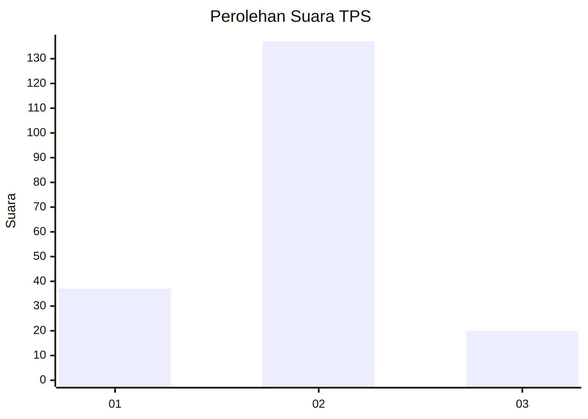
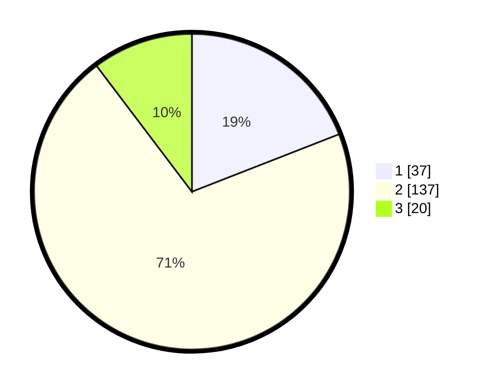

# Hasil

## Grafik

## Tabel

| No. | Nama Paslon    | Suara | Suara (raw) | Persentase |
|:--- |:-------------- | -----:| -----------:| ----------:|
| 1   | ANIES MUHAIMIN | 37    | [37][p-1]   | 19,07      |
| 2   | PRABOWO GIBRAN | 137   | [137][p-2]  | 70,62      |
| 3   | GANJAR MAHFUD  | 20    | [20][p-3]   | 10,31      |

[p-1]: https://github.com/gigit-pemilu/pemilu-2024-15-jambi/blob/main/pilpres/hitung-suara/sub/15-jambi/sub/05--muaro-jambi/sub/11-taman-rajo/sub/2002-talang-duku/sub/002-tps/sub/paslon-1.txt
[p-2]: https://github.com/gigit-pemilu/pemilu-2024-15-jambi/blob/main/pilpres/hitung-suara/sub/15-jambi/sub/05--muaro-jambi/sub/11-taman-rajo/sub/2002-talang-duku/sub/002-tps/sub/paslon-2.txt
[p-3]: https://github.com/gigit-pemilu/pemilu-2024-15-jambi/blob/main/pilpres/hitung-suara/sub/15-jambi/sub/05--muaro-jambi/sub/11-taman-rajo/sub/2002-talang-duku/sub/002-tps/sub/paslon-3.txt

## Foto C Plano

https://sirekap-obj-formc.kpu.go.id/3880/pemilu/ppwp/15/05/11/20/02/1505112002002-20240218-203317--2baebe5a-25ea-46c4-b73e-7a716c548cd6.jpg

https://sirekap-obj-formc.kpu.go.id/3880/pemilu/ppwp/15/05/11/20/02/1505112002002-20240218-203050--5e196f95-1d21-4af7-8417-5998a88e9227.jpg

https://sirekap-obj-formc.kpu.go.id/3880/pemilu/ppwp/15/05/11/20/02/1505112002002-20240218-203234--c78e4bd7-62d5-4fb7-b6b5-c3c052be38e9.jpg

## Metadata

| Key        | Value               |
| ---------- | ------------------- |
| Time Stamp | 2024-02-19 16:00:00 |

