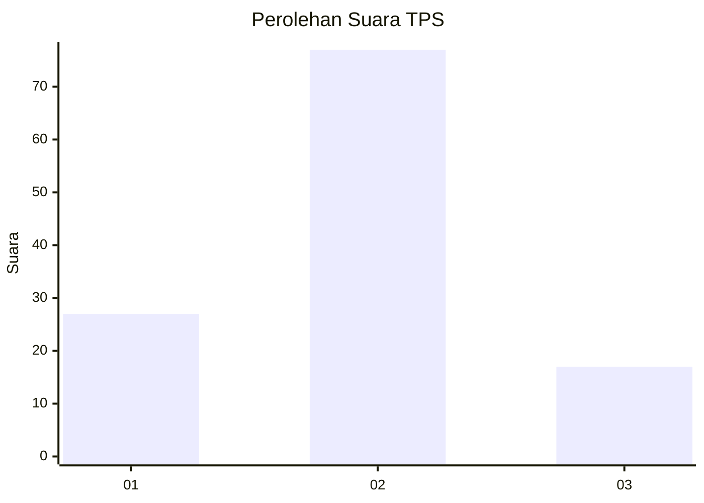
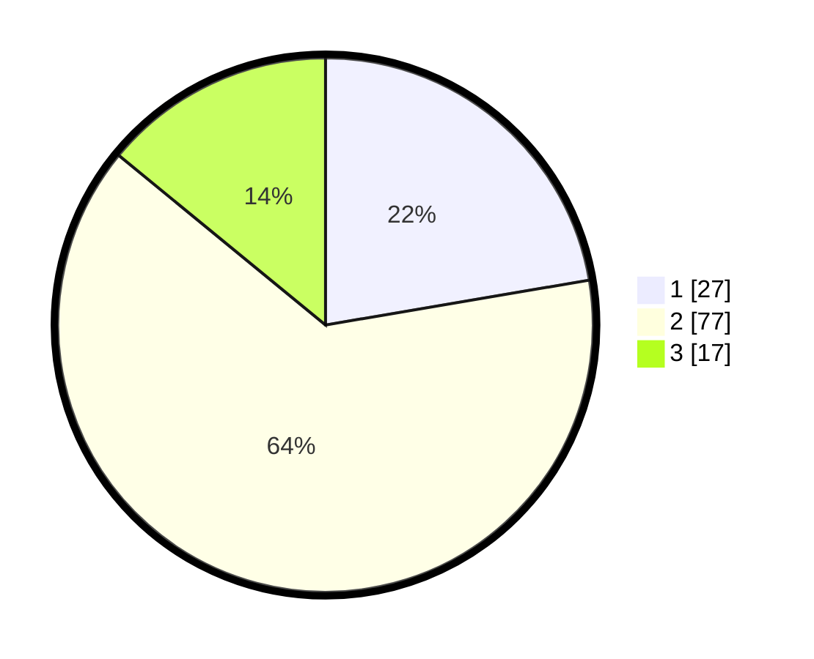

# Hasil

## Grafik

## Tabel

| No. | Nama Paslon    | Suara | Suara (raw) | Persentase |
|:--- |:-------------- | -----:| -----------:| ----------:|
| 1   | ANIES MUHAIMIN | 27    | [27][p-1]   | 22,31      |
| 2   | PRABOWO GIBRAN | 77    | [77][p-2]   | 63,64      |
| 3   | GANJAR MAHFUD  | 17    | [17][p-3]   | 14,05      |

[p-1]: https://github.com/gigit-pemilu/pemilu-2024-15-jambi/blob/main/pilpres/hitung-suara/sub/15-jambi/sub/06-tanjung-jabung-barat/sub/02-tungkal-ilir/sub/1004-tungkal-empat-kota/sub/001-tps/sub/paslon-1.txt
[p-2]: https://github.com/gigit-pemilu/pemilu-2024-15-jambi/blob/main/pilpres/hitung-suara/sub/15-jambi/sub/06-tanjung-jabung-barat/sub/02-tungkal-ilir/sub/1004-tungkal-empat-kota/sub/001-tps/sub/paslon-2.txt
[p-3]: https://github.com/gigit-pemilu/pemilu-2024-15-jambi/blob/main/pilpres/hitung-suara/sub/15-jambi/sub/06-tanjung-jabung-barat/sub/02-tungkal-ilir/sub/1004-tungkal-empat-kota/sub/001-tps/sub/paslon-3.txt

## Foto C Plano

https://sirekap-obj-formc.kpu.go.id/d78e/pemilu/ppwp/15/06/02/10/04/1506021004001-20240223-150520--662f8131-647a-4160-b6bc-e42cc393c484.jpg

https://sirekap-obj-formc.kpu.go.id/d78e/pemilu/ppwp/15/06/02/10/04/1506021004001-20240223-150902--b4e97ae3-cd40-44b2-8f72-74a8ebb5e891.jpg

https://sirekap-obj-formc.kpu.go.id/d78e/pemilu/ppwp/15/06/02/10/04/1506021004001-20240223-151206--3a5489dc-25b4-4afb-a96d-7ef218f95f61.jpg

## Metadata

| Key        | Value               |
| ---------- | ------------------- |
| Time Stamp | 2024-02-24 22:31:28 |

