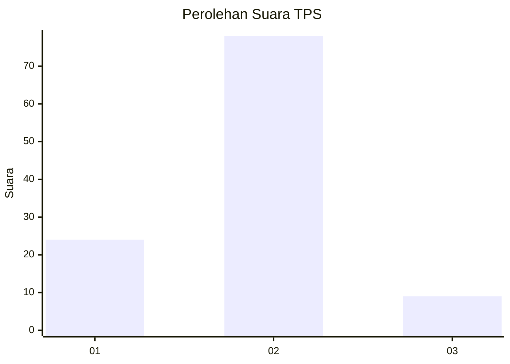
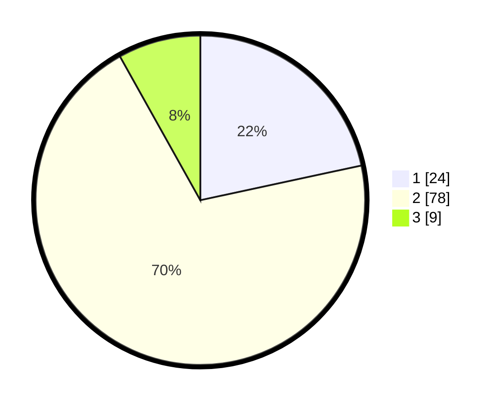

# Hasil

## Grafik

## Tabel

| No. | Nama Paslon    | Suara | Suara (raw) | Persentase |
|:--- |:-------------- | -----:| -----------:| ----------:|
| 1   | ANIES MUHAIMIN | 24    | [24][p-1]   | 21,62      |
| 2   | PRABOWO GIBRAN | 78    | [78][p-2]   | 70,27      |
| 3   | GANJAR MAHFUD  | 9     | [9][p-3]    | 8,11       |

[p-1]: https://github.com/gigit-pemilu/pemilu-2024-15-jambi/blob/main/pilpres/hitung-suara/sub/15-jambi/sub/06-tanjung-jabung-barat/sub/02-tungkal-ilir/sub/1004-tungkal-empat-kota/sub/002-tps/sub/paslon-1.txt
[p-2]: https://github.com/gigit-pemilu/pemilu-2024-15-jambi/blob/main/pilpres/hitung-suara/sub/15-jambi/sub/06-tanjung-jabung-barat/sub/02-tungkal-ilir/sub/1004-tungkal-empat-kota/sub/002-tps/sub/paslon-2.txt
[p-3]: https://github.com/gigit-pemilu/pemilu-2024-15-jambi/blob/main/pilpres/hitung-suara/sub/15-jambi/sub/06-tanjung-jabung-barat/sub/02-tungkal-ilir/sub/1004-tungkal-empat-kota/sub/002-tps/sub/paslon-3.txt

## Foto C Plano

https://sirekap-obj-formc.kpu.go.id/657b/pemilu/ppwp/15/06/02/10/04/1506021004002-20240216-133703--556b24af-e615-4ecf-9d2c-8868739a717a.jpg

https://sirekap-obj-formc.kpu.go.id/657b/pemilu/ppwp/15/06/02/10/04/1506021004002-20240216-133809--3c52cc0f-397e-4144-84ec-dc97e9fefa3c.jpg

https://sirekap-obj-formc.kpu.go.id/657b/pemilu/ppwp/15/06/02/10/04/1506021004002-20240216-133917--029f02aa-13c7-4381-8d68-6be3eaa7b5ea.jpg

## Metadata

| Key        | Value               |
| ---------- | ------------------- |
| Time Stamp | 2024-02-16 16:25:10 |

