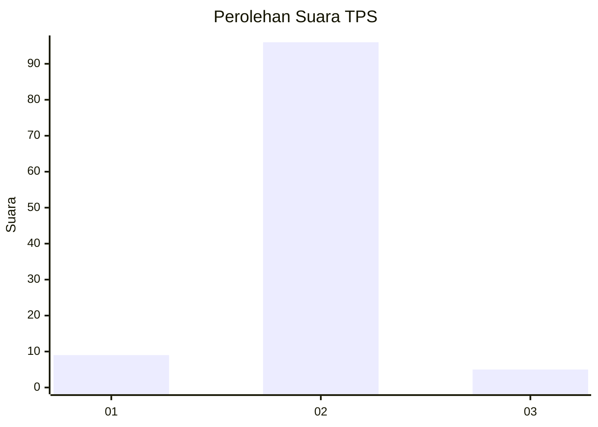
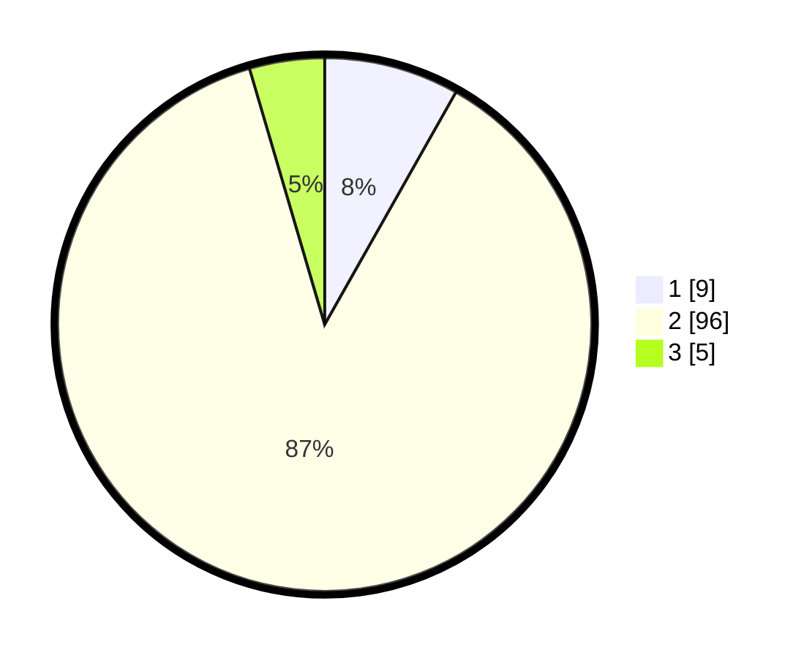

# Hasil

## Grafik

## Tabel

| No. | Nama Paslon    | Suara | Suara (raw) | Persentase |
|:--- |:-------------- | -----:| -----------:| ----------:|
| 1   | ANIES MUHAIMIN | 9     | [9][p-1]    | 8,18       |
| 2   | PRABOWO GIBRAN | 96    | [96][p-2]   | 87,27      |
| 3   | GANJAR MAHFUD  | 5     | [5][p-3]    | 4,55       |

[p-1]: https://github.com/gigit-pemilu/pemilu-2024-15-jambi/blob/main/pilpres/hitung-suara/sub/15-jambi/sub/06-tanjung-jabung-barat/sub/05-merlung/sub/2020-(desa)-merlung/sub/004-tps/sub/paslon-1.txt
[p-2]: https://github.com/gigit-pemilu/pemilu-2024-15-jambi/blob/main/pilpres/hitung-suara/sub/15-jambi/sub/06-tanjung-jabung-barat/sub/05-merlung/sub/2020-(desa)-merlung/sub/004-tps/sub/paslon-2.txt
[p-3]: https://github.com/gigit-pemilu/pemilu-2024-15-jambi/blob/main/pilpres/hitung-suara/sub/15-jambi/sub/06-tanjung-jabung-barat/sub/05-merlung/sub/2020-(desa)-merlung/sub/004-tps/sub/paslon-3.txt

## Foto C Plano

https://sirekap-obj-formc.kpu.go.id/9acb/pemilu/ppwp/15/06/05/20/20/1506052020004-20240214-214520--5a72d98e-b3e3-4ebe-9624-0d3277ab3fe8.jpg

https://sirekap-obj-formc.kpu.go.id/9acb/pemilu/ppwp/15/06/05/20/20/1506052020004-20240214-214705--85e9122c-9bcf-4fe5-aeab-fd53fc7575cc.jpg

https://sirekap-obj-formc.kpu.go.id/9acb/pemilu/ppwp/15/06/05/20/20/1506052020004-20240214-214831--c1c757a0-3fc8-45ce-b7a2-025fce7d0fff.jpg

## Metadata

| Key        | Value               |
| ---------- | ------------------- |
| Time Stamp | 2024-02-15 18:00:26 |

