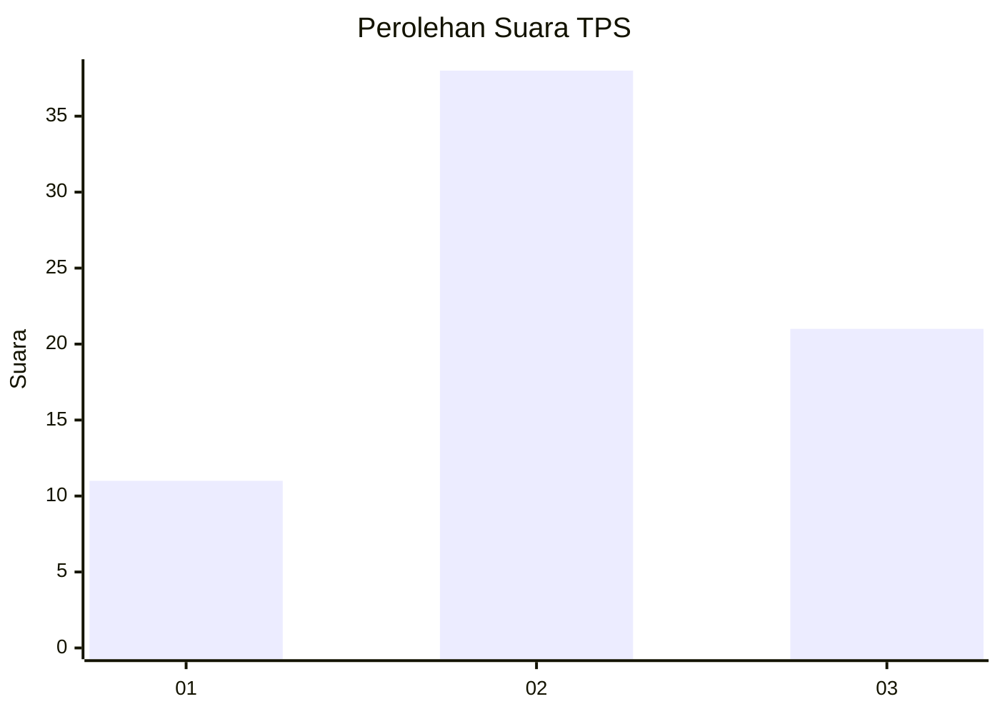
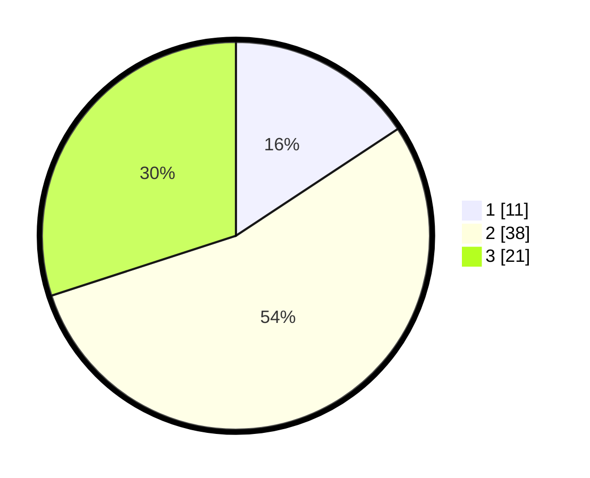

# Hasil

## Grafik

## Tabel

| No. | Nama Paslon    | Suara | Suara (raw) | Persentase |
|:--- |:-------------- | -----:| -----------:| ----------:|
| 1   | ANIES MUHAIMIN | 11    | [11][p-1]   | 15,71      |
| 2   | PRABOWO GIBRAN | 38    | [38][p-2]   | 54,29      |
| 3   | GANJAR MAHFUD  | 21    | [21][p-3]   | 30,00      |

[p-1]: https://github.com/gigit-pemilu/pemilu-2024-15-jambi/blob/main/pilpres/hitung-suara/sub/15-jambi/sub/06-tanjung-jabung-barat/sub/06-tebing-tinggi/sub/2010-delima/sub/006-tps/sub/paslon-1.txt
[p-2]: https://github.com/gigit-pemilu/pemilu-2024-15-jambi/blob/main/pilpres/hitung-suara/sub/15-jambi/sub/06-tanjung-jabung-barat/sub/06-tebing-tinggi/sub/2010-delima/sub/006-tps/sub/paslon-2.txt
[p-3]: https://github.com/gigit-pemilu/pemilu-2024-15-jambi/blob/main/pilpres/hitung-suara/sub/15-jambi/sub/06-tanjung-jabung-barat/sub/06-tebing-tinggi/sub/2010-delima/sub/006-tps/sub/paslon-3.txt

## Foto C Plano

https://sirekap-obj-formc.kpu.go.id/aa16/pemilu/ppwp/15/06/06/20/10/1506062010006-20240220-142456--0db8cf31-dcfd-4ef6-9b77-191ab94b7c95.jpg

https://sirekap-obj-formc.kpu.go.id/aa16/pemilu/ppwp/15/06/06/20/10/1506062010006-20240220-142534--20a02de4-24d3-4224-bfc3-d32167353b0e.jpg

https://sirekap-obj-formc.kpu.go.id/aa16/pemilu/ppwp/15/06/06/20/10/1506062010006-20240214-230203--b1a35c76-03f9-42a0-b77f-1302635f72be.jpg

## Metadata

| Key        | Value               |
| ---------- | ------------------- |
| Time Stamp | 2024-02-20 15:00:00 |

