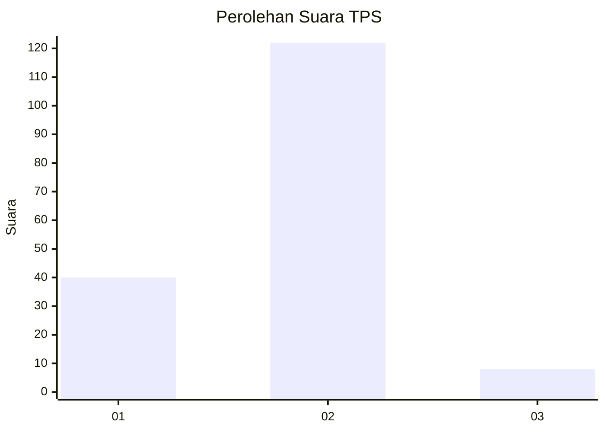
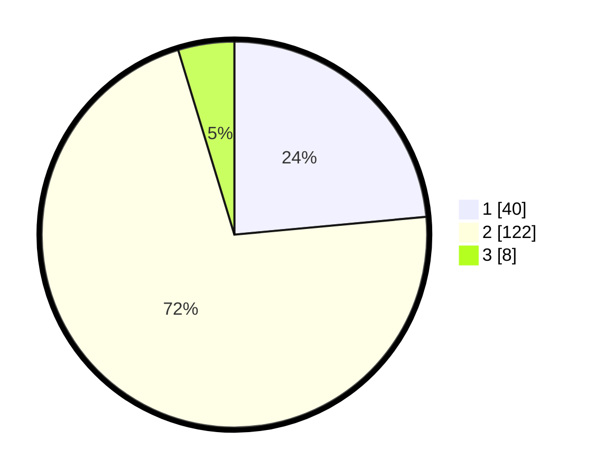

# Hasil

## Grafik

## Tabel

| No. | Nama Paslon    | Suara | Suara (raw) | Persentase |
|:--- |:-------------- | -----:| -----------:| ----------:|
| 1   | ANIES MUHAIMIN | 40    | [40][p-1]   | 23,53      |
| 2   | PRABOWO GIBRAN | 122   | [122][p-2]  | 71,76      |
| 3   | GANJAR MAHFUD  | 8     | [8][p-3]    | 4,71       |

[p-1]: https://github.com/gigit-pemilu/pemilu-2024-15-jambi/blob/main/pilpres/hitung-suara/sub/15-jambi/sub/08-bungo/sub/01-tanah-tumbuh/sub/2001-pedukun/sub/003-tps/sub/paslon-1.txt
[p-2]: https://github.com/gigit-pemilu/pemilu-2024-15-jambi/blob/main/pilpres/hitung-suara/sub/15-jambi/sub/08-bungo/sub/01-tanah-tumbuh/sub/2001-pedukun/sub/003-tps/sub/paslon-2.txt
[p-3]: https://github.com/gigit-pemilu/pemilu-2024-15-jambi/blob/main/pilpres/hitung-suara/sub/15-jambi/sub/08-bungo/sub/01-tanah-tumbuh/sub/2001-pedukun/sub/003-tps/sub/paslon-3.txt

## Foto C Plano

https://sirekap-obj-formc.kpu.go.id/e003/pemilu/ppwp/15/08/01/20/01/1508012001003-20240215-131726--ff7c658a-e86c-480b-8d4b-0fd68c2a55b0.jpg

https://sirekap-obj-formc.kpu.go.id/e003/pemilu/ppwp/15/08/01/20/01/1508012001003-20240217-091452--32722271-a882-4ea9-ad46-9e65b7b4d8c6.jpg

https://sirekap-obj-formc.kpu.go.id/e003/pemilu/ppwp/15/08/01/20/01/1508012001003-20240217-091451--57bf4aa9-7101-4a77-9108-4e93f7e90c02.jpg

## Metadata

| Key        | Value               |
| ---------- | ------------------- |
| Time Stamp | 2024-02-22 15:00:00 |

