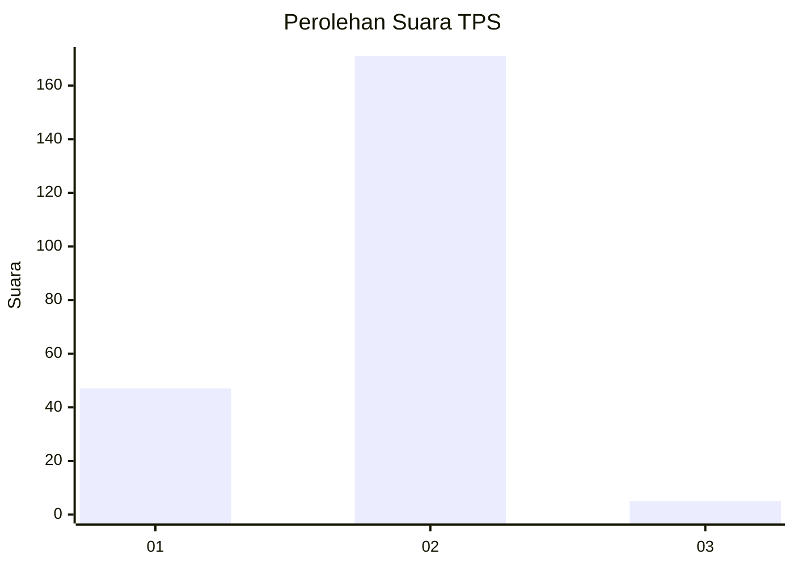
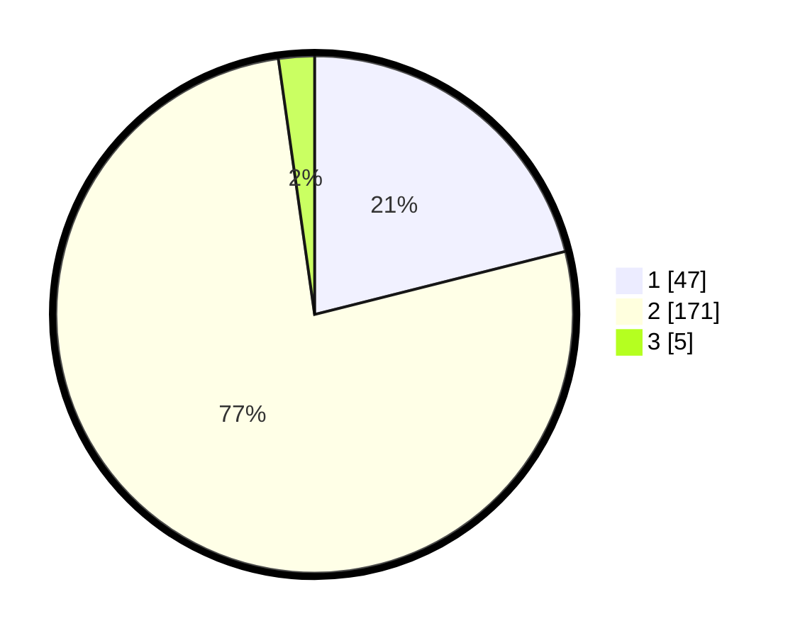

# Hasil

## Grafik

## Tabel

| No. | Nama Paslon    | Suara | Suara (raw) | Persentase |
|:--- |:-------------- | -----:| -----------:| ----------:|
| 1   | ANIES MUHAIMIN | 47    | [47][p-1]   | 21,08      |
| 2   | PRABOWO GIBRAN | 171   | [171][p-2]  | 76,68      |
| 3   | GANJAR MAHFUD  | 5     | [5][p-3]    | 2,24       |

[p-1]: https://github.com/gigit-pemilu/pemilu-2024-15-jambi/blob/main/pilpres/hitung-suara/sub/15-jambi/sub/08-bungo/sub/01-tanah-tumbuh/sub/2003-teluk-kecimbung/sub/001-tps/sub/paslon-1.txt
[p-2]: https://github.com/gigit-pemilu/pemilu-2024-15-jambi/blob/main/pilpres/hitung-suara/sub/15-jambi/sub/08-bungo/sub/01-tanah-tumbuh/sub/2003-teluk-kecimbung/sub/001-tps/sub/paslon-2.txt
[p-3]: https://github.com/gigit-pemilu/pemilu-2024-15-jambi/blob/main/pilpres/hitung-suara/sub/15-jambi/sub/08-bungo/sub/01-tanah-tumbuh/sub/2003-teluk-kecimbung/sub/001-tps/sub/paslon-3.txt

## Foto C Plano

https://sirekap-obj-formc.kpu.go.id/4a55/pemilu/ppwp/15/08/01/20/03/1508012003001-20240215-075428--9d85c025-a787-4957-a270-6c731af01d49.jpg

https://sirekap-obj-formc.kpu.go.id/4a55/pemilu/ppwp/15/08/01/20/03/1508012003001-20240215-080030--90a8e2d7-1368-4ad8-b221-55713d93d184.jpg

https://sirekap-obj-formc.kpu.go.id/4a55/pemilu/ppwp/15/08/01/20/03/1508012003001-20240215-075640--79da695f-c222-4f56-a2d4-a9dc786288aa.jpg

## Metadata

| Key        | Value               |
| ---------- | ------------------- |
| Time Stamp | 2024-02-15 15:30:25 |

## DATA PEMILIH TETAP

Jumlah pemilih dalam DPT: **55**.
 * L: **300**.
 * P: **0**.

## DATA PENGGUNA HAK PILIH

Jumlah pengguna hak pilih dalam DPT: **5**.
 * L: **0**.
 * P: **0**.

Jumlah pengguna hak pilih dalam DPTb: **157**.
 * L: **44**.
 * P: **172**.

Jumlah pengguna hak pilih dalam DPK: **57**.
 * L: **10**.
 * P: **40**.

Jumlah pengguna hak pilih: **35**.
 * L: **30**.
 * P: **0**.

## JUMLAH SUARA SAH DAN TIDAK SAH

JUMLAH SELURUH SUARA SAH: **223**.

JUMLAH SUARA TIDAK SAH: **0**.

JUMLAH SELURUH SUARA SAH DAN SUARA TIDAK SAH: **223**.

