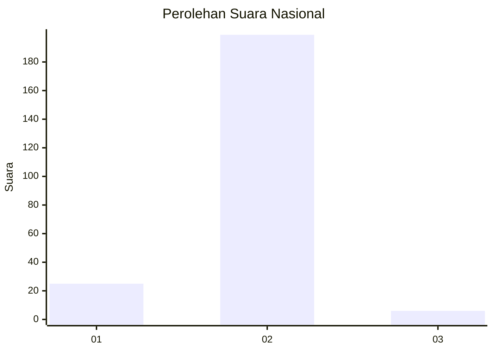
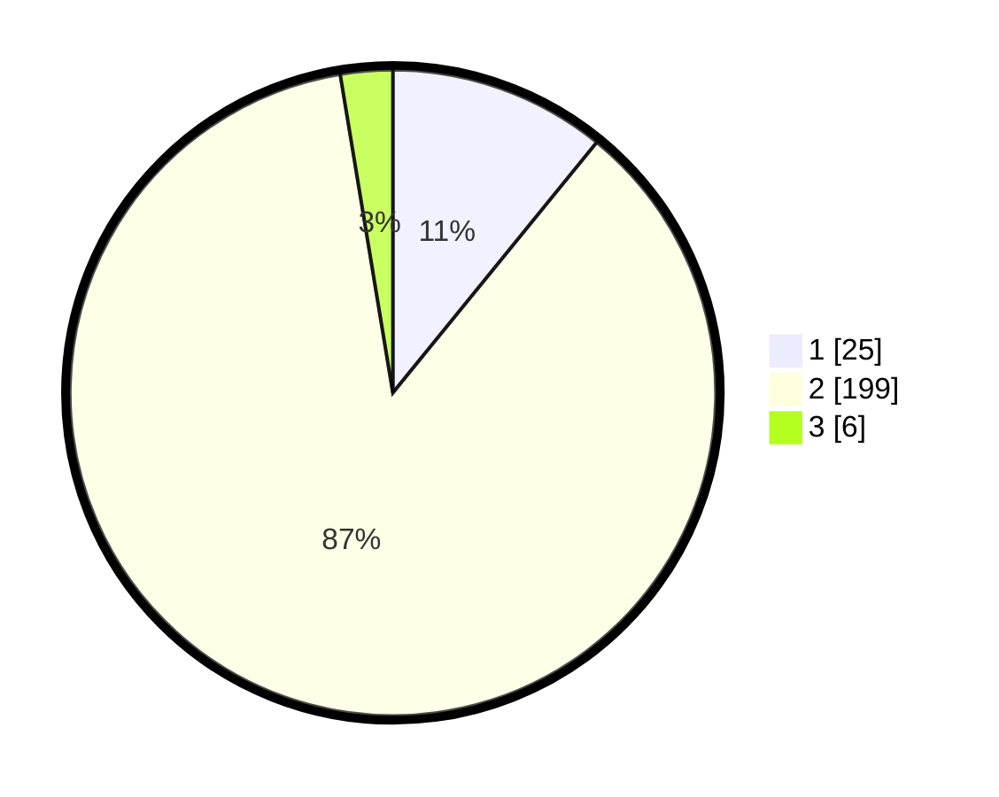

# Hasil

## Grafik

## Tabel

| No. | Nama Paslon    | Suara | Suara (raw) | Persentase |
|:--- |:-------------- | -----:| -----------:| ----------:|
| 1   | ANIES MUHAIMIN | 25    | [25][p-1]   | 10,87      |
| 2   | PRABOWO GIBRAN | 199   | [199][p-2]  | 86,52      |
| 3   | GANJAR MAHFUD  | 6     | [6][p-3]    | 2,61       |

[p-1]: https://github.com/gigit-pemilu/pemilu-2024/blob/main/pilpres/hitung-suara/sub/15-jambi/sub/08-bungo/sub/01-tanah-tumbuh/sub/2003-teluk-kecimbung/sub/004-tps/sub/paslon-1.txt
[p-2]: https://github.com/gigit-pemilu/pemilu-2024/blob/main/pilpres/hitung-suara/sub/15-jambi/sub/08-bungo/sub/01-tanah-tumbuh/sub/2003-teluk-kecimbung/sub/004-tps/sub/paslon-2.txt
[p-3]: https://github.com/gigit-pemilu/pemilu-2024/blob/main/pilpres/hitung-suara/sub/15-jambi/sub/08-bungo/sub/01-tanah-tumbuh/sub/2003-teluk-kecimbung/sub/004-tps/sub/paslon-3.txt

## Foto C Plano

https://sirekap-obj-formc.kpu.go.id/2f23/pemilu/ppwp/15/08/01/20/03/1508012003004-20240215-213255--ae53860b-06c4-40c8-b8c5-07c1d2a68d96.jpg

https://sirekap-obj-formc.kpu.go.id/2f23/pemilu/ppwp/15/08/01/20/03/1508012003004-20240215-205605--582d4adf-6b6a-4a1b-8318-f31fb0203eb5.jpg

https://sirekap-obj-formc.kpu.go.id/2f23/pemilu/ppwp/15/08/01/20/03/1508012003004-20240215-205652--009077cb-1ed6-49e1-9d02-c7996598ec6c.jpg

## Metadata

| Key        | Value               |
| ---------- | ------------------- |
| Time Stamp | 2024-02-24 22:31:28 |

