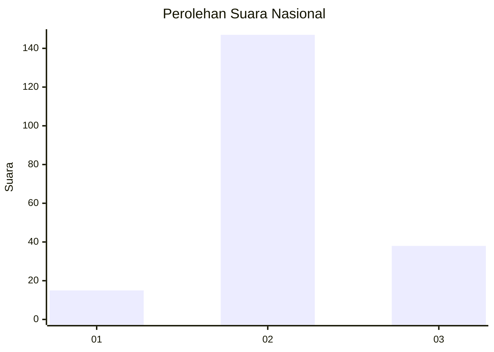
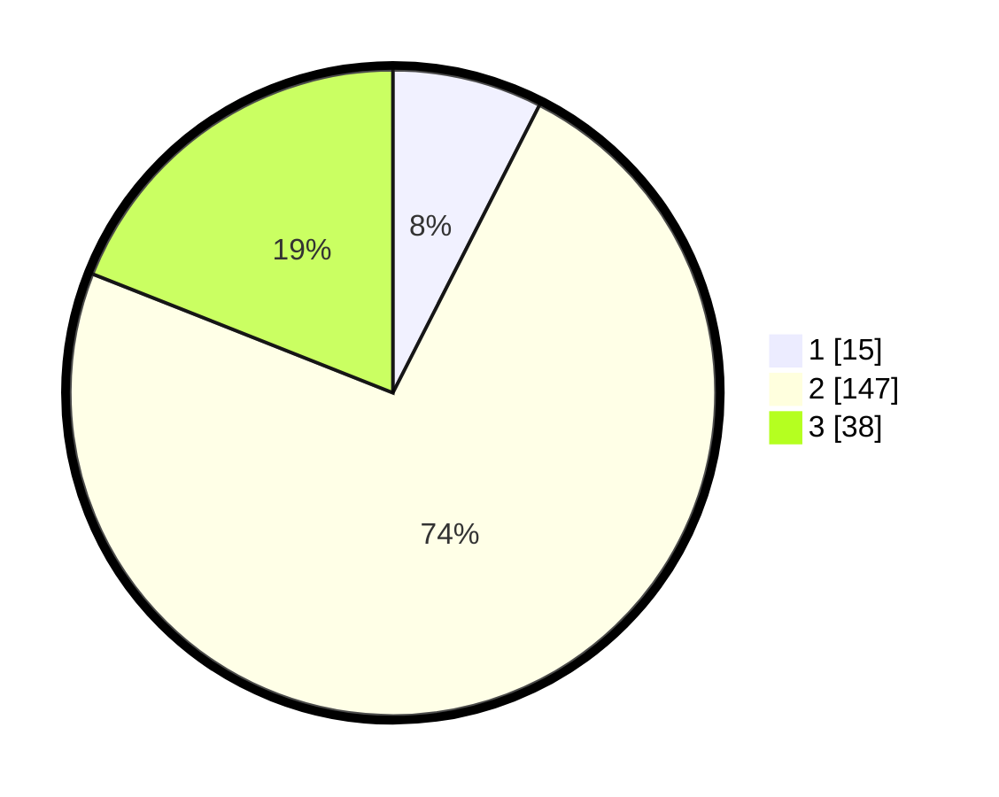

# Hasil

## Grafik

## Tabel

| No. | Nama Paslon    | Suara | Suara (raw) | Persentase |
|:--- |:-------------- | -----:| -----------:| ----------:|
| 1   | ANIES MUHAIMIN | 15    | [15][p-1]   | 7,50       |
| 2   | PRABOWO GIBRAN | 147   | [147][p-2]  | 73,50      |
| 3   | GANJAR MAHFUD  | 38    | [38][p-3]   | 19,00      |

[p-1]: https://github.com/gigit-pemilu/pemilu-2024/blob/main/pilpres/hitung-suara/sub/15-jambi/sub/08-bungo/sub/06-pelepat/sub/2002-dwi-karya-bakti/sub/004-tps/sub/paslon-1.txt
[p-2]: https://github.com/gigit-pemilu/pemilu-2024/blob/main/pilpres/hitung-suara/sub/15-jambi/sub/08-bungo/sub/06-pelepat/sub/2002-dwi-karya-bakti/sub/004-tps/sub/paslon-2.txt
[p-3]: https://github.com/gigit-pemilu/pemilu-2024/blob/main/pilpres/hitung-suara/sub/15-jambi/sub/08-bungo/sub/06-pelepat/sub/2002-dwi-karya-bakti/sub/004-tps/sub/paslon-3.txt

## Foto C Plano

https://sirekap-obj-formc.kpu.go.id/69e7/pemilu/ppwp/15/08/06/20/02/1508062002004-20240215-001746--7279fe52-456e-453e-91f9-584b353faa8f.jpg

https://sirekap-obj-formc.kpu.go.id/69e7/pemilu/ppwp/15/08/06/20/02/1508062002004-20240215-002108--4dce42c4-4f7e-4d5c-bd45-177f6c50f6b5.jpg

https://sirekap-obj-formc.kpu.go.id/69e7/pemilu/ppwp/15/08/06/20/02/1508062002004-20240215-002016--e4cac638-d401-4ad8-bc70-2500ebf09fcb.jpg

## Metadata

| Key        | Value               |
| ---------- | ------------------- |
| Time Stamp | 2024-02-15 12:00:28 |

