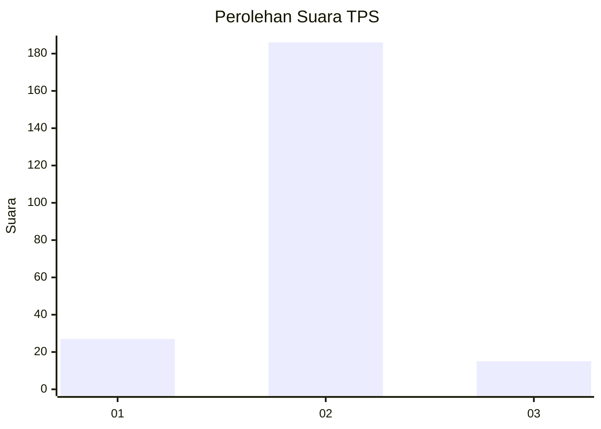
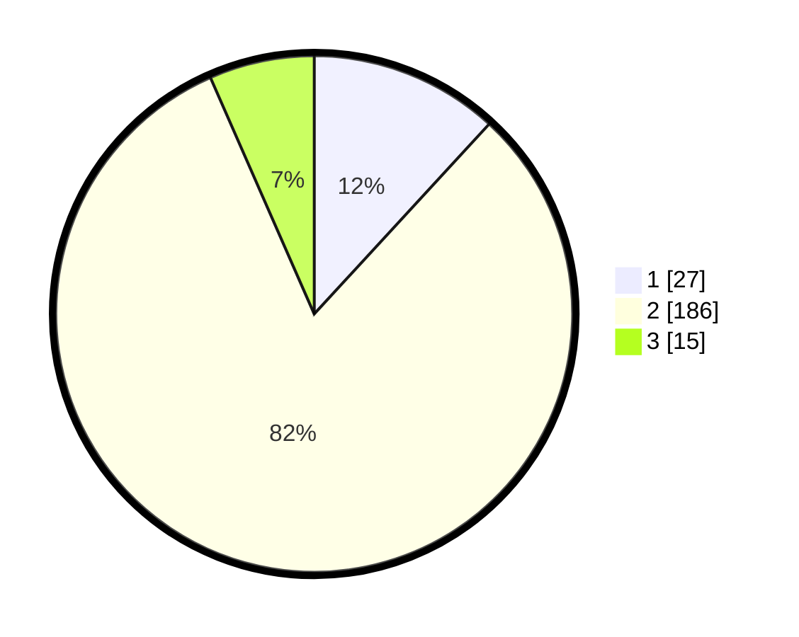

# Hasil

## Grafik

## Tabel

| No. | Nama Paslon    | Suara | Suara (raw) | Persentase |
|:--- |:-------------- | -----:| -----------:| ----------:|
| 1   | ANIES MUHAIMIN | 27    | [27][p-1]   | 11,84      |
| 2   | PRABOWO GIBRAN | 186   | [186][p-2]  | 81,58      |
| 3   | GANJAR MAHFUD  | 15    | [15][p-3]   | 6,58       |

[p-1]: https://github.com/gigit-pemilu/pemilu-2024-15-jambi/blob/main/pilpres/hitung-suara/sub/15-jambi/sub/08-bungo/sub/06-pelepat/sub/2003-rantau-keloyang/sub/006-tps/sub/paslon-1.txt
[p-2]: https://github.com/gigit-pemilu/pemilu-2024-15-jambi/blob/main/pilpres/hitung-suara/sub/15-jambi/sub/08-bungo/sub/06-pelepat/sub/2003-rantau-keloyang/sub/006-tps/sub/paslon-2.txt
[p-3]: https://github.com/gigit-pemilu/pemilu-2024-15-jambi/blob/main/pilpres/hitung-suara/sub/15-jambi/sub/08-bungo/sub/06-pelepat/sub/2003-rantau-keloyang/sub/006-tps/sub/paslon-3.txt

## Foto C Plano

https://sirekap-obj-formc.kpu.go.id/af98/pemilu/ppwp/15/08/06/20/03/1508062003006-20240215-022513--3028d1a0-cc2f-4876-979d-efa2d2bbe864.jpg

https://sirekap-obj-formc.kpu.go.id/af98/pemilu/ppwp/15/08/06/20/03/1508062003006-20240215-023054--539a78bd-2cb2-4093-9fce-6c861644c1ed.jpg

https://sirekap-obj-formc.kpu.go.id/af98/pemilu/ppwp/15/08/06/20/03/1508062003006-20240215-023205--f2f266c1-7355-491e-aa3e-da8b5a52b8e9.jpg

## Metadata

| Key        | Value               |
| ---------- | ------------------- |
| Time Stamp | 2024-02-15 15:30:25 |

