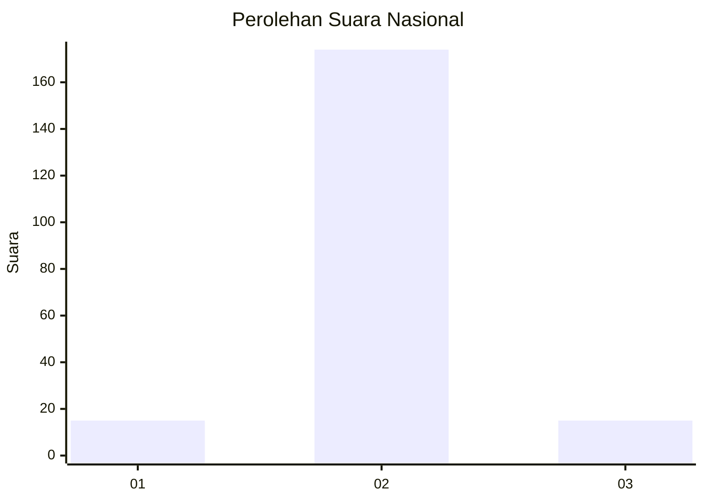
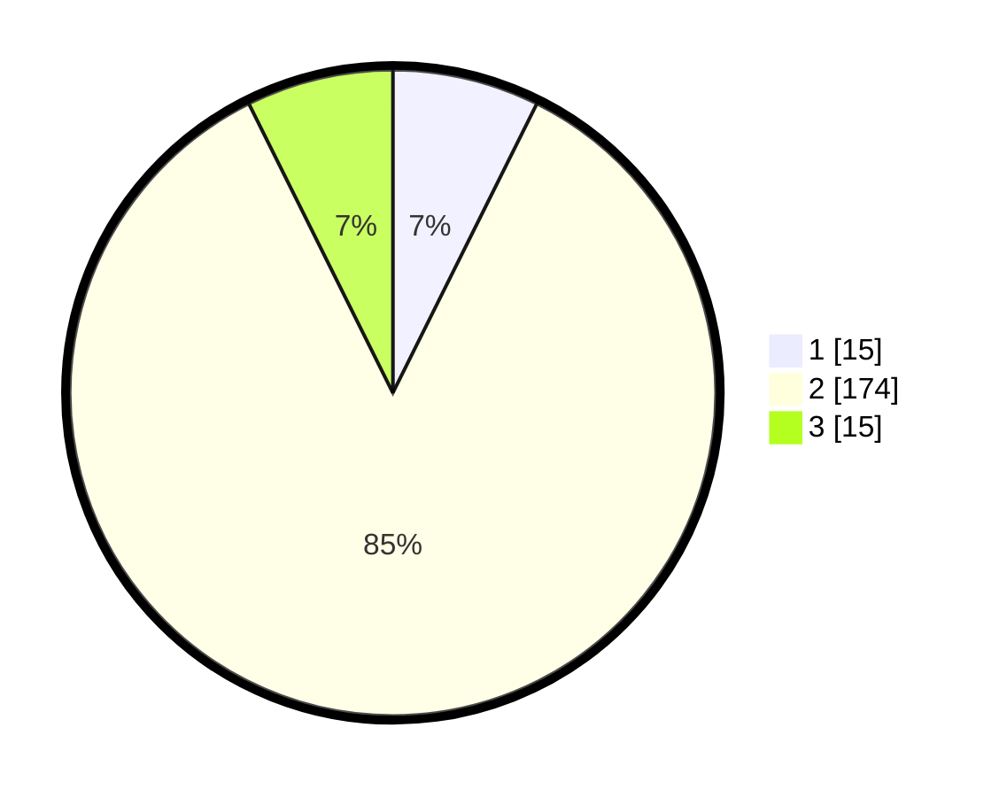

# Hasil

## Grafik

## Tabel

| No. | Nama Paslon    | Suara | Suara (raw) | Persentase |
|:--- |:-------------- | -----:| -----------:| ----------:|
| 1   | ANIES MUHAIMIN | 15    | [15][p-1]   | 7,35       |
| 2   | PRABOWO GIBRAN | 174   | [174][p-2]  | 85,29      |
| 3   | GANJAR MAHFUD  | 15    | [15][p-3]   | 7,35       |

[p-1]: https://github.com/gigit-pemilu/pemilu-2024/blob/main/pilpres/hitung-suara/sub/15-jambi/sub/08-bungo/sub/06-pelepat/sub/2013-cilodang/sub/006-tps/sub/paslon-1.txt
[p-2]: https://github.com/gigit-pemilu/pemilu-2024/blob/main/pilpres/hitung-suara/sub/15-jambi/sub/08-bungo/sub/06-pelepat/sub/2013-cilodang/sub/006-tps/sub/paslon-2.txt
[p-3]: https://github.com/gigit-pemilu/pemilu-2024/blob/main/pilpres/hitung-suara/sub/15-jambi/sub/08-bungo/sub/06-pelepat/sub/2013-cilodang/sub/006-tps/sub/paslon-3.txt

## Foto C Plano

https://sirekap-obj-formc.kpu.go.id/b6bd/pemilu/ppwp/15/08/06/20/13/1508062013006-20240215-022640--9ff0ffa1-13d6-46f0-a84a-f3424b9bab95.jpg

https://sirekap-obj-formc.kpu.go.id/b6bd/pemilu/ppwp/15/08/06/20/13/1508062013006-20240214-194416--2a937e03-506f-445a-9f3a-39fceeb5e734.jpg

https://sirekap-obj-formc.kpu.go.id/b6bd/pemilu/ppwp/15/08/06/20/13/1508062013006-20240214-194829--24ddb6bd-bc55-4d58-97ea-ae4b69facab5.jpg

## Metadata

| Key        | Value               |
| ---------- | ------------------- |
| Time Stamp | 2024-02-15 15:00:29 |

