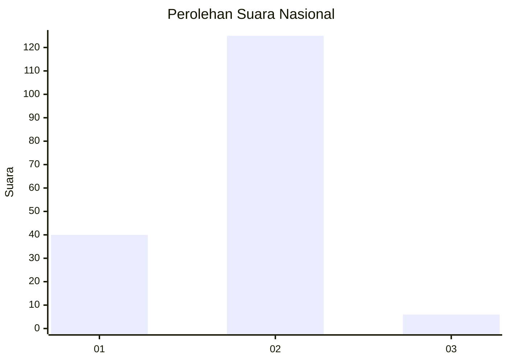

# Hasil

## Grafik

## Tabel

| No. | Nama Paslon    | Suara | Suara (raw) | Persentase |
|:--- |:-------------- | -----:| -----------:| ----------:|
| 1   | ANIES MUHAIMIN | 40    | [40][p-1]   | 23,39      |
| 2   | PRABOWO GIBRAN | 125   | [125][p-2]  | 73,10      |
| 3   | GANJAR MAHFUD  | 6     | [6][p-3]    | 3,51       |

[p-1]: https://github.com/gigit-pemilu/pemilu-2024/blob/main/pilpres/hitung-suara/sub/15-jambi/sub/08-bungo/sub/08-muko-muko-bathin-vii/sub/2004-baru-pusat-jalo/sub/002-tps/sub/paslon-1.txt
[p-2]: https://github.com/gigit-pemilu/pemilu-2024/blob/main/pilpres/hitung-suara/sub/15-jambi/sub/08-bungo/sub/08-muko-muko-bathin-vii/sub/2004-baru-pusat-jalo/sub/002-tps/sub/paslon-2.txt
[p-3]: https://github.com/gigit-pemilu/pemilu-2024/blob/main/pilpres/hitung-suara/sub/15-jambi/sub/08-bungo/sub/08-muko-muko-bathin-vii/sub/2004-baru-pusat-jalo/sub/002-tps/sub/paslon-3.txt

## Foto C Plano

https://sirekap-obj-formc.kpu.go.id/9df0/pemilu/ppwp/15/08/08/20/04/1508082004002-20240215-062707--ad43e0f8-85fd-4d8a-b62a-151c6e1a6dd1.jpg

https://sirekap-obj-formc.kpu.go.id/9df0/pemilu/ppwp/15/08/08/20/04/1508082004002-20240222-175734--0ca21dad-a609-4878-9701-354b95bd6f2d.jpg

https://sirekap-obj-formc.kpu.go.id/9df0/pemilu/ppwp/15/08/08/20/04/1508082004002-20240215-063905--d576f1c4-0a84-4004-9ebe-b79c963cbd36.jpg

## Metadata

| Key        | Value               |
| ---------- | ------------------- |
| Time Stamp | 2024-02-24 22:31:28 |

