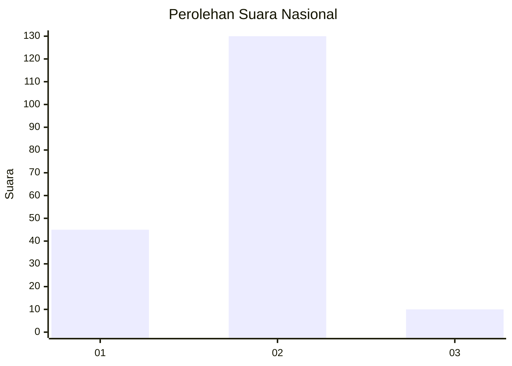
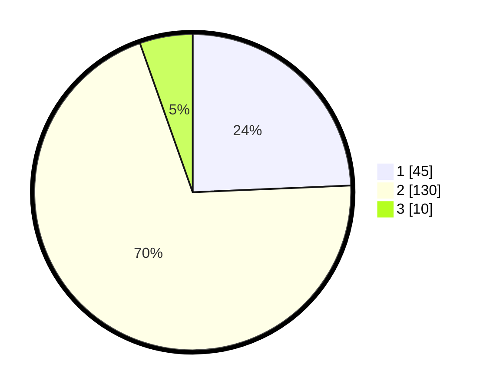

# Hasil

## Grafik

## Tabel

| No. | Nama Paslon    | Suara | Suara (raw) | Persentase |
|:--- |:-------------- | -----:| -----------:| ----------:|
| 1   | ANIES MUHAIMIN | 45    | [45][p-1]   | 24,32      |
| 2   | PRABOWO GIBRAN | 130   | [130][p-2]  | 70,27      |
| 3   | GANJAR MAHFUD  | 10    | [10][p-3]   | 5,41       |

[p-1]: https://github.com/gigit-pemilu/pemilu-2024/blob/main/pilpres/hitung-suara/sub/15-jambi/sub/08-bungo/sub/09-pelepat-ilir/sub/2002-danau/sub/001-tps/sub/paslon-1.txt
[p-2]: https://github.com/gigit-pemilu/pemilu-2024/blob/main/pilpres/hitung-suara/sub/15-jambi/sub/08-bungo/sub/09-pelepat-ilir/sub/2002-danau/sub/001-tps/sub/paslon-2.txt
[p-3]: https://github.com/gigit-pemilu/pemilu-2024/blob/main/pilpres/hitung-suara/sub/15-jambi/sub/08-bungo/sub/09-pelepat-ilir/sub/2002-danau/sub/001-tps/sub/paslon-3.txt

## Foto C Plano

https://sirekap-obj-formc.kpu.go.id/c4a7/pemilu/ppwp/15/08/09/20/02/1508092002001-20240215-021259--eae18ad7-2c62-40af-951a-4eeb421edcbf.jpg

https://sirekap-obj-formc.kpu.go.id/c4a7/pemilu/ppwp/15/08/09/20/02/1508092002001-20240215-030747--c75dfea6-c6a1-4b11-9ca2-bb6174c97a90.jpg

https://sirekap-obj-formc.kpu.go.id/c4a7/pemilu/ppwp/15/08/09/20/02/1508092002001-20240215-021503--6128ed78-24a7-4b61-8967-ff1265521b2a.jpg

## Metadata

| Key        | Value               |
| ---------- | ------------------- |
| Time Stamp | 2024-02-15 12:00:28 |

