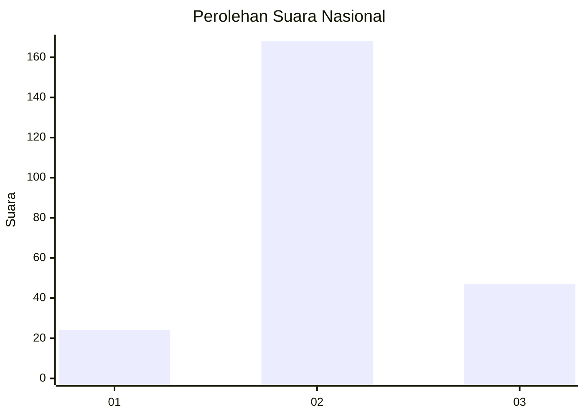
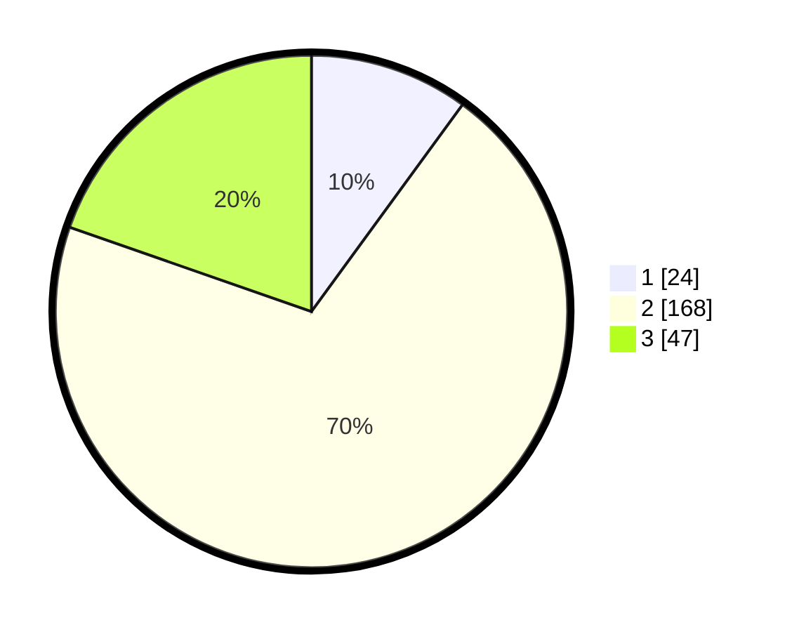

# Hasil

## Grafik

## Tabel

| No. | Nama Paslon    | Suara | Suara (raw) | Persentase |
|:--- |:-------------- | -----:| -----------:| ----------:|
| 1   | ANIES MUHAIMIN | 24    | [24][p-1]   | 10,04      |
| 2   | PRABOWO GIBRAN | 168   | [168][p-2]  | 70,29      |
| 3   | GANJAR MAHFUD  | 47    | [47][p-3]   | 19,67      |

[p-1]: https://github.com/gigit-pemilu/pemilu-2024/blob/main/pilpres/hitung-suara/sub/15-jambi/sub/08-bungo/sub/09-pelepat-ilir/sub/2006-lembah-kuamang/sub/004-tps/sub/paslon-1.txt
[p-2]: https://github.com/gigit-pemilu/pemilu-2024/blob/main/pilpres/hitung-suara/sub/15-jambi/sub/08-bungo/sub/09-pelepat-ilir/sub/2006-lembah-kuamang/sub/004-tps/sub/paslon-2.txt
[p-3]: https://github.com/gigit-pemilu/pemilu-2024/blob/main/pilpres/hitung-suara/sub/15-jambi/sub/08-bungo/sub/09-pelepat-ilir/sub/2006-lembah-kuamang/sub/004-tps/sub/paslon-3.txt

## Foto C Plano

https://sirekap-obj-formc.kpu.go.id/a3ee/pemilu/ppwp/15/08/09/20/06/1508092006004-20240226-205009--8475ab02-1891-4670-aab9-065322f24968.jpg

https://sirekap-obj-formc.kpu.go.id/a3ee/pemilu/ppwp/15/08/09/20/06/1508092006004-20240215-071348--0148487d-0448-40d1-98b0-069c00a1150b.jpg

https://sirekap-obj-formc.kpu.go.id/a3ee/pemilu/ppwp/15/08/09/20/06/1508092006004-20240215-064554--0fe2bb3f-5ebb-4443-ab95-6b9006d842f3.jpg

## Metadata

| Key        | Value               |
| ---------- | ------------------- |
| Time Stamp | 2024-02-26 21:00:00 |

