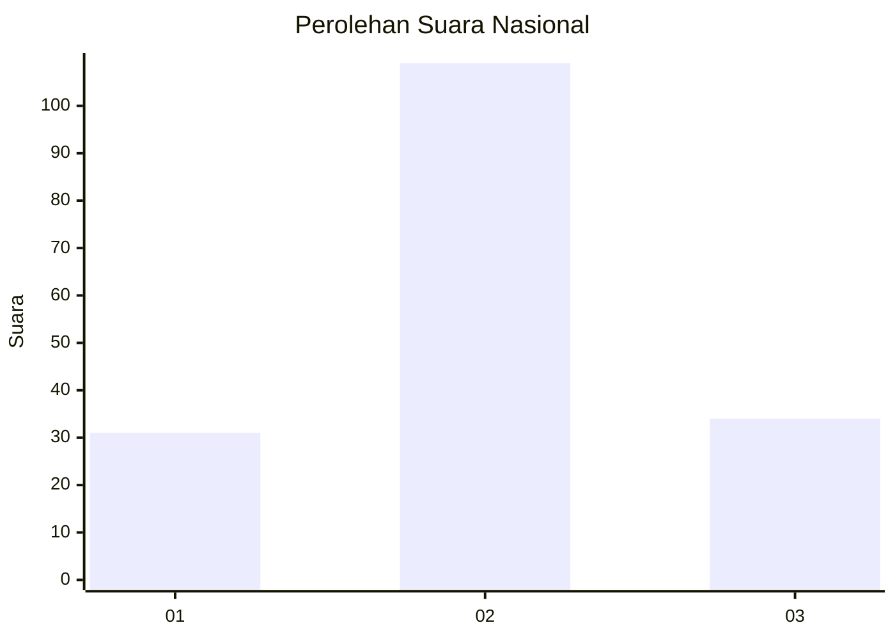
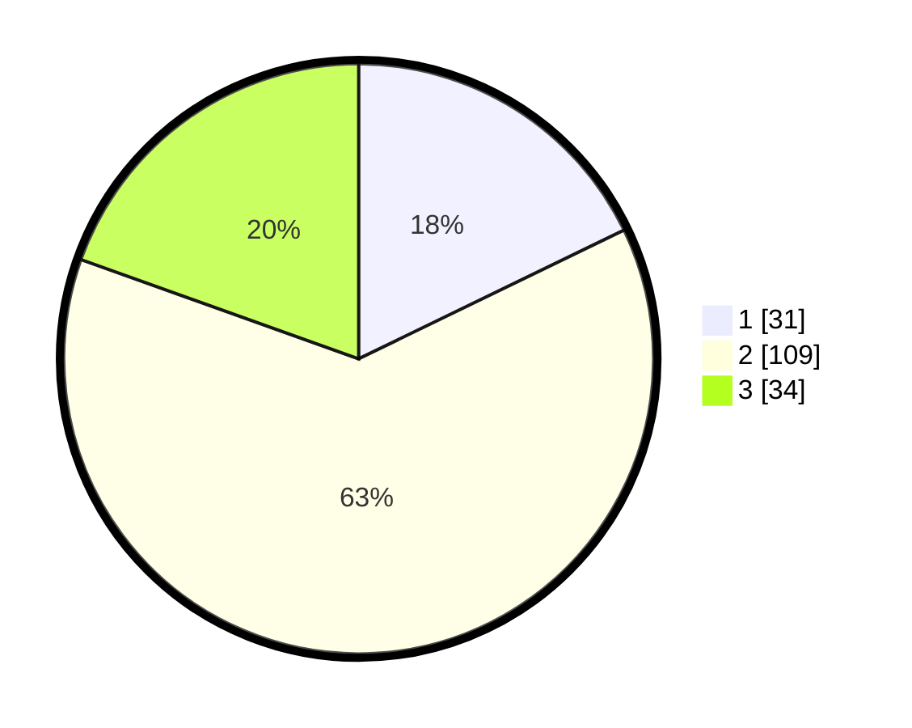

# Hasil

## Grafik

## Tabel

| No. | Nama Paslon    | Suara | Suara (raw) | Persentase |
|:--- |:-------------- | -----:| -----------:| ----------:|
| 1   | ANIES MUHAIMIN | 31    | [31][p-1]   | 17,82      |
| 2   | PRABOWO GIBRAN | 109   | [109][p-2]  | 62,64      |
| 3   | GANJAR MAHFUD  | 34    | [34][p-3]   | 19,54      |

[p-1]: https://github.com/gigit-pemilu/pemilu-2024/blob/main/pilpres/hitung-suara/sub/15-jambi/sub/08-bungo/sub/10-batin-ii-babeko/sub/2001-tanjung-menanti/sub/002-tps/sub/paslon-1.txt
[p-2]: https://github.com/gigit-pemilu/pemilu-2024/blob/main/pilpres/hitung-suara/sub/15-jambi/sub/08-bungo/sub/10-batin-ii-babeko/sub/2001-tanjung-menanti/sub/002-tps/sub/paslon-2.txt
[p-3]: https://github.com/gigit-pemilu/pemilu-2024/blob/main/pilpres/hitung-suara/sub/15-jambi/sub/08-bungo/sub/10-batin-ii-babeko/sub/2001-tanjung-menanti/sub/002-tps/sub/paslon-3.txt

## Foto C Plano

https://sirekap-obj-formc.kpu.go.id/40bb/pemilu/ppwp/15/08/10/20/01/1508102001002-20240215-052321--756ac5c9-a969-4f0f-ac4b-8cb1b466c1c3.jpg

https://sirekap-obj-formc.kpu.go.id/40bb/pemilu/ppwp/15/08/10/20/01/1508102001002-20240215-040748--f6b4947d-faad-456f-ba0a-e2d493340705.jpg

https://sirekap-obj-formc.kpu.go.id/40bb/pemilu/ppwp/15/08/10/20/01/1508102001002-20240215-040836--fe3f7db2-bd3d-4fd7-b729-a74cefa0098a.jpg

## Metadata

| Key        | Value               |
| ---------- | ------------------- |
| Time Stamp | 2024-02-15 22:30:27 |

