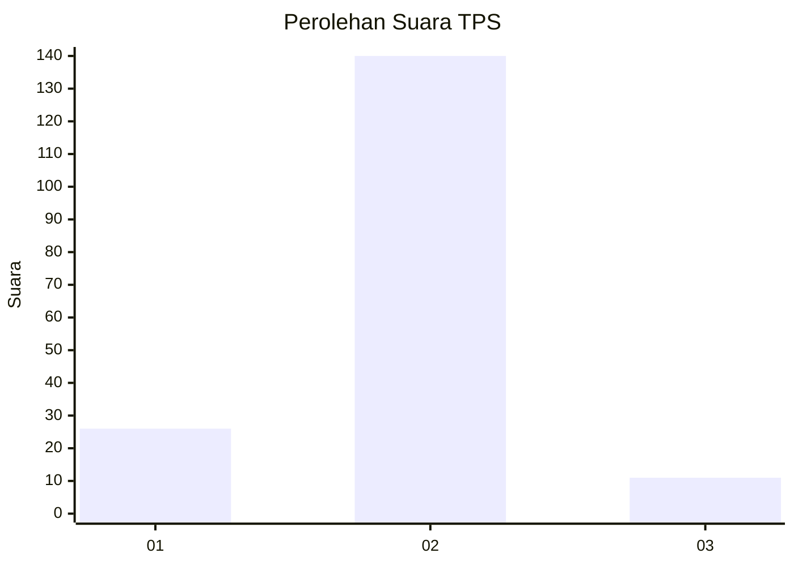
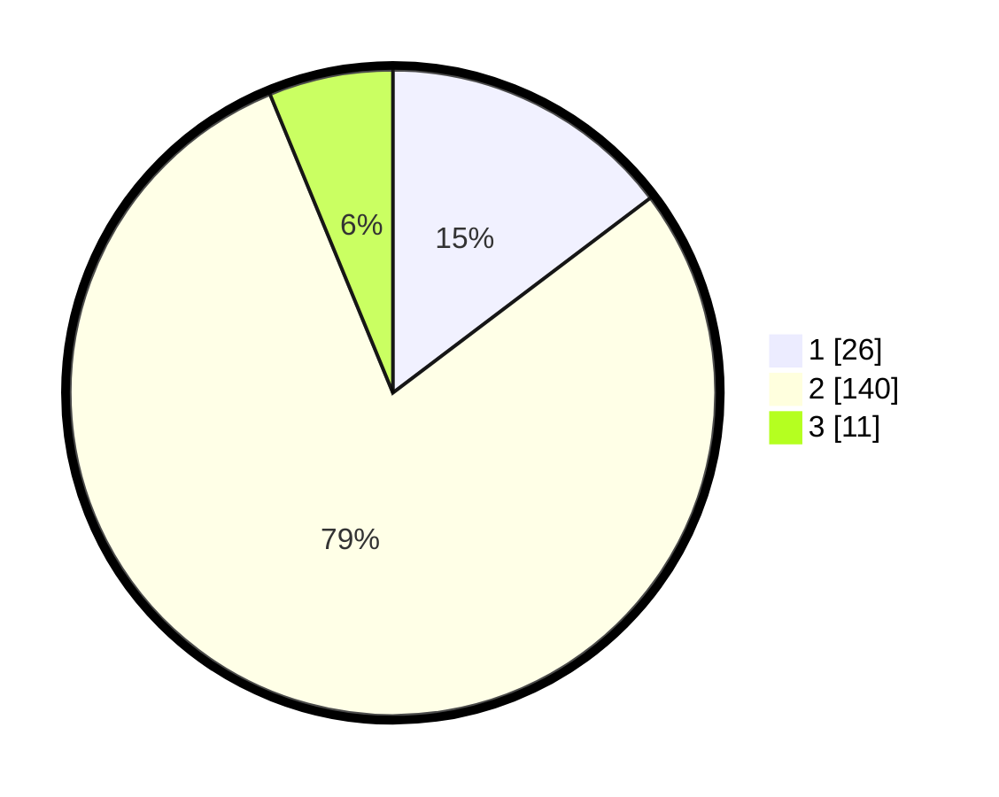

# Hasil

## Grafik

## Tabel

| No. | Nama Paslon    | Suara | Suara (raw) | Persentase |
|:--- |:-------------- | -----:| -----------:| ----------:|
| 1   | ANIES MUHAIMIN | 26    | [26][p-1]   | 14,69      |
| 2   | PRABOWO GIBRAN | 140   | [140][p-2]  | 79,10      |
| 3   | GANJAR MAHFUD  | 11    | [11][p-3]   | 6,21       |

[p-1]: https://github.com/gigit-pemilu/pemilu-2024-15-jambi/blob/main/pilpres/hitung-suara/sub/15-jambi/sub/08-bungo/sub/11-bathin-iii/sub/1001-manggis/sub/002-tps/sub/paslon-1.txt
[p-2]: https://github.com/gigit-pemilu/pemilu-2024-15-jambi/blob/main/pilpres/hitung-suara/sub/15-jambi/sub/08-bungo/sub/11-bathin-iii/sub/1001-manggis/sub/002-tps/sub/paslon-2.txt
[p-3]: https://github.com/gigit-pemilu/pemilu-2024-15-jambi/blob/main/pilpres/hitung-suara/sub/15-jambi/sub/08-bungo/sub/11-bathin-iii/sub/1001-manggis/sub/002-tps/sub/paslon-3.txt

## Foto C Plano

https://sirekap-obj-formc.kpu.go.id/a186/pemilu/ppwp/15/08/11/10/01/1508111001002-20240216-190821--36fa3309-d3a1-4e0a-a3aa-3056904a5753.jpg

https://sirekap-obj-formc.kpu.go.id/a186/pemilu/ppwp/15/08/11/10/01/1508111001002-20240216-180953--5c115fab-8b14-44f1-8b51-cc14b76a5508.jpg

https://sirekap-obj-formc.kpu.go.id/a186/pemilu/ppwp/15/08/11/10/01/1508111001002-20240216-181423--e4634abb-425e-4d68-9c8c-61d4f3fb021d.jpg

## Metadata

| Key        | Value               |
| ---------- | ------------------- |
| Time Stamp | 2024-02-16 23:30:00 |

