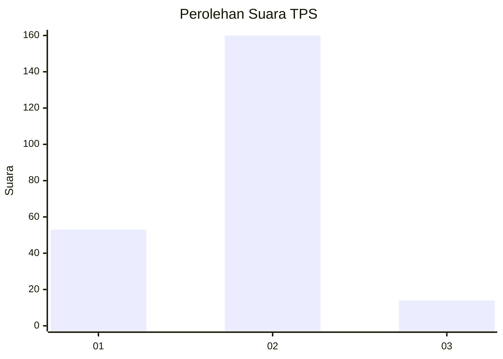

# Hasil

## Grafik

## Tabel

| No. | Nama Paslon    | Suara | Suara (raw) | Persentase |
|:--- |:-------------- | -----:| -----------:| ----------:|
| 1   | ANIES MUHAIMIN | 53    | [53][p-1]   | 23,35      |
| 2   | PRABOWO GIBRAN | 160   | [160][p-2]  | 70,48      |
| 3   | GANJAR MAHFUD  | 14    | [14][p-3]   | 6,17       |

[p-1]: https://github.com/gigit-pemilu/pemilu-2024-15-jambi/blob/main/pilpres/hitung-suara/sub/15-jambi/sub/08-bungo/sub/11-bathin-iii/sub/1001-manggis/sub/005-tps/sub/paslon-1.txt
[p-2]: https://github.com/gigit-pemilu/pemilu-2024-15-jambi/blob/main/pilpres/hitung-suara/sub/15-jambi/sub/08-bungo/sub/11-bathin-iii/sub/1001-manggis/sub/005-tps/sub/paslon-2.txt
[p-3]: https://github.com/gigit-pemilu/pemilu-2024-15-jambi/blob/main/pilpres/hitung-suara/sub/15-jambi/sub/08-bungo/sub/11-bathin-iii/sub/1001-manggis/sub/005-tps/sub/paslon-3.txt

## Foto C Plano

https://sirekap-obj-formc.kpu.go.id/b558/pemilu/ppwp/15/08/11/10/01/1508111001005-20240215-014708--910450ba-8692-4f28-8b0e-d6425cd1f745.jpg

https://sirekap-obj-formc.kpu.go.id/b558/pemilu/ppwp/15/08/11/10/01/1508111001005-20240215-013634--57a5c122-a083-4aac-bc6d-ddab5d576a1a.jpg

https://sirekap-obj-formc.kpu.go.id/b558/pemilu/ppwp/15/08/11/10/01/1508111001005-20240215-014812--fc89903a-39d9-4e05-b706-97f68e246e38.jpg

## Metadata

| Key        | Value               |
| ---------- | ------------------- |
| Time Stamp | 2024-02-15 22:30:27 |

