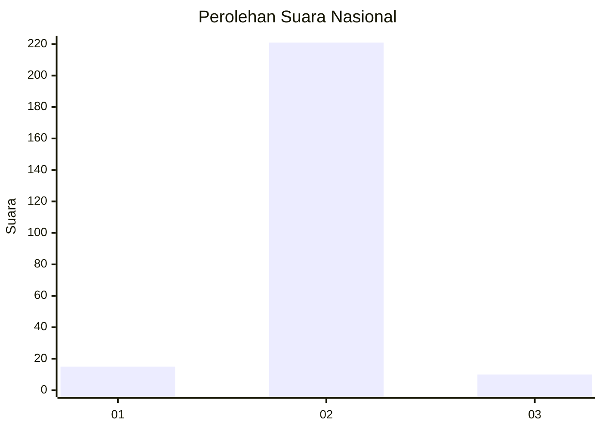
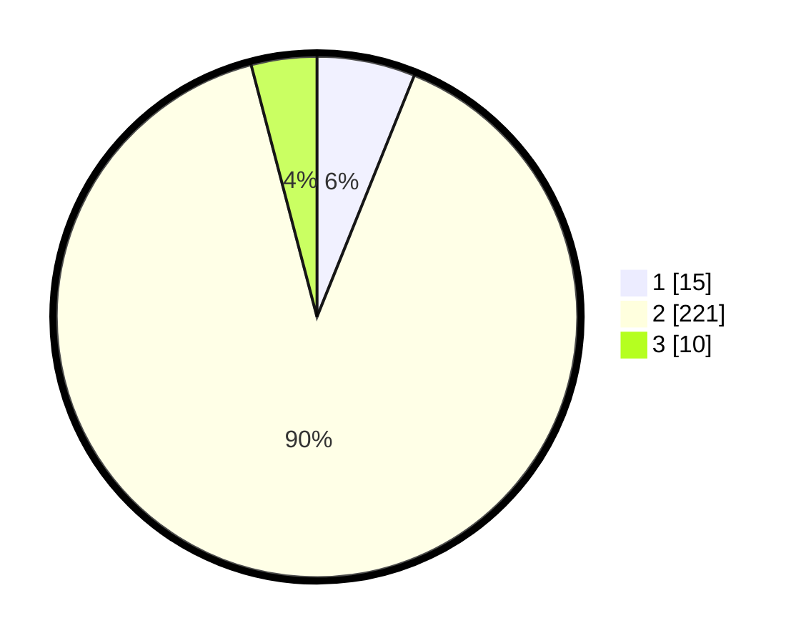

# Hasil

## Grafik

## Tabel

| No. | Nama Paslon    | Suara | Suara (raw) | Persentase |
|:--- |:-------------- | -----:| -----------:| ----------:|
| 1   | ANIES MUHAIMIN | 15    | [15][p-1]   | 6,10       |
| 2   | PRABOWO GIBRAN | 221   | [221][p-2]  | 89,84      |
| 3   | GANJAR MAHFUD  | 10    | [10][p-3]   | 4,07       |

[p-1]: https://github.com/gigit-pemilu/pemilu-2024/blob/main/pilpres/hitung-suara/sub/15-jambi/sub/08-bungo/sub/11-bathin-iii/sub/2008-teluk-panjang/sub/002-tps/sub/paslon-1.txt
[p-2]: https://github.com/gigit-pemilu/pemilu-2024/blob/main/pilpres/hitung-suara/sub/15-jambi/sub/08-bungo/sub/11-bathin-iii/sub/2008-teluk-panjang/sub/002-tps/sub/paslon-2.txt
[p-3]: https://github.com/gigit-pemilu/pemilu-2024/blob/main/pilpres/hitung-suara/sub/15-jambi/sub/08-bungo/sub/11-bathin-iii/sub/2008-teluk-panjang/sub/002-tps/sub/paslon-3.txt

## Foto C Plano

https://sirekap-obj-formc.kpu.go.id/3ae5/pemilu/ppwp/15/08/11/20/08/1508112008002-20240216-215443--aa5fb0cd-c128-47eb-b16c-b53d2248ce79.jpg

https://sirekap-obj-formc.kpu.go.id/3ae5/pemilu/ppwp/15/08/11/20/08/1508112008002-20240216-213752--79cd5868-d2e8-49fe-8c6f-190799d967c1.jpg

https://sirekap-obj-formc.kpu.go.id/3ae5/pemilu/ppwp/15/08/11/20/08/1508112008002-20240216-213951--1dd897fa-e512-4aac-a7a0-13ececb7efea.jpg

## Metadata

| Key        | Value               |
| ---------- | ------------------- |
| Time Stamp | 2024-02-24 22:31:28 |

