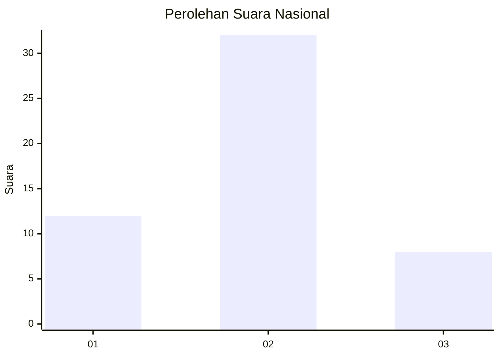
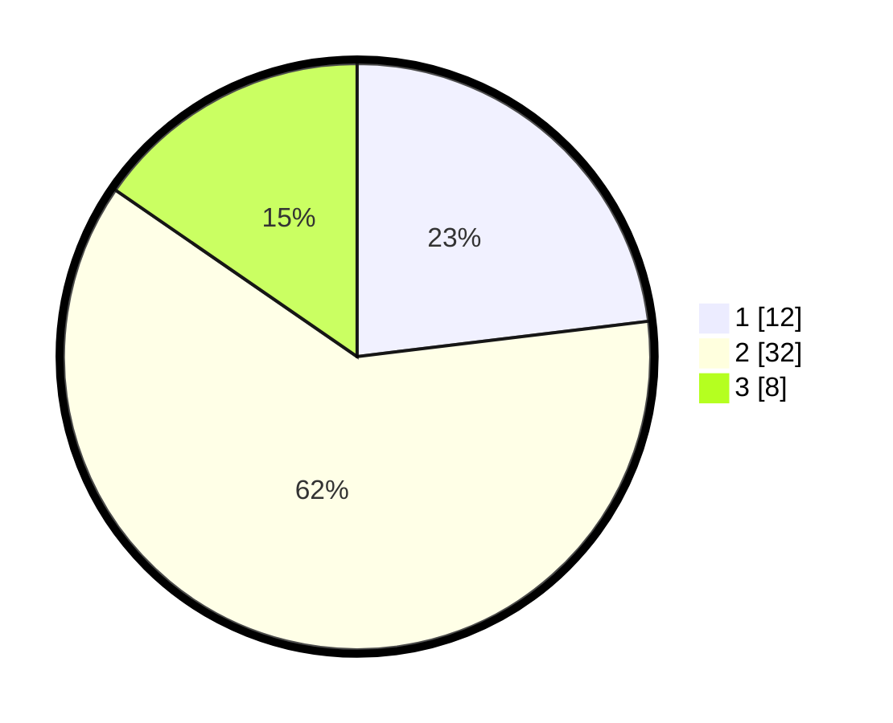

# Hasil

## Grafik

## Tabel

| No. | Nama Paslon    | Suara | Suara (raw) | Persentase |
|:--- |:-------------- | -----:| -----------:| ----------:|
| 1   | ANIES MUHAIMIN | 12    | [12][p-1]   | 23,08      |
| 2   | PRABOWO GIBRAN | 32    | [32][p-2]   | 61,54      |
| 3   | GANJAR MAHFUD  | 8     | [8][p-3]    | 15,38      |

[p-1]: https://github.com/gigit-pemilu/pemilu-2024/blob/main/pilpres/hitung-suara/sub/15-jambi/sub/08-bungo/sub/14-bathin-iii-ulu/sub/2001-muara-buat/sub/003-tps/sub/paslon-1.txt
[p-2]: https://github.com/gigit-pemilu/pemilu-2024/blob/main/pilpres/hitung-suara/sub/15-jambi/sub/08-bungo/sub/14-bathin-iii-ulu/sub/2001-muara-buat/sub/003-tps/sub/paslon-2.txt
[p-3]: https://github.com/gigit-pemilu/pemilu-2024/blob/main/pilpres/hitung-suara/sub/15-jambi/sub/08-bungo/sub/14-bathin-iii-ulu/sub/2001-muara-buat/sub/003-tps/sub/paslon-3.txt

## Foto C Plano

https://sirekap-obj-formc.kpu.go.id/f3a2/pemilu/ppwp/15/08/14/20/01/1508142001003-20240215-205529--b36fc989-0c2b-41c0-853f-34deed65531b.jpg

https://sirekap-obj-formc.kpu.go.id/f3a2/pemilu/ppwp/15/08/14/20/01/1508142001003-20240215-222121--d0621ce4-f48c-41c0-b43d-76a7e435b781.jpg

https://sirekap-obj-formc.kpu.go.id/f3a2/pemilu/ppwp/15/08/14/20/01/1508142001003-20240215-205827--4d910de2-ea81-40b1-a7b1-4c98a407db1e.jpg

## Metadata

| Key        | Value               |
| ---------- | ------------------- |
| Time Stamp | 2024-02-16 12:51:22 |

## DATA PEMILIH TETAP

Jumlah pemilih dalam DPT: **75**.
 * L: **39**.
 * P: **36**.

## DATA PENGGUNA HAK PILIH

Jumlah pengguna hak pilih dalam DPT: **53**.
 * L: **27**.
 * P: **26**.

Jumlah pengguna hak pilih dalam DPTb: **0**.
 * L: **0**.
 * P: **0**.

Jumlah pengguna hak pilih dalam DPK: **0**.
 * L: **0**.
 * P: **0**.

Jumlah pengguna hak pilih: **53**.
 * L: **27**.
 * P: **26**.

## JUMLAH SUARA SAH DAN TIDAK SAH

JUMLAH SELURUH SUARA SAH: **52**.

JUMLAH SUARA TIDAK SAH: **1**.

JUMLAH SELURUH SUARA SAH DAN SUARA TIDAK SAH: **53**.

