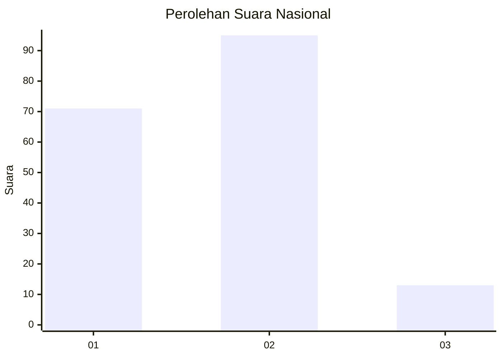

# Hasil

## Grafik

## Tabel

| No. | Nama Paslon    | Suara | Suara (raw) | Persentase |
|:--- |:-------------- | -----:| -----------:| ----------:|
| 1   | ANIES MUHAIMIN | 71    | [71][p-1]   | 39,66      |
| 2   | PRABOWO GIBRAN | 95    | [95][p-2]   | 53,07      |
| 3   | GANJAR MAHFUD  | 13    | [13][p-3]   | 7,26       |

[p-1]: https://github.com/gigit-pemilu/pemilu-2024/blob/main/pilpres/hitung-suara/sub/15-jambi/sub/08-bungo/sub/14-bathin-iii-ulu/sub/2002-buat/sub/002-tps/sub/paslon-1.txt
[p-2]: https://github.com/gigit-pemilu/pemilu-2024/blob/main/pilpres/hitung-suara/sub/15-jambi/sub/08-bungo/sub/14-bathin-iii-ulu/sub/2002-buat/sub/002-tps/sub/paslon-2.txt
[p-3]: https://github.com/gigit-pemilu/pemilu-2024/blob/main/pilpres/hitung-suara/sub/15-jambi/sub/08-bungo/sub/14-bathin-iii-ulu/sub/2002-buat/sub/002-tps/sub/paslon-3.txt

## Foto C Plano

https://sirekap-obj-formc.kpu.go.id/c6b9/pemilu/ppwp/15/08/14/20/02/1508142002002-20240215-074917--bbc4bed2-0890-4e87-9435-54b567254746.jpg

https://sirekap-obj-formc.kpu.go.id/c6b9/pemilu/ppwp/15/08/14/20/02/1508142002002-20240215-075049--25de9917-f5be-4750-b329-5bd2886c1e80.jpg

https://sirekap-obj-formc.kpu.go.id/c6b9/pemilu/ppwp/15/08/14/20/02/1508142002002-20240215-073643--c7e96d68-0375-4c85-ba2f-c4c8d216d15a.jpg

## Metadata

| Key        | Value               |
| ---------- | ------------------- |
| Time Stamp | 2024-02-25 18:00:00 |

