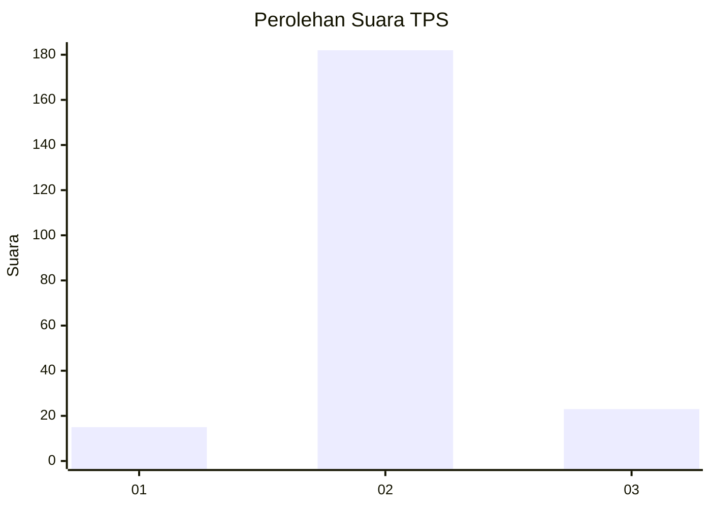
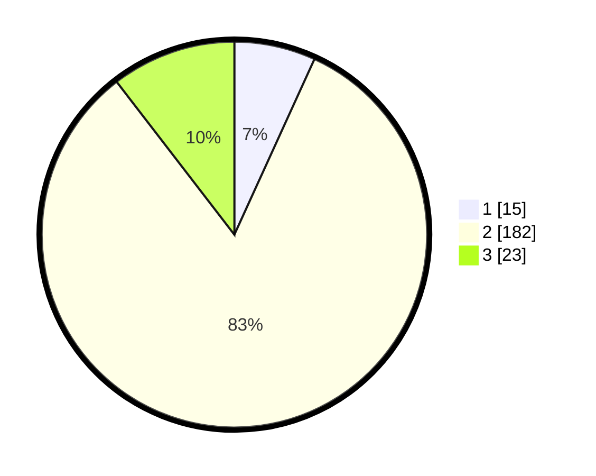

# Hasil

## Grafik

## Tabel

| No. | Nama Paslon    | Suara | Suara (raw) | Persentase |
|:--- |:-------------- | -----:| -----------:| ----------:|
| 1   | ANIES MUHAIMIN | 15    | [15][p-1]   | 6,82       |
| 2   | PRABOWO GIBRAN | 182   | [182][p-2]  | 82,73      |
| 3   | GANJAR MAHFUD  | 23    | [23][p-3]   | 10,45      |

[p-1]: https://github.com/gigit-pemilu/pemilu-2024-15-jambi/blob/main/pilpres/hitung-suara/sub/15-jambi/sub/08-bungo/sub/15-bathin-ii-pelayang/sub/2001-pelayang/sub/003-tps/sub/paslon-1.txt
[p-2]: https://github.com/gigit-pemilu/pemilu-2024-15-jambi/blob/main/pilpres/hitung-suara/sub/15-jambi/sub/08-bungo/sub/15-bathin-ii-pelayang/sub/2001-pelayang/sub/003-tps/sub/paslon-2.txt
[p-3]: https://github.com/gigit-pemilu/pemilu-2024-15-jambi/blob/main/pilpres/hitung-suara/sub/15-jambi/sub/08-bungo/sub/15-bathin-ii-pelayang/sub/2001-pelayang/sub/003-tps/sub/paslon-3.txt

## Foto C Plano

https://sirekap-obj-formc.kpu.go.id/7688/pemilu/ppwp/15/08/15/20/01/1508152001003-20240215-151100--a05b90d9-b83a-4e1f-bbd1-199002522d30.jpg

https://sirekap-obj-formc.kpu.go.id/7688/pemilu/ppwp/15/08/15/20/01/1508152001003-20240215-132622--9dee90d1-935c-41d4-b683-179021eb7a6d.jpg

https://sirekap-obj-formc.kpu.go.id/7688/pemilu/ppwp/15/08/15/20/01/1508152001003-20240215-132734--722570db-36c7-4873-ac72-65509dd5f0a7.jpg

## Metadata

| Key        | Value               |
| ---------- | ------------------- |
| Time Stamp | 2024-02-15 17:00:25 |

