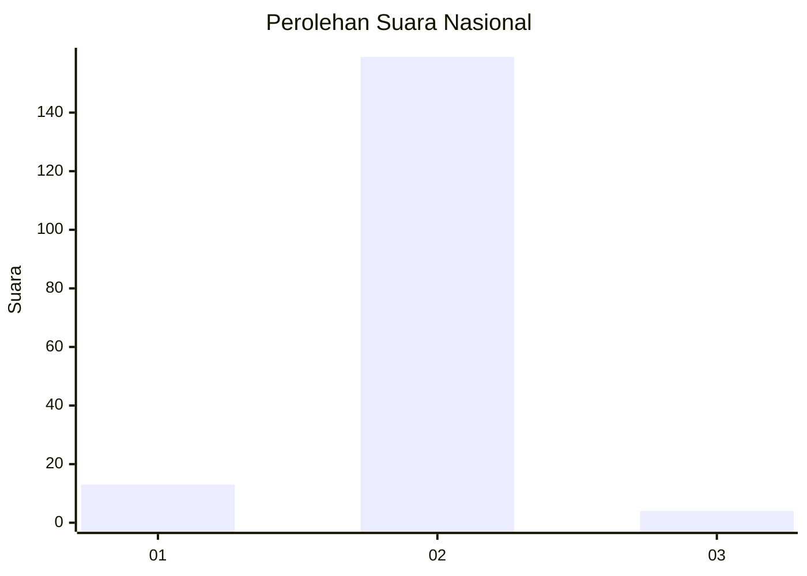
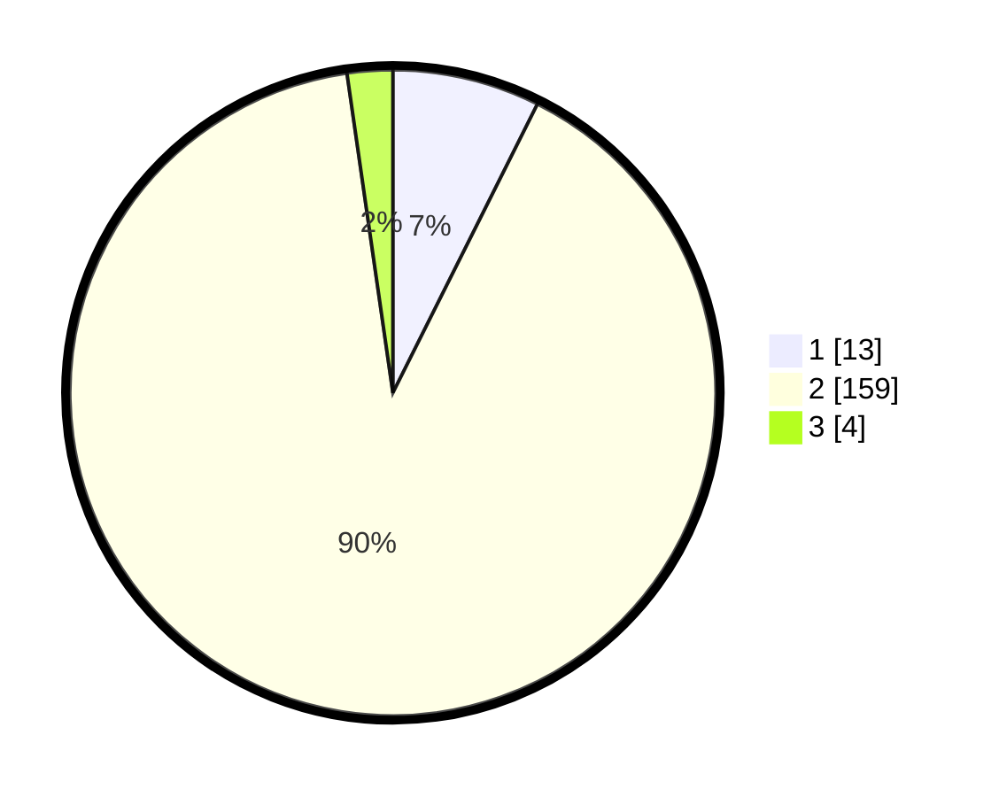

# Hasil

## Grafik

## Tabel

| No. | Nama Paslon    | Suara | Suara (raw) | Persentase |
|:--- |:-------------- | -----:| -----------:| ----------:|
| 1   | ANIES MUHAIMIN | 13    | [13][p-1]   | 7,39       |
| 2   | PRABOWO GIBRAN | 159   | [159][p-2]  | 90,34      |
| 3   | GANJAR MAHFUD  | 4     | [4][p-3]    | 2,27       |

[p-1]: https://github.com/gigit-pemilu/pemilu-2024/blob/main/pilpres/hitung-suara/sub/15-jambi/sub/08-bungo/sub/15-bathin-ii-pelayang/sub/2002-peninjau/sub/004-tps/sub/paslon-1.txt
[p-2]: https://github.com/gigit-pemilu/pemilu-2024/blob/main/pilpres/hitung-suara/sub/15-jambi/sub/08-bungo/sub/15-bathin-ii-pelayang/sub/2002-peninjau/sub/004-tps/sub/paslon-2.txt
[p-3]: https://github.com/gigit-pemilu/pemilu-2024/blob/main/pilpres/hitung-suara/sub/15-jambi/sub/08-bungo/sub/15-bathin-ii-pelayang/sub/2002-peninjau/sub/004-tps/sub/paslon-3.txt

## Foto C Plano

https://sirekap-obj-formc.kpu.go.id/c941/pemilu/ppwp/15/08/15/20/02/1508152002004-20240216-202146--b3ebd38d-c7b6-41a9-a5a1-84caffeaba96.jpg

https://sirekap-obj-formc.kpu.go.id/c941/pemilu/ppwp/15/08/15/20/02/1508152002004-20240215-005439--ba62d650-d13b-4c0b-ac4f-ed6c16525181.jpg

https://sirekap-obj-formc.kpu.go.id/c941/pemilu/ppwp/15/08/15/20/02/1508152002004-20240215-005506--fd64cba7-ea0c-41d9-bd7d-f2b4e70e3a1f.jpg

## Metadata

| Key        | Value               |
| ---------- | ------------------- |
| Time Stamp | 2024-02-16 21:01:00 |

