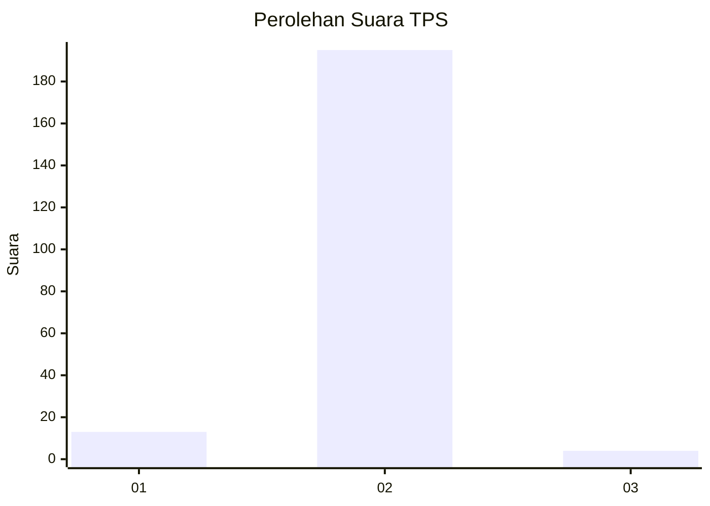
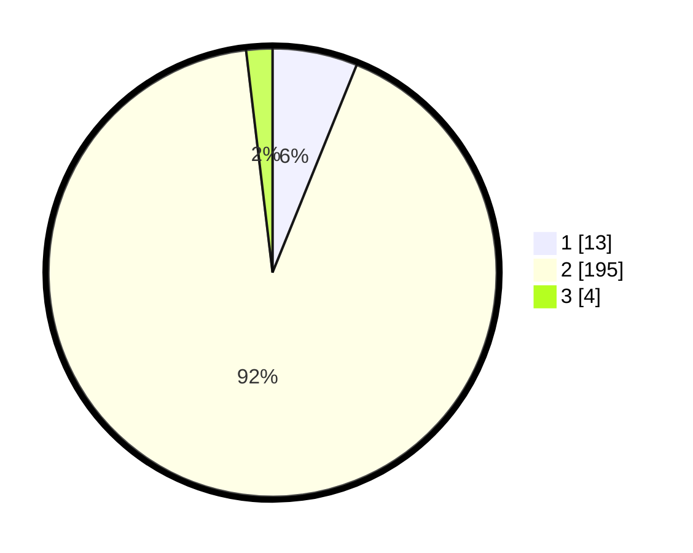

# Hasil

## Grafik

## Tabel

| No. | Nama Paslon    | Suara | Suara (raw) | Persentase |
|:--- |:-------------- | -----:| -----------:| ----------:|
| 1   | ANIES MUHAIMIN | 13    | [13][p-1]   | 6,13       |
| 2   | PRABOWO GIBRAN | 195   | [195][p-2]  | 91,98      |
| 3   | GANJAR MAHFUD  | 4     | [4][p-3]    | 1,89       |

[p-1]: https://github.com/gigit-pemilu/pemilu-2024-15-jambi/blob/main/pilpres/hitung-suara/sub/15-jambi/sub/08-bungo/sub/17-tanah-sepenggal-lintas/sub/2001-sungai-mancur/sub/003-tps/sub/paslon-1.txt
[p-2]: https://github.com/gigit-pemilu/pemilu-2024-15-jambi/blob/main/pilpres/hitung-suara/sub/15-jambi/sub/08-bungo/sub/17-tanah-sepenggal-lintas/sub/2001-sungai-mancur/sub/003-tps/sub/paslon-2.txt
[p-3]: https://github.com/gigit-pemilu/pemilu-2024-15-jambi/blob/main/pilpres/hitung-suara/sub/15-jambi/sub/08-bungo/sub/17-tanah-sepenggal-lintas/sub/2001-sungai-mancur/sub/003-tps/sub/paslon-3.txt

## Foto C Plano

https://sirekap-obj-formc.kpu.go.id/fbe6/pemilu/ppwp/15/08/17/20/01/1508172001003-20240215-063410--27a78fef-3e59-4c84-af65-e0e5e6c0a0b9.jpg

https://sirekap-obj-formc.kpu.go.id/fbe6/pemilu/ppwp/15/08/17/20/01/1508172001003-20240215-063645--512e42e2-bd67-4081-9d1c-3447202822ef.jpg

https://sirekap-obj-formc.kpu.go.id/fbe6/pemilu/ppwp/15/08/17/20/01/1508172001003-20240215-063913--e7fbae8e-771a-4b2c-96b3-e7641b14c69c.jpg

## Metadata

| Key        | Value               |
| ---------- | ------------------- |
| Time Stamp | 2024-02-15 19:00:26 |

