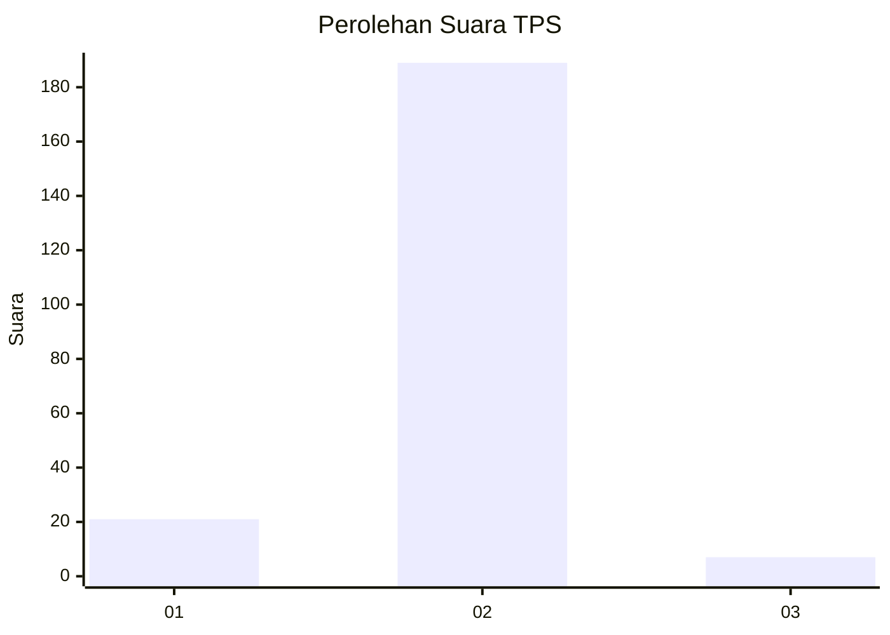
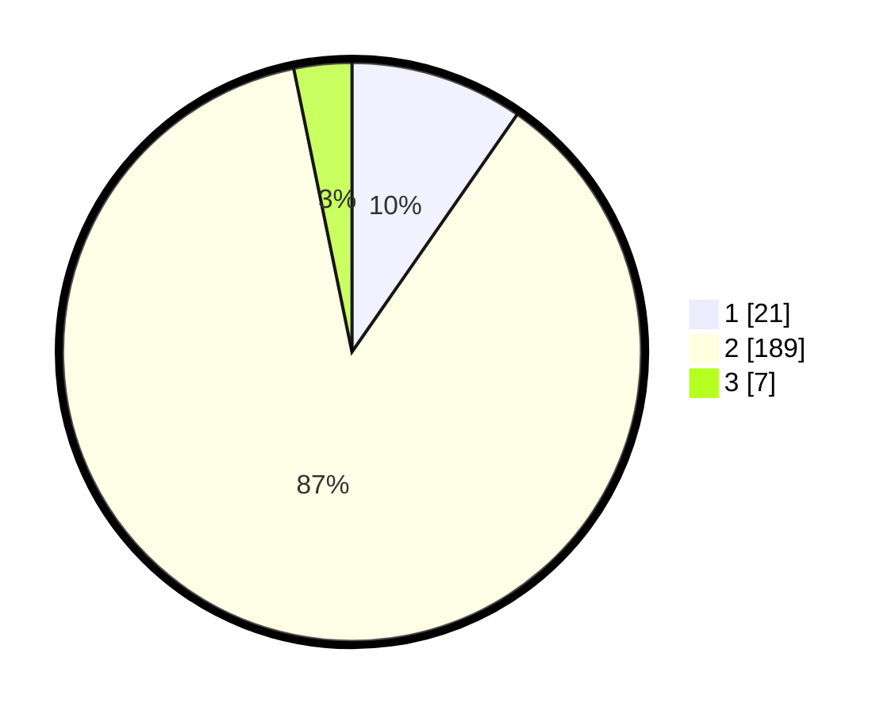

# Hasil

## Grafik

## Tabel

| No. | Nama Paslon    | Suara | Suara (raw) | Persentase |
|:--- |:-------------- | -----:| -----------:| ----------:|
| 1   | ANIES MUHAIMIN | 21    | [21][p-1]   | 9,68       |
| 2   | PRABOWO GIBRAN | 189   | [189][p-2]  | 87,10      |
| 3   | GANJAR MAHFUD  | 7     | [7][p-3]    | 3,23       |

[p-1]: https://github.com/gigit-pemilu/pemilu-2024-15-jambi/blob/main/pilpres/hitung-suara/sub/15-jambi/sub/08-bungo/sub/17-tanah-sepenggal-lintas/sub/2001-sungai-mancur/sub/004-tps/sub/paslon-1.txt
[p-2]: https://github.com/gigit-pemilu/pemilu-2024-15-jambi/blob/main/pilpres/hitung-suara/sub/15-jambi/sub/08-bungo/sub/17-tanah-sepenggal-lintas/sub/2001-sungai-mancur/sub/004-tps/sub/paslon-2.txt
[p-3]: https://github.com/gigit-pemilu/pemilu-2024-15-jambi/blob/main/pilpres/hitung-suara/sub/15-jambi/sub/08-bungo/sub/17-tanah-sepenggal-lintas/sub/2001-sungai-mancur/sub/004-tps/sub/paslon-3.txt

## Foto C Plano

https://sirekap-obj-formc.kpu.go.id/e03f/pemilu/ppwp/15/08/17/20/01/1508172001004-20240215-050042--e583dff6-db1d-4564-9bd2-e37a4bcda1e9.jpg

https://sirekap-obj-formc.kpu.go.id/e03f/pemilu/ppwp/15/08/17/20/01/1508172001004-20240215-050258--c2551e54-f63c-4ba6-b93d-8241a5de815e.jpg

https://sirekap-obj-formc.kpu.go.id/e03f/pemilu/ppwp/15/08/17/20/01/1508172001004-20240215-050704--dbc1ee3f-dc9f-4dfa-8f6a-579f178dc4f8.jpg

## Metadata

| Key        | Value               |
| ---------- | ------------------- |
| Time Stamp | 2024-02-15 15:30:25 |

