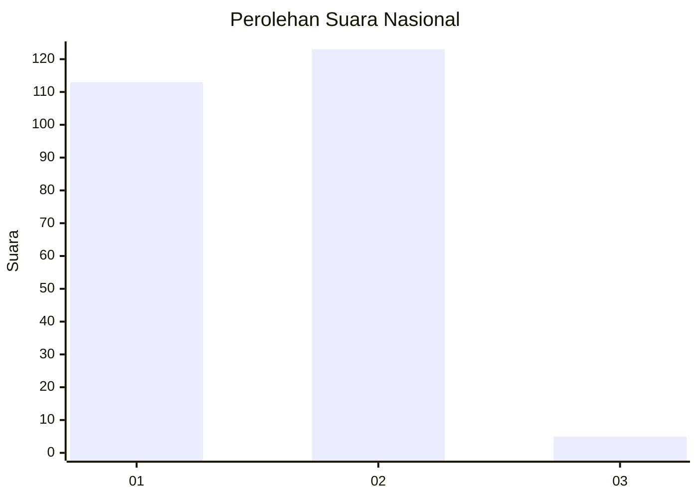
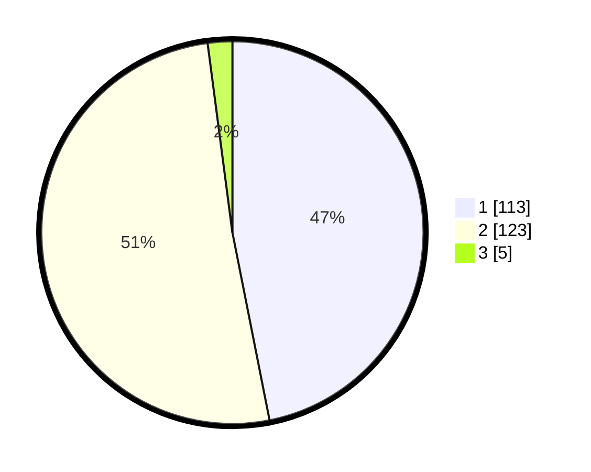

# Hasil

## Grafik

## Tabel

| No. | Nama Paslon    | Suara | Suara (raw) | Persentase |
|:--- |:-------------- | -----:| -----------:| ----------:|
| 1   | ANIES MUHAIMIN | 113   | [113][p-1]  | 46,89      |
| 2   | PRABOWO GIBRAN | 123   | [123][p-2]  | 51,04      |
| 3   | GANJAR MAHFUD  | 5     | [5][p-3]    | 2,07       |

[p-1]: https://github.com/gigit-pemilu/pemilu-2024/blob/main/pilpres/hitung-suara/sub/15-jambi/sub/09-tebo/sub/01-tebo-tengah/sub/1001-muara-tebo/sub/004-tps/sub/paslon-1.txt
[p-2]: https://github.com/gigit-pemilu/pemilu-2024/blob/main/pilpres/hitung-suara/sub/15-jambi/sub/09-tebo/sub/01-tebo-tengah/sub/1001-muara-tebo/sub/004-tps/sub/paslon-2.txt
[p-3]: https://github.com/gigit-pemilu/pemilu-2024/blob/main/pilpres/hitung-suara/sub/15-jambi/sub/09-tebo/sub/01-tebo-tengah/sub/1001-muara-tebo/sub/004-tps/sub/paslon-3.txt

## Foto C Plano

https://sirekap-obj-formc.kpu.go.id/cc47/pemilu/ppwp/15/09/01/10/01/1509011001004-20240222-182118--751b051c-ea7e-42b8-88c6-6711a1fea6ea.jpg

https://sirekap-obj-formc.kpu.go.id/cc47/pemilu/ppwp/15/09/01/10/01/1509011001004-20240214-204619--898e8536-70b6-444a-8433-00ea83e7fe9c.jpg

https://sirekap-obj-formc.kpu.go.id/cc47/pemilu/ppwp/15/09/01/10/01/1509011001004-20240214-204728--614f4531-ca69-4f0b-bb09-4769cde23bb6.jpg

## Metadata

| Key        | Value               |
| ---------- | ------------------- |
| Time Stamp | 2024-02-22 19:00:00 |

