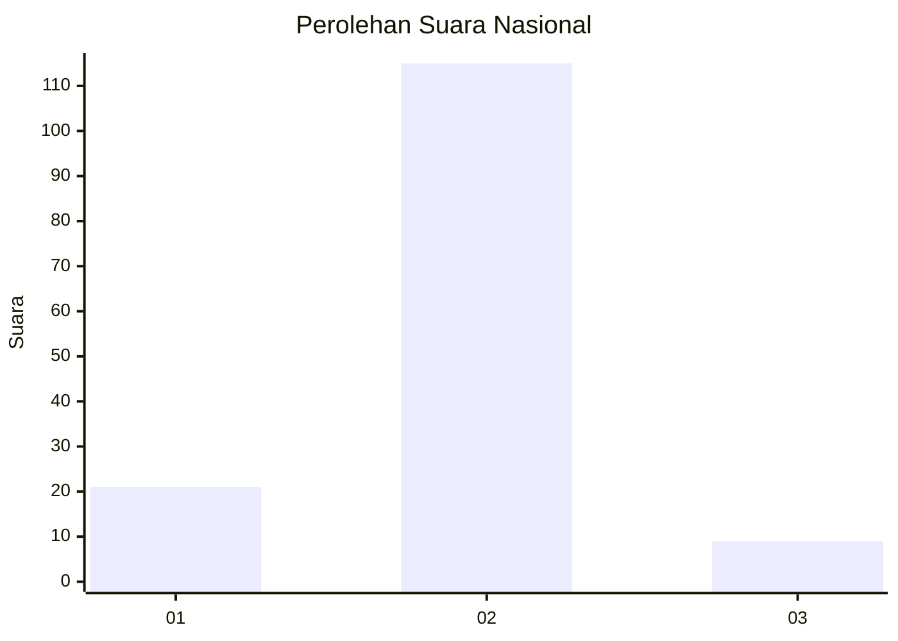
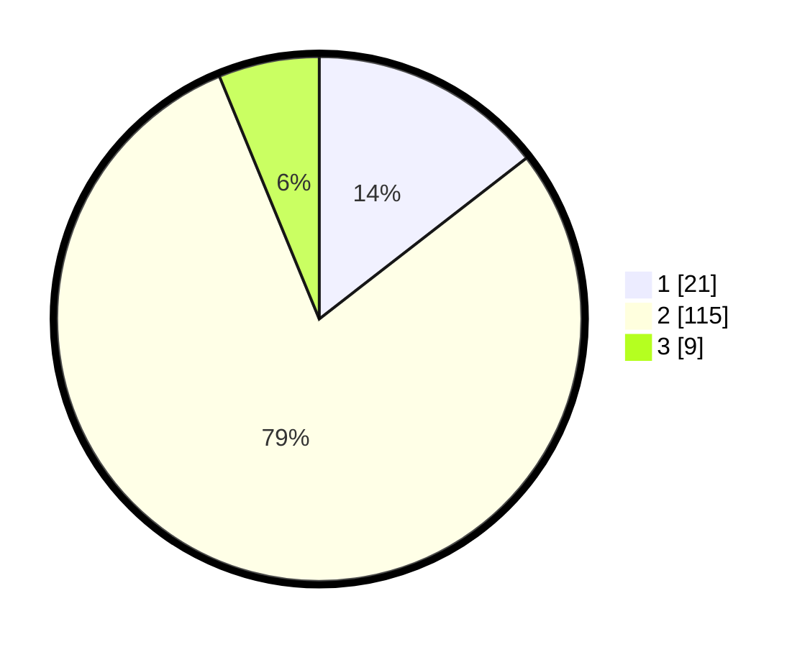

# Hasil

## Grafik

## Tabel

| No. | Nama Paslon    | Suara | Suara (raw) | Persentase |
|:--- |:-------------- | -----:| -----------:| ----------:|
| 1   | ANIES MUHAIMIN | 21    | [21][p-1]   | 14,48      |
| 2   | PRABOWO GIBRAN | 115   | [115][p-2]  | 79,31      |
| 3   | GANJAR MAHFUD  | 9     | [9][p-3]    | 6,21       |

[p-1]: https://github.com/gigit-pemilu/pemilu-2024/blob/main/pilpres/hitung-suara/sub/15-jambi/sub/09-tebo/sub/03-tebo-ulu/sub/2005-teluk-kasai-rambahan/sub/005-tps/sub/paslon-1.txt
[p-2]: https://github.com/gigit-pemilu/pemilu-2024/blob/main/pilpres/hitung-suara/sub/15-jambi/sub/09-tebo/sub/03-tebo-ulu/sub/2005-teluk-kasai-rambahan/sub/005-tps/sub/paslon-2.txt
[p-3]: https://github.com/gigit-pemilu/pemilu-2024/blob/main/pilpres/hitung-suara/sub/15-jambi/sub/09-tebo/sub/03-tebo-ulu/sub/2005-teluk-kasai-rambahan/sub/005-tps/sub/paslon-3.txt

## Foto C Plano

https://sirekap-obj-formc.kpu.go.id/db42/pemilu/ppwp/15/09/03/20/05/1509032005005-20240221-120236--1d2bfa3f-f72e-46ee-b352-b8b8d3c2ea9d.jpg

https://sirekap-obj-formc.kpu.go.id/db42/pemilu/ppwp/15/09/03/20/05/1509032005005-20240221-120444--441c2b8f-445a-4b5f-9213-6d657b273ae8.jpg

https://sirekap-obj-formc.kpu.go.id/db42/pemilu/ppwp/15/09/03/20/05/1509032005005-20240221-120653--802645df-80c0-4d0e-bdfc-287993d74d9c.jpg

## Metadata

| Key        | Value               |
| ---------- | ------------------- |
| Time Stamp | 2024-02-24 22:31:28 |

