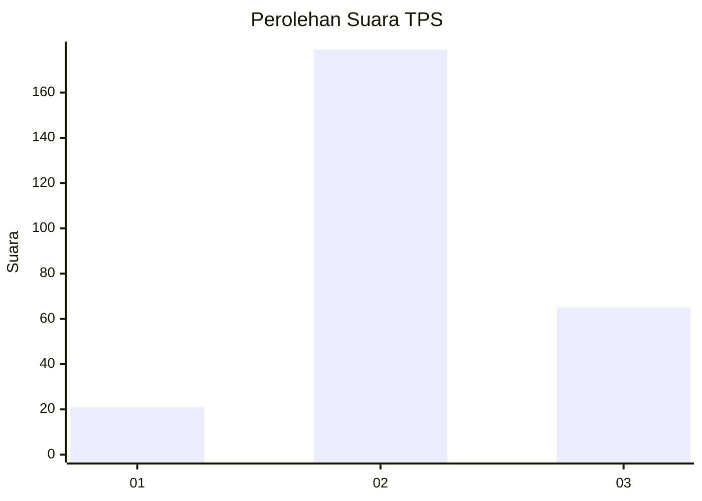
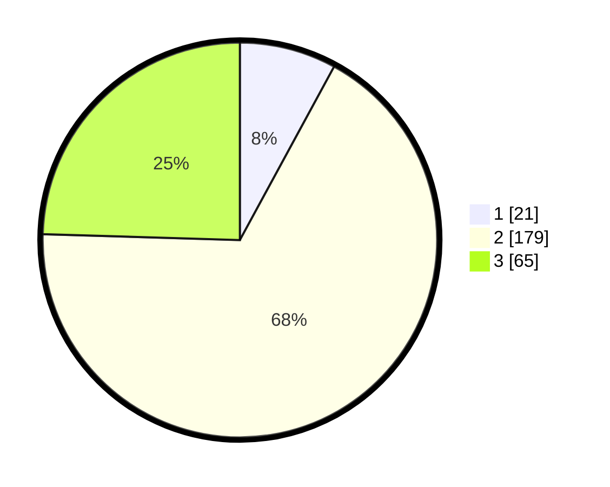

# Hasil

## Grafik

## Tabel

| No. | Nama Paslon    | Suara | Suara (raw) | Persentase |
|:--- |:-------------- | -----:| -----------:| ----------:|
| 1   | ANIES MUHAIMIN | 21    | [21][p-1]   | 7,92       |
| 2   | PRABOWO GIBRAN | 179   | [179][p-2]  | 67,55      |
| 3   | GANJAR MAHFUD  | 65    | [65][p-3]   | 24,53      |

[p-1]: https://github.com/gigit-pemilu/pemilu-2024-15-jambi/blob/main/pilpres/hitung-suara/sub/15-jambi/sub/09-tebo/sub/04-rimbo-bujang/sub/1009-sarana-agung/sub/002-tps/sub/paslon-1.txt
[p-2]: https://github.com/gigit-pemilu/pemilu-2024-15-jambi/blob/main/pilpres/hitung-suara/sub/15-jambi/sub/09-tebo/sub/04-rimbo-bujang/sub/1009-sarana-agung/sub/002-tps/sub/paslon-2.txt
[p-3]: https://github.com/gigit-pemilu/pemilu-2024-15-jambi/blob/main/pilpres/hitung-suara/sub/15-jambi/sub/09-tebo/sub/04-rimbo-bujang/sub/1009-sarana-agung/sub/002-tps/sub/paslon-3.txt

## Foto C Plano

https://sirekap-obj-formc.kpu.go.id/977f/pemilu/ppwp/15/09/04/10/09/1509041009002-20240218-105014--94246c48-a5f0-44e3-8e17-dd35c4d93da3.jpg

https://sirekap-obj-formc.kpu.go.id/977f/pemilu/ppwp/15/09/04/10/09/1509041009002-20240218-105053--a7203c76-2f55-4034-9400-659877535d39.jpg

https://sirekap-obj-formc.kpu.go.id/977f/pemilu/ppwp/15/09/04/10/09/1509041009002-20240218-105140--310764cf-9179-4b65-9f7d-ce157ac1372d.jpg

## Metadata

| Key        | Value               |
| ---------- | ------------------- |
| Time Stamp | 2024-02-24 22:31:28 |

