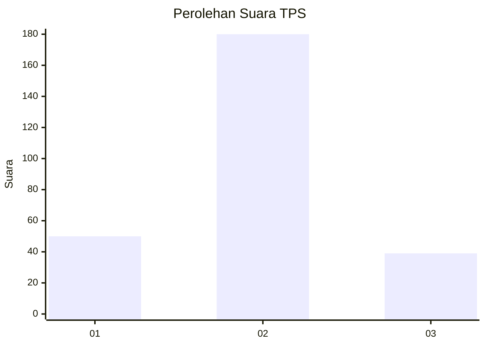
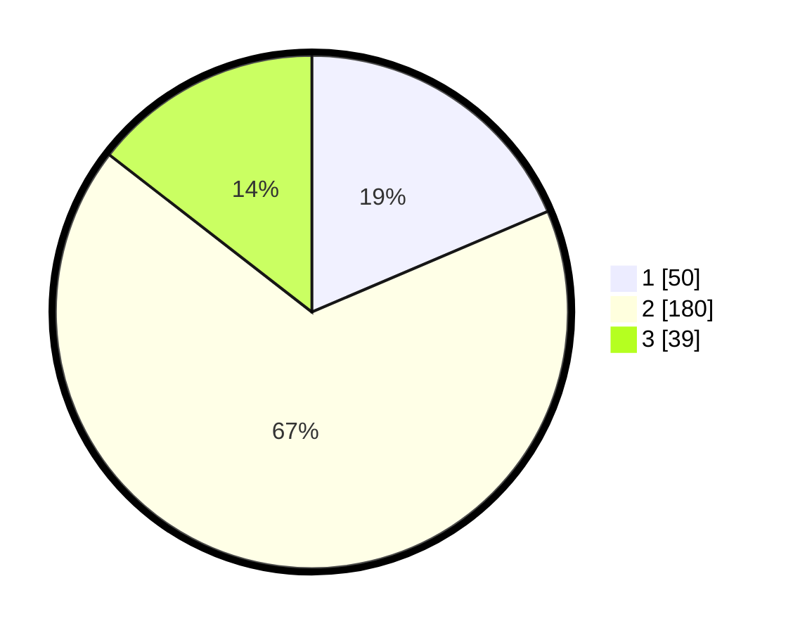

# Hasil

## Grafik

## Tabel

| No. | Nama Paslon    | Suara | Suara (raw) | Persentase |
|:--- |:-------------- | -----:| -----------:| ----------:|
| 1   | ANIES MUHAIMIN | 50    | [50][p-1]   | 18,59      |
| 2   | PRABOWO GIBRAN | 180   | [180][p-2]  | 66,91      |
| 3   | GANJAR MAHFUD  | 39    | [39][p-3]   | 14,50      |

[p-1]: https://github.com/gigit-pemilu/pemilu-2024-15-jambi/blob/main/pilpres/hitung-suara/sub/15-jambi/sub/09-tebo/sub/04-rimbo-bujang/sub/1009-sarana-agung/sub/007-tps/sub/paslon-1.txt
[p-2]: https://github.com/gigit-pemilu/pemilu-2024-15-jambi/blob/main/pilpres/hitung-suara/sub/15-jambi/sub/09-tebo/sub/04-rimbo-bujang/sub/1009-sarana-agung/sub/007-tps/sub/paslon-2.txt
[p-3]: https://github.com/gigit-pemilu/pemilu-2024-15-jambi/blob/main/pilpres/hitung-suara/sub/15-jambi/sub/09-tebo/sub/04-rimbo-bujang/sub/1009-sarana-agung/sub/007-tps/sub/paslon-3.txt

## Foto C Plano

https://sirekap-obj-formc.kpu.go.id/5a9e/pemilu/ppwp/15/09/04/10/09/1509041009007-20240218-190115--ac3242d3-7e8c-4090-b58c-586cd85bf859.jpg

https://sirekap-obj-formc.kpu.go.id/5a9e/pemilu/ppwp/15/09/04/10/09/1509041009007-20240218-190344--74812e71-f767-46e9-876d-192ffa78953d.jpg

https://sirekap-obj-formc.kpu.go.id/5a9e/pemilu/ppwp/15/09/04/10/09/1509041009007-20240218-190943--e3c0286e-7ab6-4bb0-822c-55e9502116e7.jpg

## Metadata

| Key        | Value               |
| ---------- | ------------------- |
| Time Stamp | 2024-02-24 22:31:28 |

