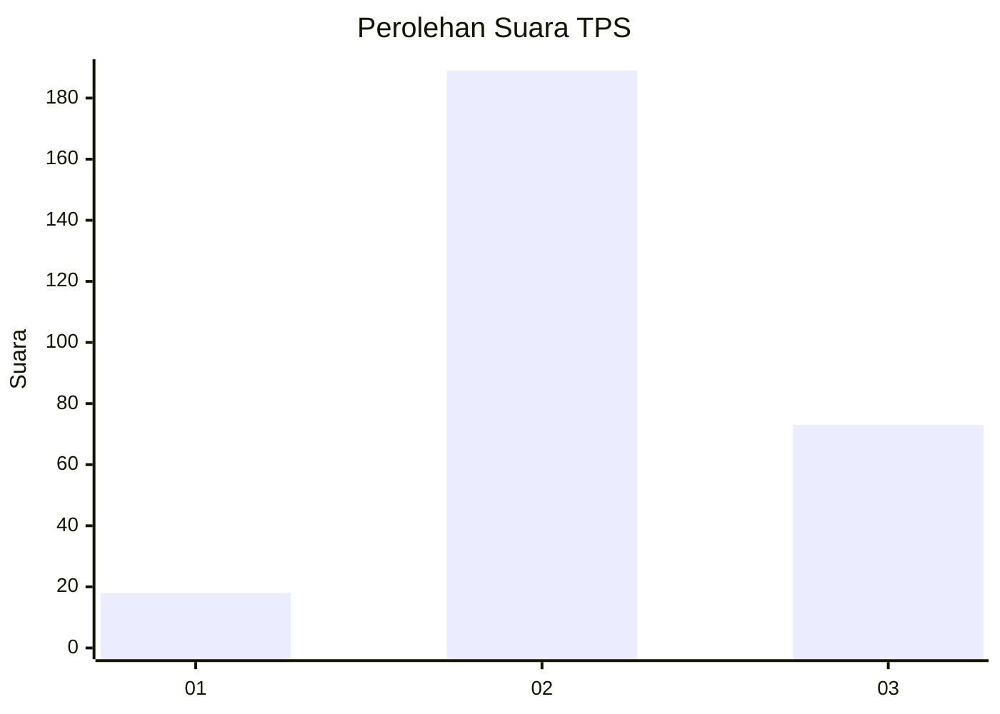
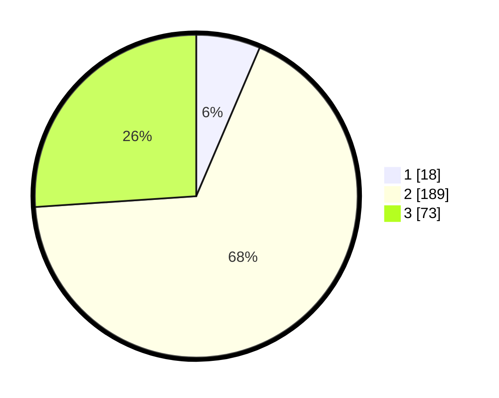

# Hasil

## Grafik

## Tabel

| No. | Nama Paslon    | Suara | Suara (raw) | Persentase |
|:--- |:-------------- | -----:| -----------:| ----------:|
| 1   | ANIES MUHAIMIN | 18    | [18][p-1]   | 6,43       |
| 2   | PRABOWO GIBRAN | 189   | [189][p-2]  | 67,50      |
| 3   | GANJAR MAHFUD  | 73    | [73][p-3]   | 26,07      |

[p-1]: https://github.com/gigit-pemilu/pemilu-2024-15-jambi/blob/main/pilpres/hitung-suara/sub/15-jambi/sub/09-tebo/sub/04-rimbo-bujang/sub/2005-tegal-arum/sub/012-tps/sub/paslon-1.txt
[p-2]: https://github.com/gigit-pemilu/pemilu-2024-15-jambi/blob/main/pilpres/hitung-suara/sub/15-jambi/sub/09-tebo/sub/04-rimbo-bujang/sub/2005-tegal-arum/sub/012-tps/sub/paslon-2.txt
[p-3]: https://github.com/gigit-pemilu/pemilu-2024-15-jambi/blob/main/pilpres/hitung-suara/sub/15-jambi/sub/09-tebo/sub/04-rimbo-bujang/sub/2005-tegal-arum/sub/012-tps/sub/paslon-3.txt

## Foto C Plano

https://sirekap-obj-formc.kpu.go.id/d0e8/pemilu/ppwp/15/09/04/20/05/1509042005012-20240221-095301--228064a1-0606-406f-8004-563bdfe8ebc6.jpg

https://sirekap-obj-formc.kpu.go.id/d0e8/pemilu/ppwp/15/09/04/20/05/1509042005012-20240221-095355--6b53ec15-2265-417d-8738-03dde543e1cd.jpg

https://sirekap-obj-formc.kpu.go.id/d0e8/pemilu/ppwp/15/09/04/20/05/1509042005012-20240221-095444--d4b3e8d8-96ce-46e0-a530-8c6e4a40ac2a.jpg

## Metadata

| Key        | Value               |
| ---------- | ------------------- |
| Time Stamp | 2024-02-24 22:31:28 |

