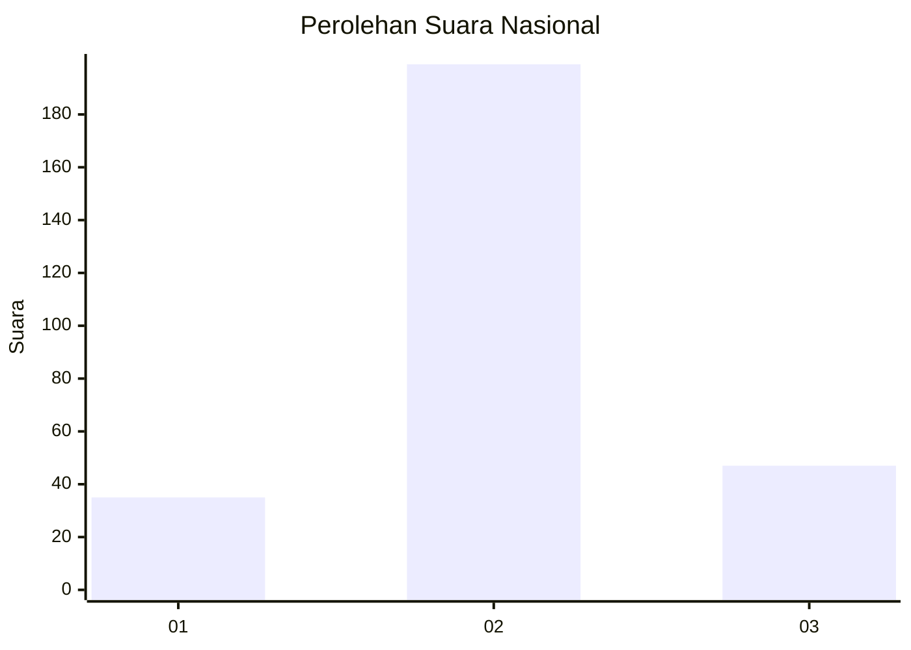
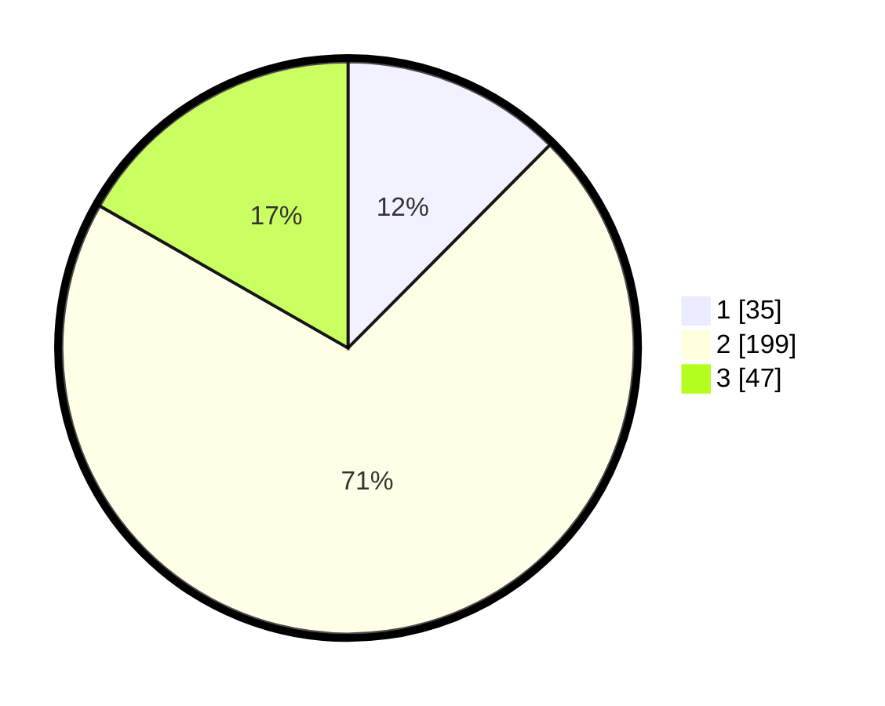

# Hasil

## Grafik

## Tabel

| No. | Nama Paslon    | Suara | Suara (raw) | Persentase |
|:--- |:-------------- | -----:| -----------:| ----------:|
| 1   | ANIES MUHAIMIN | 35    | [35][p-1]   | 12,46      |
| 2   | PRABOWO GIBRAN | 199   | [199][p-2]  | 70,82      |
| 3   | GANJAR MAHFUD  | 47    | [47][p-3]   | 16,73      |

[p-1]: https://github.com/gigit-pemilu/pemilu-2024/blob/main/pilpres/hitung-suara/sub/15-jambi/sub/09-tebo/sub/04-rimbo-bujang/sub/2012-purwo-dadi/sub/007-tps/sub/paslon-1.txt
[p-2]: https://github.com/gigit-pemilu/pemilu-2024/blob/main/pilpres/hitung-suara/sub/15-jambi/sub/09-tebo/sub/04-rimbo-bujang/sub/2012-purwo-dadi/sub/007-tps/sub/paslon-2.txt
[p-3]: https://github.com/gigit-pemilu/pemilu-2024/blob/main/pilpres/hitung-suara/sub/15-jambi/sub/09-tebo/sub/04-rimbo-bujang/sub/2012-purwo-dadi/sub/007-tps/sub/paslon-3.txt

## Foto C Plano

https://sirekap-obj-formc.kpu.go.id/4083/pemilu/ppwp/15/09/04/20/12/1509042012007-20240218-105252--31cdeee0-ad0e-4ea3-af4a-4601f5b849b0.jpg

https://sirekap-obj-formc.kpu.go.id/4083/pemilu/ppwp/15/09/04/20/12/1509042012007-20240218-105406--2b0cbc42-8c0a-47a0-8126-cc5dbdfc9d9b.jpg

https://sirekap-obj-formc.kpu.go.id/4083/pemilu/ppwp/15/09/04/20/12/1509042012007-20240218-105515--911c73f9-7fb7-4bf5-8163-7aab8a89e91a.jpg

## Metadata

| Key        | Value               |
| ---------- | ------------------- |
| Time Stamp | 2024-02-24 22:31:28 |

