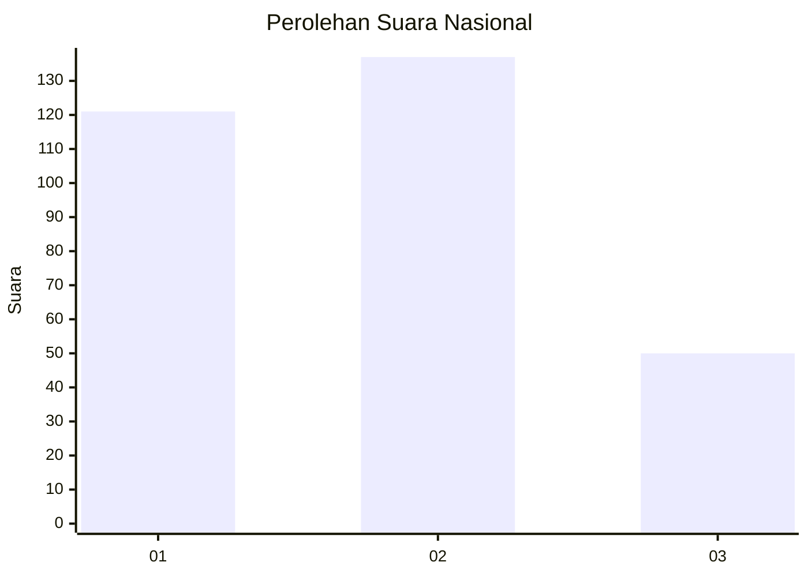
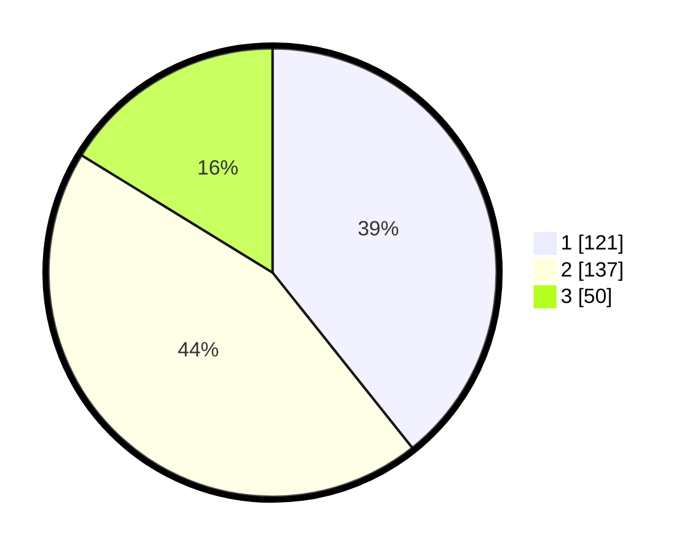

# Hasil

## Grafik

## Tabel

| No. | Nama Paslon    | Suara | Suara (raw) | Persentase |
|:--- |:-------------- | -----:| -----------:| ----------:|
| 1   | ANIES MUHAIMIN | 121   | [121][p-1]  | 39,29      |
| 2   | PRABOWO GIBRAN | 137   | [137][p-2]  | 44,48      |
| 3   | GANJAR MAHFUD  | 50    | [50][p-3]   | 16,23      |

[p-1]: https://github.com/gigit-pemilu/pemilu-2024/blob/main/pilpres/hitung-suara/sub/15-jambi/sub/09-tebo/sub/04-rimbo-bujang/sub/2012-purwo-dadi/sub/008-tps/sub/paslon-1.txt
[p-2]: https://github.com/gigit-pemilu/pemilu-2024/blob/main/pilpres/hitung-suara/sub/15-jambi/sub/09-tebo/sub/04-rimbo-bujang/sub/2012-purwo-dadi/sub/008-tps/sub/paslon-2.txt
[p-3]: https://github.com/gigit-pemilu/pemilu-2024/blob/main/pilpres/hitung-suara/sub/15-jambi/sub/09-tebo/sub/04-rimbo-bujang/sub/2012-purwo-dadi/sub/008-tps/sub/paslon-3.txt

## Foto C Plano

https://sirekap-obj-formc.kpu.go.id/7b42/pemilu/ppwp/15/09/04/20/12/1509042012008-20240218-134733--132c8a79-53a0-4d92-be1c-876110e19055.jpg

https://sirekap-obj-formc.kpu.go.id/7b42/pemilu/ppwp/15/09/04/20/12/1509042012008-20240218-134446--eddbc988-511b-4b8f-b652-00d998847660.jpg

https://sirekap-obj-formc.kpu.go.id/7b42/pemilu/ppwp/15/09/04/20/12/1509042012008-20240218-134624--623bbf3d-8228-4b4e-ad6f-5d5c03e0405b.jpg

## Metadata

| Key        | Value               |
| ---------- | ------------------- |
| Time Stamp | 2024-02-24 22:31:28 |

