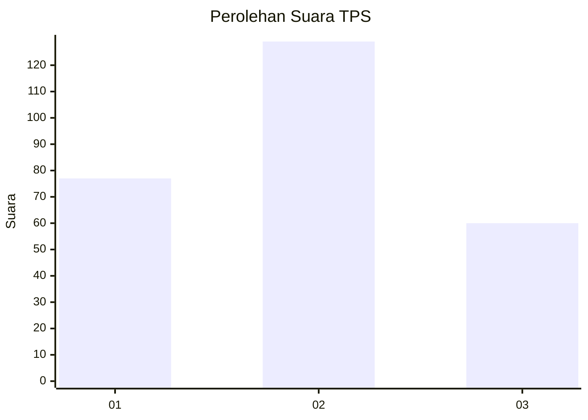
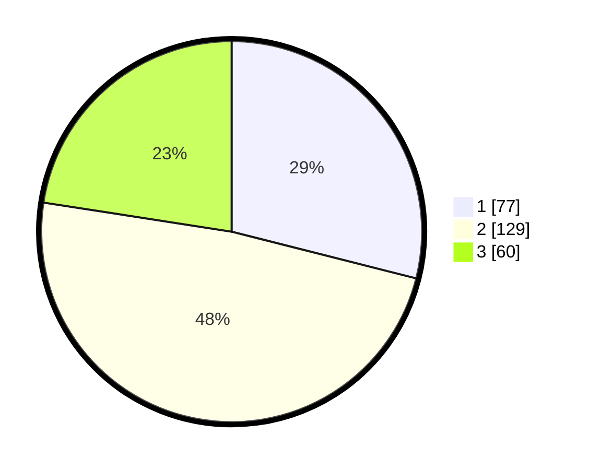

# Hasil

## Grafik

## Tabel

| No. | Nama Paslon    | Suara | Suara (raw) | Persentase |
|:--- |:-------------- | -----:| -----------:| ----------:|
| 1   | ANIES MUHAIMIN | 77    | [77][p-1]   | 28,95      |
| 2   | PRABOWO GIBRAN | 129   | [129][p-2]  | 48,50      |
| 3   | GANJAR MAHFUD  | 60    | [60][p-3]   | 22,56      |

[p-1]: https://github.com/gigit-pemilu/pemilu-2024-15-jambi/blob/main/pilpres/hitung-suara/sub/15-jambi/sub/09-tebo/sub/04-rimbo-bujang/sub/2015-perintis-makmur/sub/006-tps/sub/paslon-1.txt
[p-2]: https://github.com/gigit-pemilu/pemilu-2024-15-jambi/blob/main/pilpres/hitung-suara/sub/15-jambi/sub/09-tebo/sub/04-rimbo-bujang/sub/2015-perintis-makmur/sub/006-tps/sub/paslon-2.txt
[p-3]: https://github.com/gigit-pemilu/pemilu-2024-15-jambi/blob/main/pilpres/hitung-suara/sub/15-jambi/sub/09-tebo/sub/04-rimbo-bujang/sub/2015-perintis-makmur/sub/006-tps/sub/paslon-3.txt

## Foto C Plano

https://sirekap-obj-formc.kpu.go.id/e98c/pemilu/ppwp/15/09/04/20/15/1509042015006-20240220-101826--bc5ac888-4dfe-4a1e-9436-b6420ea50acb.jpg

https://sirekap-obj-formc.kpu.go.id/e98c/pemilu/ppwp/15/09/04/20/15/1509042015006-20240220-101844--73972734-3c2f-4957-a71b-78cfd25f47e2.jpg

https://sirekap-obj-formc.kpu.go.id/e98c/pemilu/ppwp/15/09/04/20/15/1509042015006-20240220-101902--0a33adbe-5150-4279-a883-c054fac2b3c2.jpg

## Metadata

| Key        | Value               |
| ---------- | ------------------- |
| Time Stamp | 2024-02-24 22:31:28 |

