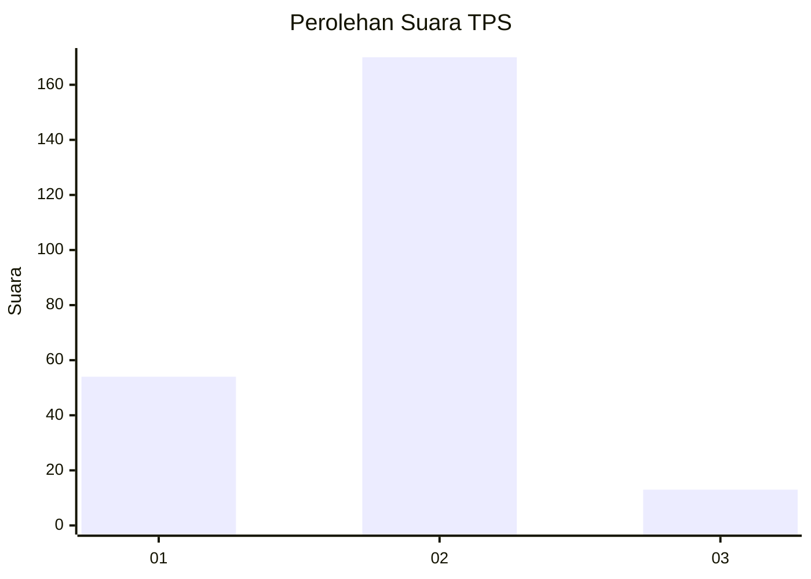
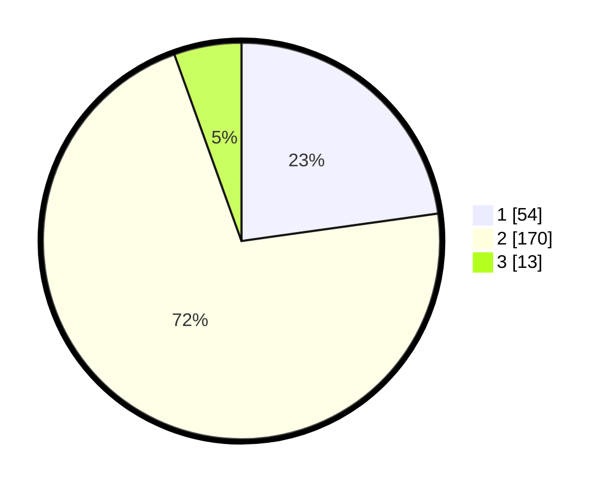

# Hasil

## Grafik

## Tabel

| No. | Nama Paslon    | Suara | Suara (raw) | Persentase |
|:--- |:-------------- | -----:| -----------:| ----------:|
| 1   | ANIES MUHAIMIN | 54    | [54][p-1]   | 22,78      |
| 2   | PRABOWO GIBRAN | 170   | [170][p-2]  | 71,73      |
| 3   | GANJAR MAHFUD  | 13    | [13][p-3]   | 5,49       |

[p-1]: https://github.com/gigit-pemilu/pemilu-2024-15-jambi/blob/main/pilpres/hitung-suara/sub/15-jambi/sub/09-tebo/sub/05-sumay/sub/2007-tuo-sumay/sub/002-tps/sub/paslon-1.txt
[p-2]: https://github.com/gigit-pemilu/pemilu-2024-15-jambi/blob/main/pilpres/hitung-suara/sub/15-jambi/sub/09-tebo/sub/05-sumay/sub/2007-tuo-sumay/sub/002-tps/sub/paslon-2.txt
[p-3]: https://github.com/gigit-pemilu/pemilu-2024-15-jambi/blob/main/pilpres/hitung-suara/sub/15-jambi/sub/09-tebo/sub/05-sumay/sub/2007-tuo-sumay/sub/002-tps/sub/paslon-3.txt

## Foto C Plano

https://sirekap-obj-formc.kpu.go.id/b209/pemilu/ppwp/15/09/05/20/07/1509052007002-20240217-073710--cedb0522-ca7e-4f5b-9555-b72d5ca17b56.jpg

https://sirekap-obj-formc.kpu.go.id/b209/pemilu/ppwp/15/09/05/20/07/1509052007002-20240217-080158--1109c9cc-5eb9-441b-9357-d95376929e61.jpg

https://sirekap-obj-formc.kpu.go.id/b209/pemilu/ppwp/15/09/05/20/07/1509052007002-20240217-074208--aefdc459-509b-46f5-9b71-88de6e024a19.jpg

## Metadata

| Key        | Value               |
| ---------- | ------------------- |
| Time Stamp | 2024-02-24 22:31:28 |

