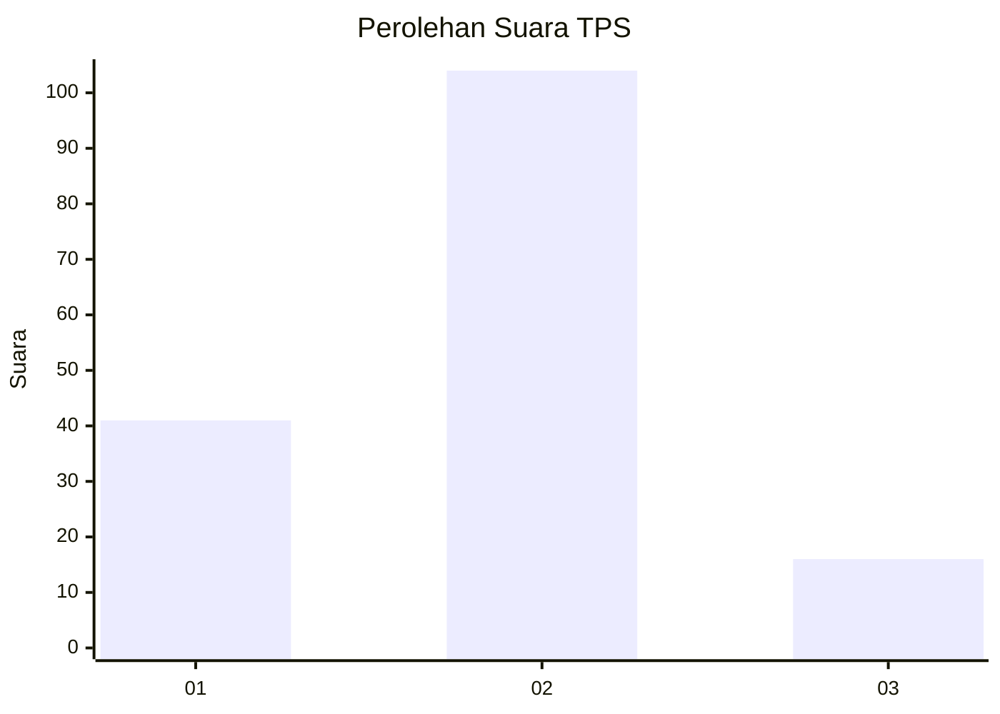
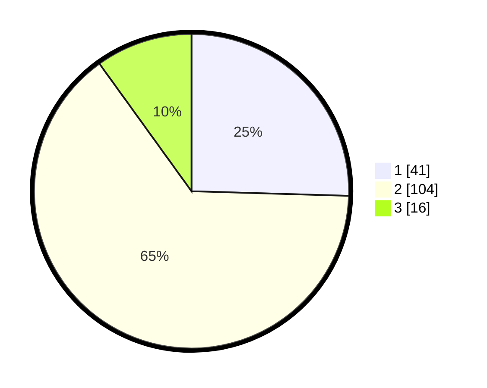

# Hasil

## Grafik

## Tabel

| No. | Nama Paslon    | Suara | Suara (raw) | Persentase |
|:--- |:-------------- | -----:| -----------:| ----------:|
| 1   | ANIES MUHAIMIN | 41    | [41][p-1]   | 25,47      |
| 2   | PRABOWO GIBRAN | 104   | [104][p-2]  | 64,60      |
| 3   | GANJAR MAHFUD  | 16    | [16][p-3]   | 9,94       |

[p-1]: https://github.com/gigit-pemilu/pemilu-2024-15-jambi/blob/main/pilpres/hitung-suara/sub/15-jambi/sub/09-tebo/sub/06-vii-koto/sub/2001-tanjung-pucuk-jambi/sub/003-tps/sub/paslon-1.txt
[p-2]: https://github.com/gigit-pemilu/pemilu-2024-15-jambi/blob/main/pilpres/hitung-suara/sub/15-jambi/sub/09-tebo/sub/06-vii-koto/sub/2001-tanjung-pucuk-jambi/sub/003-tps/sub/paslon-2.txt
[p-3]: https://github.com/gigit-pemilu/pemilu-2024-15-jambi/blob/main/pilpres/hitung-suara/sub/15-jambi/sub/09-tebo/sub/06-vii-koto/sub/2001-tanjung-pucuk-jambi/sub/003-tps/sub/paslon-3.txt

## Foto C Plano

https://sirekap-obj-formc.kpu.go.id/c697/pemilu/ppwp/15/09/06/20/01/1509062001003-20240215-082856--fab354f2-e067-465c-98ae-309a056b2079.jpg

https://sirekap-obj-formc.kpu.go.id/c697/pemilu/ppwp/15/09/06/20/01/1509062001003-20240215-083015--bb359cd4-7623-4a03-bffb-3051b4de199b.jpg

https://sirekap-obj-formc.kpu.go.id/c697/pemilu/ppwp/15/09/06/20/01/1509062001003-20240215-083149--00c98a75-7a3b-4a6c-ab62-5de28d8aaca7.jpg

## Metadata

| Key        | Value               |
| ---------- | ------------------- |
| Time Stamp | 2024-02-15 15:00:29 |

