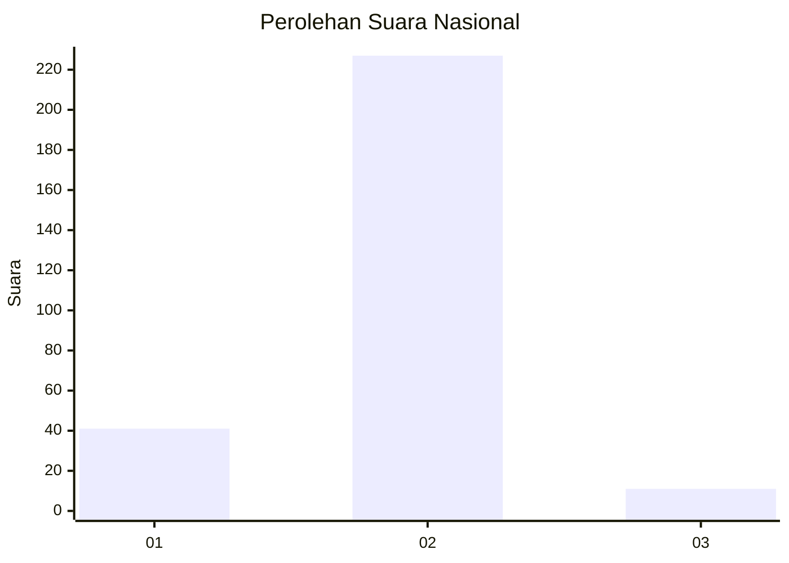
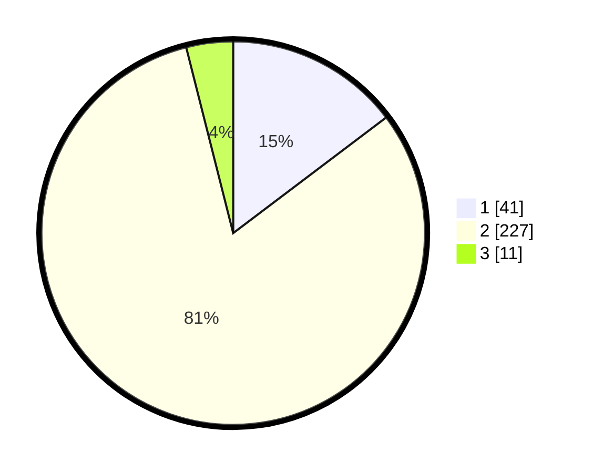

# Hasil

## Grafik

## Tabel

| No. | Nama Paslon    | Suara | Suara (raw) | Persentase |
|:--- |:-------------- | -----:| -----------:| ----------:|
| 1   | ANIES MUHAIMIN | 41    | [41][p-1]   | 14,70      |
| 2   | PRABOWO GIBRAN | 227   | [227][p-2]  | 81,36      |
| 3   | GANJAR MAHFUD  | 11    | [11][p-3]   | 3,94       |

[p-1]: https://github.com/gigit-pemilu/pemilu-2024/blob/main/pilpres/hitung-suara/sub/15-jambi/sub/09-tebo/sub/06-vii-koto/sub/2013-teluk-lancang/sub/002-tps/sub/paslon-1.txt
[p-2]: https://github.com/gigit-pemilu/pemilu-2024/blob/main/pilpres/hitung-suara/sub/15-jambi/sub/09-tebo/sub/06-vii-koto/sub/2013-teluk-lancang/sub/002-tps/sub/paslon-2.txt
[p-3]: https://github.com/gigit-pemilu/pemilu-2024/blob/main/pilpres/hitung-suara/sub/15-jambi/sub/09-tebo/sub/06-vii-koto/sub/2013-teluk-lancang/sub/002-tps/sub/paslon-3.txt

## Foto C Plano

https://sirekap-obj-formc.kpu.go.id/4e74/pemilu/ppwp/15/09/06/20/13/1509062013002-20240215-094535--a4c426db-a2f0-4516-9cb9-bc42deb23524.jpg

https://sirekap-obj-formc.kpu.go.id/4e74/pemilu/ppwp/15/09/06/20/13/1509062013002-20240215-160948--463c06f6-19c9-447a-878b-7ce7d6971dc0.jpg

https://sirekap-obj-formc.kpu.go.id/4e74/pemilu/ppwp/15/09/06/20/13/1509062013002-20240215-161157--d77cf51d-db89-436e-ab5f-0f63ceb0eddf.jpg

## Metadata

| Key        | Value               |
| ---------- | ------------------- |
| Time Stamp | 2024-02-25 14:00:00 |

## DATA PEMILIH TETAP

Jumlah pemilih dalam DPT: **289**.
 * L: **134**.
 * P: **155**.

## DATA PENGGUNA HAK PILIH

Jumlah pengguna hak pilih dalam DPT: **234**.
 * L: **102**.
 * P: **132**.

Jumlah pengguna hak pilih dalam DPTb: **1**.
 * L: **0**.
 * P: **1**.

Jumlah pengguna hak pilih dalam DPK: **43**.
 * L: **18**.
 * P: **25**.

Jumlah pengguna hak pilih: **278**.
 * L: **120**.
 * P: **158**.

## JUMLAH SUARA SAH DAN TIDAK SAH

JUMLAH SELURUH SUARA SAH: **279**.

JUMLAH SUARA TIDAK SAH: **16**.

JUMLAH SELURUH SUARA SAH DAN SUARA TIDAK SAH: **295**.

