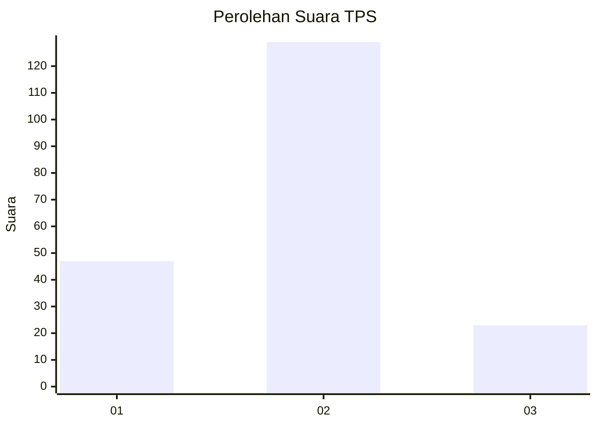
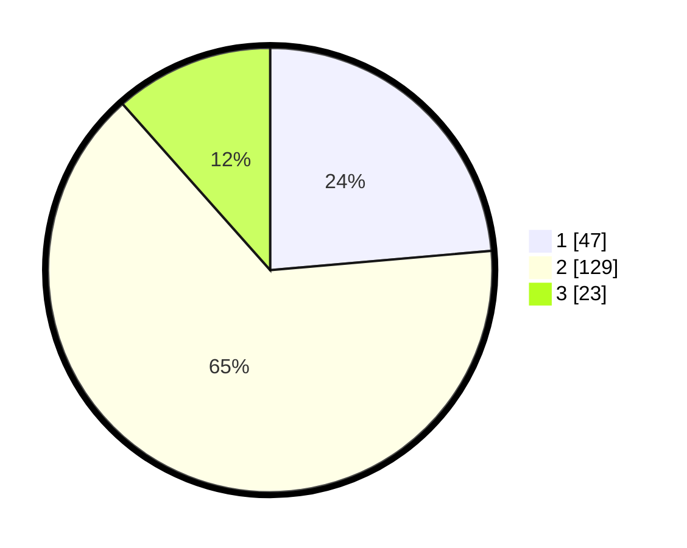

# Hasil

## Grafik

## Tabel

| No. | Nama Paslon    | Suara | Suara (raw) | Persentase |
|:--- |:-------------- | -----:| -----------:| ----------:|
| 1   | ANIES MUHAIMIN | 47    | [47][p-1]   | 23,62      |
| 2   | PRABOWO GIBRAN | 129   | [129][p-2]  | 64,82      |
| 3   | GANJAR MAHFUD  | 23    | [23][p-3]   | 11,56      |

[p-1]: https://github.com/gigit-pemilu/pemilu-2024-15-jambi/blob/main/pilpres/hitung-suara/sub/15-jambi/sub/09-tebo/sub/09-tengah-ilir/sub/2001-muara-kilis/sub/003-tps/sub/paslon-1.txt
[p-2]: https://github.com/gigit-pemilu/pemilu-2024-15-jambi/blob/main/pilpres/hitung-suara/sub/15-jambi/sub/09-tebo/sub/09-tengah-ilir/sub/2001-muara-kilis/sub/003-tps/sub/paslon-2.txt
[p-3]: https://github.com/gigit-pemilu/pemilu-2024-15-jambi/blob/main/pilpres/hitung-suara/sub/15-jambi/sub/09-tebo/sub/09-tengah-ilir/sub/2001-muara-kilis/sub/003-tps/sub/paslon-3.txt

## Foto C Plano

https://sirekap-obj-formc.kpu.go.id/ab4b/pemilu/ppwp/15/09/09/20/01/1509092001003-20240219-151813--f49a4e08-c271-429a-af9f-67e2987b1b32.jpg

https://sirekap-obj-formc.kpu.go.id/ab4b/pemilu/ppwp/15/09/09/20/01/1509092001003-20240219-152029--434d2965-2318-4821-b831-66fca7f1b6ed.jpg

https://sirekap-obj-formc.kpu.go.id/ab4b/pemilu/ppwp/15/09/09/20/01/1509092001003-20240219-152209--0598c98e-5cb3-4470-9d0b-b57012b1604d.jpg

## Metadata

| Key        | Value               |
| ---------- | ------------------- |
| Time Stamp | 2024-02-20 16:00:00 |

