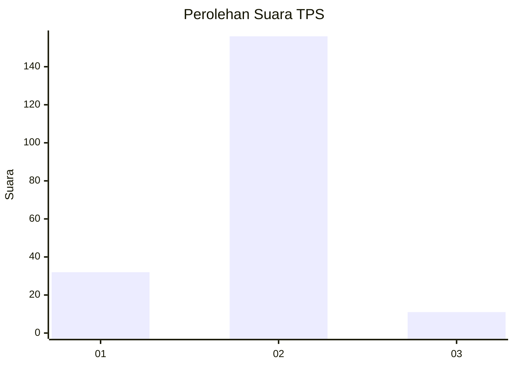
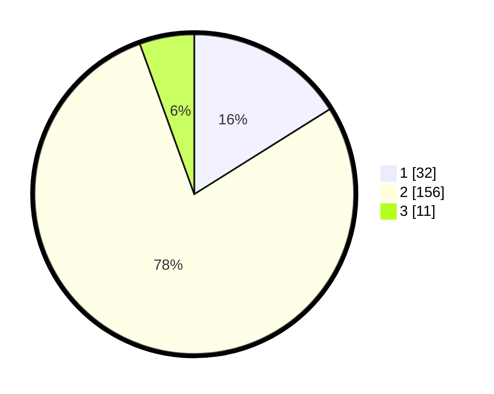

# Hasil

## Grafik

## Tabel

| No. | Nama Paslon    | Suara | Suara (raw) | Persentase |
|:--- |:-------------- | -----:| -----------:| ----------:|
| 1   | ANIES MUHAIMIN | 32    | [32][p-1]   | 16,08      |
| 2   | PRABOWO GIBRAN | 156   | [156][p-2]  | 78,39      |
| 3   | GANJAR MAHFUD  | 11    | [11][p-3]   | 5,53       |

[p-1]: https://github.com/gigit-pemilu/pemilu-2024-15-jambi/blob/main/pilpres/hitung-suara/sub/15-jambi/sub/09-tebo/sub/09-tengah-ilir/sub/2001-muara-kilis/sub/004-tps/sub/paslon-1.txt
[p-2]: https://github.com/gigit-pemilu/pemilu-2024-15-jambi/blob/main/pilpres/hitung-suara/sub/15-jambi/sub/09-tebo/sub/09-tengah-ilir/sub/2001-muara-kilis/sub/004-tps/sub/paslon-2.txt
[p-3]: https://github.com/gigit-pemilu/pemilu-2024-15-jambi/blob/main/pilpres/hitung-suara/sub/15-jambi/sub/09-tebo/sub/09-tengah-ilir/sub/2001-muara-kilis/sub/004-tps/sub/paslon-3.txt

## Foto C Plano

https://sirekap-obj-formc.kpu.go.id/d2af/pemilu/ppwp/15/09/09/20/01/1509092001004-20240219-152912--bca507ba-2eb3-4c38-a6bd-68b8ec0deccf.jpg

https://sirekap-obj-formc.kpu.go.id/d2af/pemilu/ppwp/15/09/09/20/01/1509092001004-20240219-153009--7c5613b3-1723-4234-9293-5b120af437cd.jpg

https://sirekap-obj-formc.kpu.go.id/d2af/pemilu/ppwp/15/09/09/20/01/1509092001004-20240219-153057--0c8d6a43-7e01-4c58-bef2-d9d251b2f58e.jpg

## Metadata

| Key        | Value               |
| ---------- | ------------------- |
| Time Stamp | 2024-02-25 12:00:00 |

