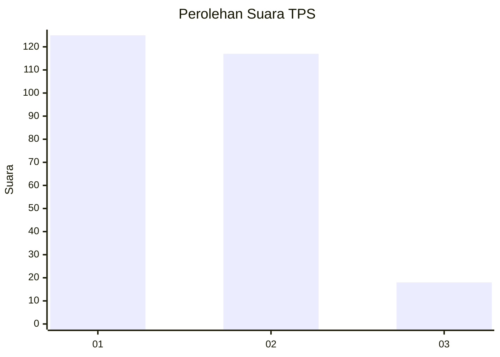
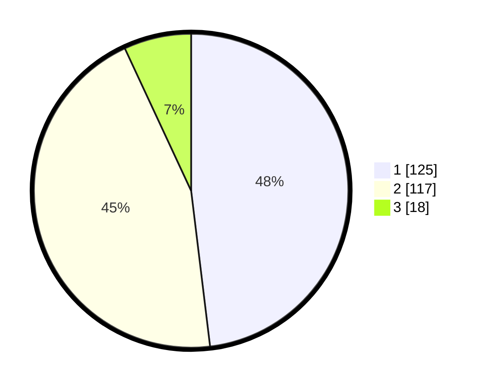

# Hasil

## Grafik

## Tabel

| No. | Nama Paslon    | Suara | Suara (raw) | Persentase |
|:--- |:-------------- | -----:| -----------:| ----------:|
| 1   | ANIES MUHAIMIN | 125   | [125][p-1]  | 48,08      |
| 2   | PRABOWO GIBRAN | 117   | [117][p-2]  | 45,00      |
| 3   | GANJAR MAHFUD  | 18    | [18][p-3]   | 6,92       |

[p-1]: https://github.com/gigit-pemilu/pemilu-2024-15-jambi/blob/main/pilpres/hitung-suara/sub/15-jambi/sub/09-tebo/sub/09-tengah-ilir/sub/2004-rantau-api/sub/001-tps/sub/paslon-1.txt
[p-2]: https://github.com/gigit-pemilu/pemilu-2024-15-jambi/blob/main/pilpres/hitung-suara/sub/15-jambi/sub/09-tebo/sub/09-tengah-ilir/sub/2004-rantau-api/sub/001-tps/sub/paslon-2.txt
[p-3]: https://github.com/gigit-pemilu/pemilu-2024-15-jambi/blob/main/pilpres/hitung-suara/sub/15-jambi/sub/09-tebo/sub/09-tengah-ilir/sub/2004-rantau-api/sub/001-tps/sub/paslon-3.txt

## Foto C Plano

https://sirekap-obj-formc.kpu.go.id/34d3/pemilu/ppwp/15/09/09/20/04/1509092004001-20240218-031428--8ff9bf77-5d4f-4e49-8bce-eaa714cbb299.jpg

https://sirekap-obj-formc.kpu.go.id/34d3/pemilu/ppwp/15/09/09/20/04/1509092004001-20240218-031504--454c6a2d-b73e-494c-8e9f-0f6f72e7f6e3.jpg

https://sirekap-obj-formc.kpu.go.id/34d3/pemilu/ppwp/15/09/09/20/04/1509092004001-20240218-031532--8ea657ad-2e76-450f-8178-d725409b8ffd.jpg

## Metadata

| Key        | Value               |
| ---------- | ------------------- |
| Time Stamp | 2024-02-24 22:31:28 |

