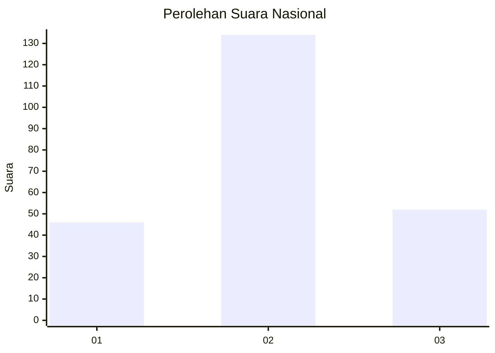
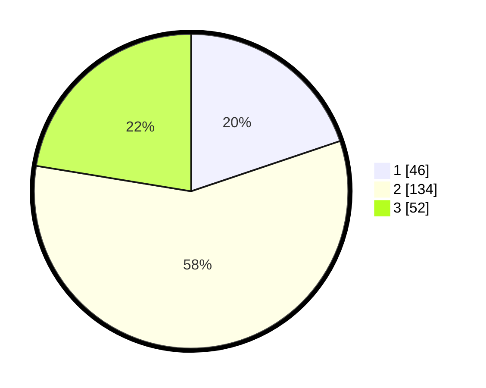

# Hasil

## Grafik

## Tabel

| No. | Nama Paslon    | Suara | Suara (raw) | Persentase |
|:--- |:-------------- | -----:| -----------:| ----------:|
| 1   | ANIES MUHAIMIN | 46    | [46][p-1]   | 19,83      |
| 2   | PRABOWO GIBRAN | 134   | [134][p-2]  | 57,76      |
| 3   | GANJAR MAHFUD  | 52    | [52][p-3]   | 22,41      |

[p-1]: https://github.com/gigit-pemilu/pemilu-2024/blob/main/pilpres/hitung-suara/sub/15-jambi/sub/09-tebo/sub/09-tengah-ilir/sub/2005-lubuk-mandarsah/sub/006-tps/sub/paslon-1.txt
[p-2]: https://github.com/gigit-pemilu/pemilu-2024/blob/main/pilpres/hitung-suara/sub/15-jambi/sub/09-tebo/sub/09-tengah-ilir/sub/2005-lubuk-mandarsah/sub/006-tps/sub/paslon-2.txt
[p-3]: https://github.com/gigit-pemilu/pemilu-2024/blob/main/pilpres/hitung-suara/sub/15-jambi/sub/09-tebo/sub/09-tengah-ilir/sub/2005-lubuk-mandarsah/sub/006-tps/sub/paslon-3.txt

## Foto C Plano

https://sirekap-obj-formc.kpu.go.id/4364/pemilu/ppwp/15/09/09/20/05/1509092005006-20240215-073118--393c25ce-ac33-498f-a3e7-ee6b6db05b43.jpg

https://sirekap-obj-formc.kpu.go.id/4364/pemilu/ppwp/15/09/09/20/05/1509092005006-20240215-073207--9bbbbcbd-0f66-40a7-a2cb-9b84d5cd22e8.jpg

https://sirekap-obj-formc.kpu.go.id/4364/pemilu/ppwp/15/09/09/20/05/1509092005006-20240215-073426--0848514b-7b41-4ee4-981e-5b15699e4cb3.jpg

## Metadata

| Key        | Value               |
| ---------- | ------------------- |
| Time Stamp | 2024-02-16 14:00:34 |

