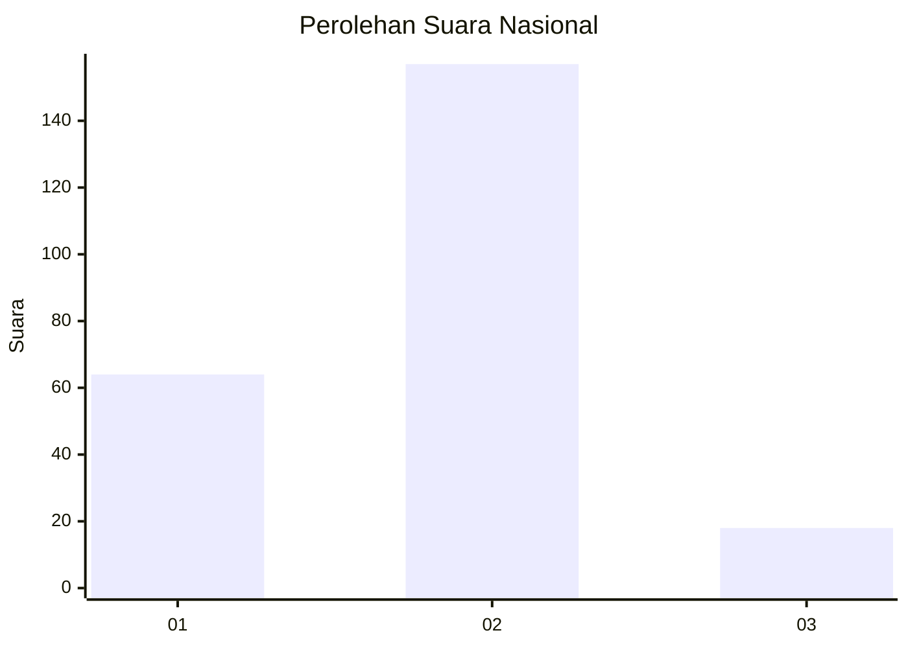
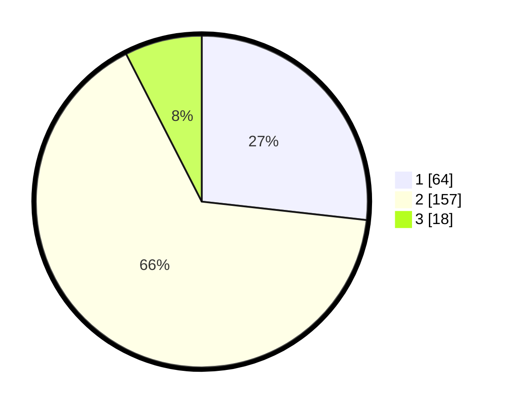

# Hasil

## Grafik

## Tabel

| No. | Nama Paslon    | Suara | Suara (raw) | Persentase |
|:--- |:-------------- | -----:| -----------:| ----------:|
| 1   | ANIES MUHAIMIN | 64    | [64][p-1]   | 26,78      |
| 2   | PRABOWO GIBRAN | 157   | [157][p-2]  | 65,69      |
| 3   | GANJAR MAHFUD  | 18    | [18][p-3]   | 7,53       |

[p-1]: https://github.com/gigit-pemilu/pemilu-2024/blob/main/pilpres/hitung-suara/sub/15-jambi/sub/71-kota-jambi/sub/01-telanaipura/sub/1001-simpang-iv-sipin/sub/002-tps/sub/paslon-1.txt
[p-2]: https://github.com/gigit-pemilu/pemilu-2024/blob/main/pilpres/hitung-suara/sub/15-jambi/sub/71-kota-jambi/sub/01-telanaipura/sub/1001-simpang-iv-sipin/sub/002-tps/sub/paslon-2.txt
[p-3]: https://github.com/gigit-pemilu/pemilu-2024/blob/main/pilpres/hitung-suara/sub/15-jambi/sub/71-kota-jambi/sub/01-telanaipura/sub/1001-simpang-iv-sipin/sub/002-tps/sub/paslon-3.txt

## Foto C Plano

https://sirekap-obj-formc.kpu.go.id/d4ac/pemilu/ppwp/15/71/01/10/01/1571011001002-20240214-184909--968cec1c-7638-43a0-8465-973407baaa93.jpg

https://sirekap-obj-formc.kpu.go.id/d4ac/pemilu/ppwp/15/71/01/10/01/1571011001002-20240214-184838--8c3ac927-cd46-4e72-a5b5-bc867f1b4be6.jpg

## Metadata

| Key        | Value               |
| ---------- | ------------------- |
| Time Stamp | 2024-02-15 07:00:44 |

