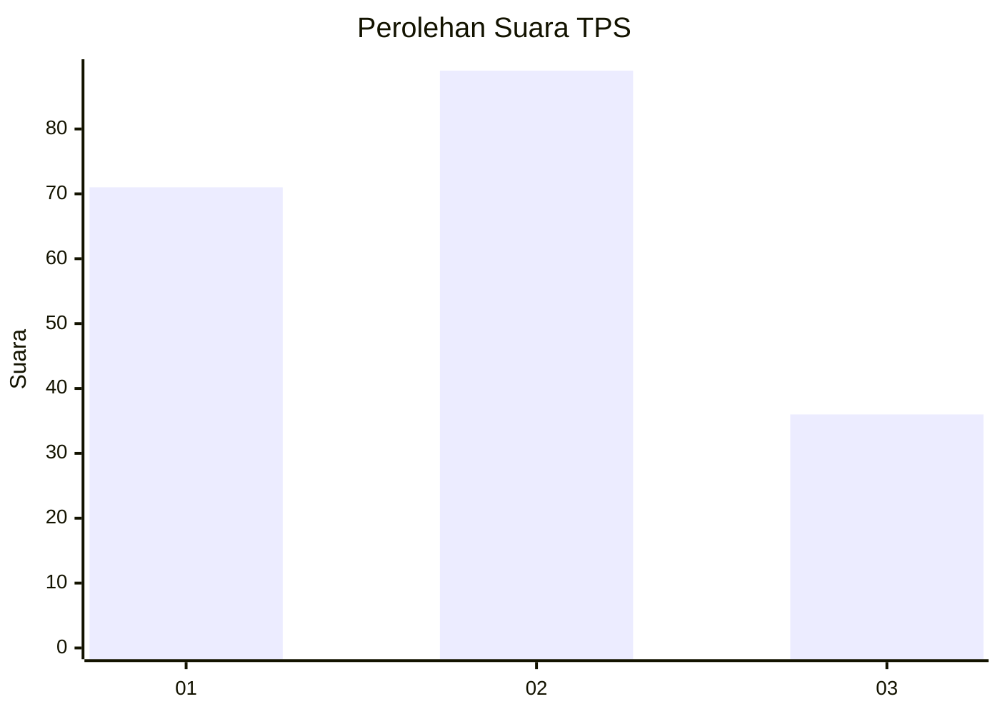
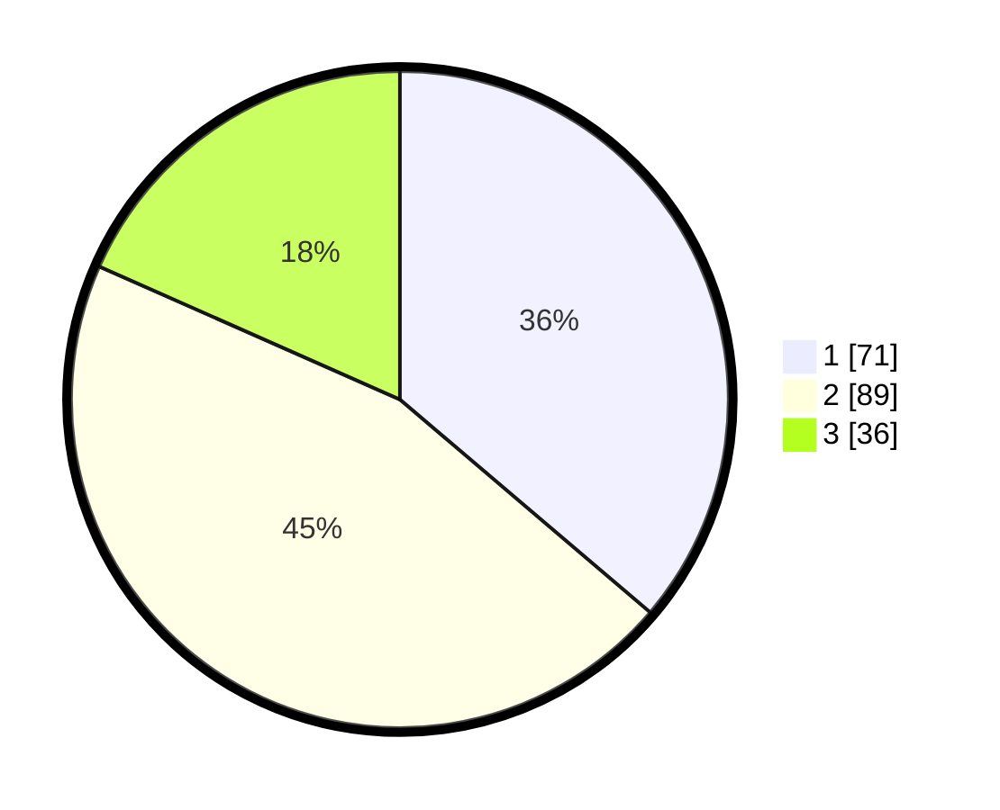

# Hasil

## Grafik

## Tabel

| No. | Nama Paslon    | Suara | Suara (raw) | Persentase |
|:--- |:-------------- | -----:| -----------:| ----------:|
| 1   | ANIES MUHAIMIN | 71    | [71][p-1]   | 36,22      |
| 2   | PRABOWO GIBRAN | 89    | [89][p-2]   | 45,41      |
| 3   | GANJAR MAHFUD  | 36    | [36][p-3]   | 18,37      |

[p-1]: https://github.com/gigit-pemilu/pemilu-2024-15-jambi/blob/main/pilpres/hitung-suara/sub/15-jambi/sub/71-kota-jambi/sub/01-telanaipura/sub/1001-simpang-iv-sipin/sub/003-tps/sub/paslon-1.txt
[p-2]: https://github.com/gigit-pemilu/pemilu-2024-15-jambi/blob/main/pilpres/hitung-suara/sub/15-jambi/sub/71-kota-jambi/sub/01-telanaipura/sub/1001-simpang-iv-sipin/sub/003-tps/sub/paslon-2.txt
[p-3]: https://github.com/gigit-pemilu/pemilu-2024-15-jambi/blob/main/pilpres/hitung-suara/sub/15-jambi/sub/71-kota-jambi/sub/01-telanaipura/sub/1001-simpang-iv-sipin/sub/003-tps/sub/paslon-3.txt

## Foto C Plano

https://sirekap-obj-formc.kpu.go.id/f959/pemilu/ppwp/15/71/01/10/01/1571011001003-20240214-235826--12f5bdbb-120c-4373-9bb0-559030399f74.jpg

https://sirekap-obj-formc.kpu.go.id/f959/pemilu/ppwp/15/71/01/10/01/1571011001003-20240214-235939--72d76bea-a11c-469f-a668-90ab3f05528e.jpg

https://sirekap-obj-formc.kpu.go.id/f959/pemilu/ppwp/15/71/01/10/01/1571011001003-20240215-000040--c62c785b-809b-467d-b56d-9deb2d4ebb07.jpg

## Metadata

| Key        | Value               |
| ---------- | ------------------- |
| Time Stamp | 2024-02-15 15:00:29 |

