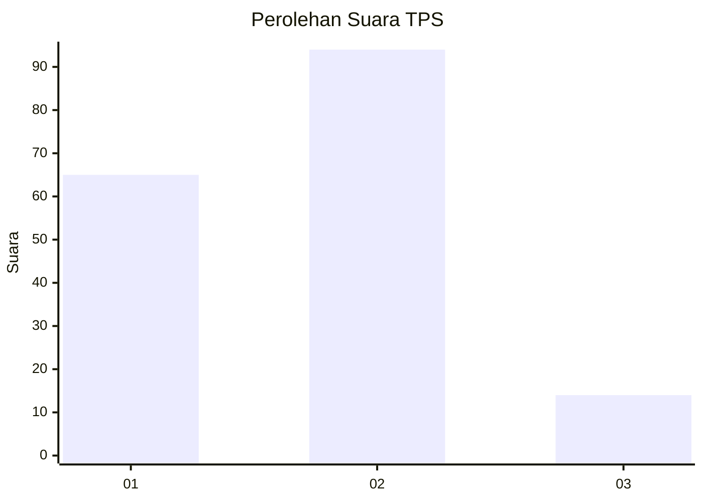
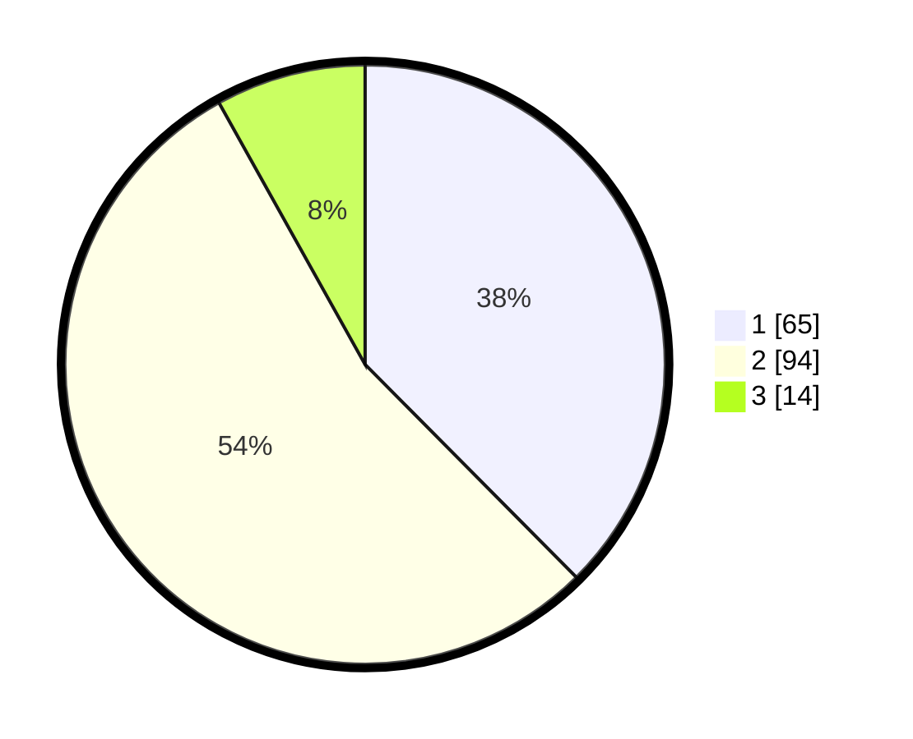

# Hasil

## Grafik

## Tabel

| No. | Nama Paslon    | Suara | Suara (raw) | Persentase |
|:--- |:-------------- | -----:| -----------:| ----------:|
| 1   | ANIES MUHAIMIN | 65    | [65][p-1]   | 37,57      |
| 2   | PRABOWO GIBRAN | 94    | [94][p-2]   | 54,34      |
| 3   | GANJAR MAHFUD  | 14    | [14][p-3]   | 8,09       |

[p-1]: https://github.com/gigit-pemilu/pemilu-2024-15-jambi/blob/main/pilpres/hitung-suara/sub/15-jambi/sub/71-kota-jambi/sub/01-telanaipura/sub/1001-simpang-iv-sipin/sub/004-tps/sub/paslon-1.txt
[p-2]: https://github.com/gigit-pemilu/pemilu-2024-15-jambi/blob/main/pilpres/hitung-suara/sub/15-jambi/sub/71-kota-jambi/sub/01-telanaipura/sub/1001-simpang-iv-sipin/sub/004-tps/sub/paslon-2.txt
[p-3]: https://github.com/gigit-pemilu/pemilu-2024-15-jambi/blob/main/pilpres/hitung-suara/sub/15-jambi/sub/71-kota-jambi/sub/01-telanaipura/sub/1001-simpang-iv-sipin/sub/004-tps/sub/paslon-3.txt

## Foto C Plano

https://sirekap-obj-formc.kpu.go.id/5cf2/pemilu/ppwp/15/71/01/10/01/1571011001004-20240218-112633--6092c39b-f326-4224-b6f7-0417873f5d10.jpg

https://sirekap-obj-formc.kpu.go.id/5cf2/pemilu/ppwp/15/71/01/10/01/1571011001004-20240216-170351--b47d8180-b0c2-4826-b812-a0808b409fd3.jpg

https://sirekap-obj-formc.kpu.go.id/5cf2/pemilu/ppwp/15/71/01/10/01/1571011001004-20240216-170521--46461b35-29e0-475d-96e8-3823d74ad9c3.jpg

## Metadata

| Key        | Value               |
| ---------- | ------------------- |
| Time Stamp | 2024-02-19 06:16:00 |

