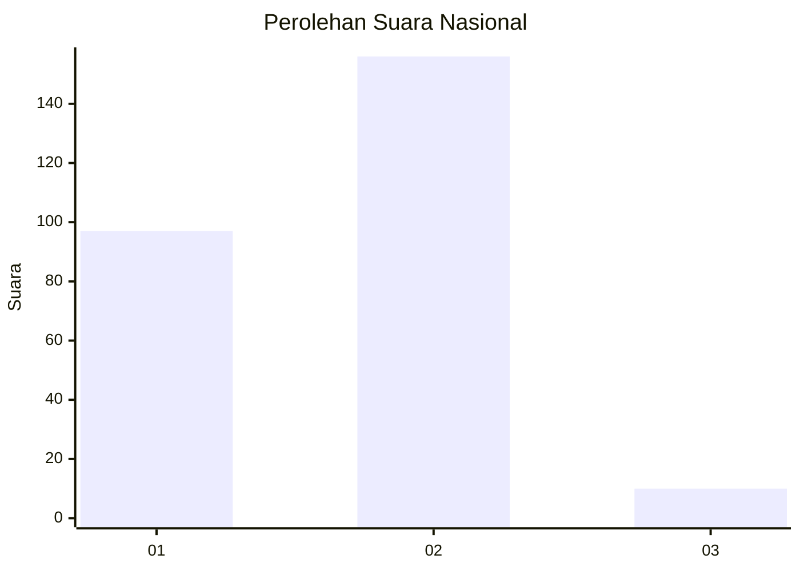
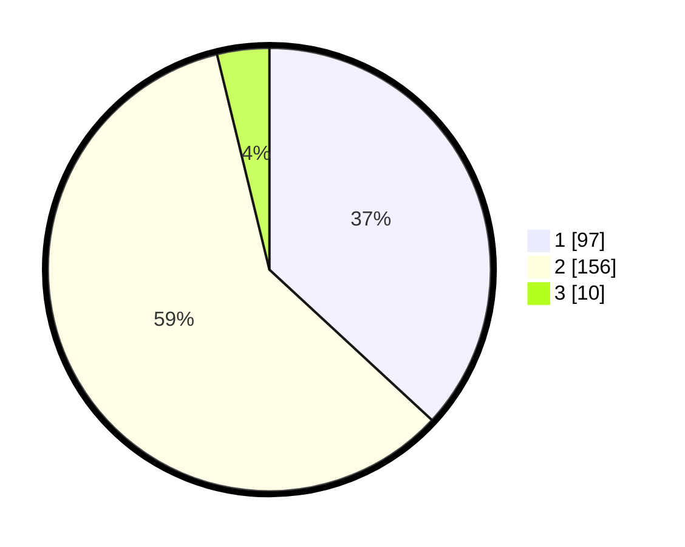

# Hasil

## Grafik

## Tabel

| No. | Nama Paslon    | Suara | Suara (raw) | Persentase |
|:--- |:-------------- | -----:| -----------:| ----------:|
| 1   | ANIES MUHAIMIN | 97    | [97][p-1]   | 36,88      |
| 2   | PRABOWO GIBRAN | 156   | [156][p-2]  | 59,32      |
| 3   | GANJAR MAHFUD  | 10    | [10][p-3]   | 3,80       |

[p-1]: https://github.com/gigit-pemilu/pemilu-2024/blob/main/pilpres/hitung-suara/sub/15-jambi/sub/71-kota-jambi/sub/01-telanaipura/sub/1002-buluran-kenali/sub/004-tps/sub/paslon-1.txt
[p-2]: https://github.com/gigit-pemilu/pemilu-2024/blob/main/pilpres/hitung-suara/sub/15-jambi/sub/71-kota-jambi/sub/01-telanaipura/sub/1002-buluran-kenali/sub/004-tps/sub/paslon-2.txt
[p-3]: https://github.com/gigit-pemilu/pemilu-2024/blob/main/pilpres/hitung-suara/sub/15-jambi/sub/71-kota-jambi/sub/01-telanaipura/sub/1002-buluran-kenali/sub/004-tps/sub/paslon-3.txt

## Foto C Plano

https://sirekap-obj-formc.kpu.go.id/e0fa/pemilu/ppwp/15/71/01/10/02/1571011002004-20240215-041004--d8574d6b-c11c-419e-9679-6f74078b3c77.jpg

https://sirekap-obj-formc.kpu.go.id/e0fa/pemilu/ppwp/15/71/01/10/02/1571011002004-20240214-234438--4be4ace6-c63b-4840-9d22-00101ee4485b.jpg

https://sirekap-obj-formc.kpu.go.id/e0fa/pemilu/ppwp/15/71/01/10/02/1571011002004-20240214-234839--101d3b65-c89c-428e-9d77-637f1bdea9a7.jpg

## Metadata

| Key        | Value               |
| ---------- | ------------------- |
| Time Stamp | 2024-02-15 22:30:27 |

