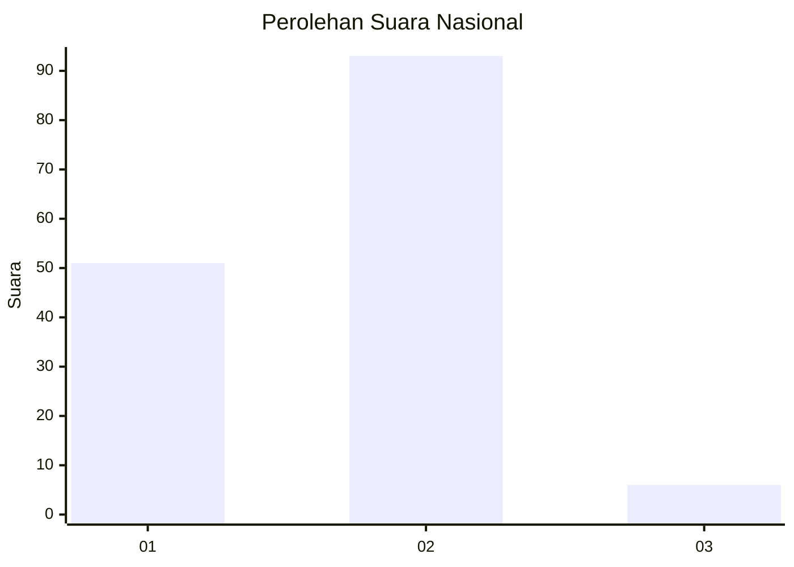
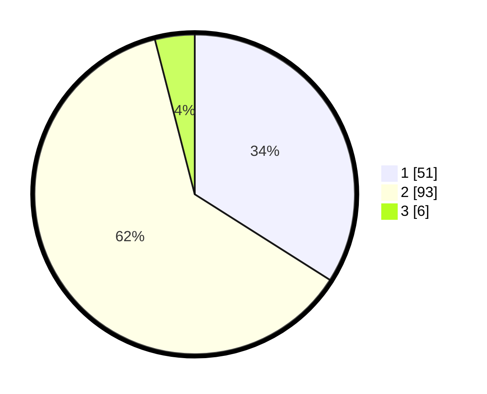

# Hasil

## Grafik

## Tabel

| No. | Nama Paslon    | Suara | Suara (raw) | Persentase |
|:--- |:-------------- | -----:| -----------:| ----------:|
| 1   | ANIES MUHAIMIN | 51    | [51][p-1]   | 34,00      |
| 2   | PRABOWO GIBRAN | 93    | [93][p-2]   | 62,00      |
| 3   | GANJAR MAHFUD  | 6     | [6][p-3]    | 4,00       |

[p-1]: https://github.com/gigit-pemilu/pemilu-2024/blob/main/pilpres/hitung-suara/sub/15-jambi/sub/71-kota-jambi/sub/01-telanaipura/sub/1002-buluran-kenali/sub/006-tps/sub/paslon-1.txt
[p-2]: https://github.com/gigit-pemilu/pemilu-2024/blob/main/pilpres/hitung-suara/sub/15-jambi/sub/71-kota-jambi/sub/01-telanaipura/sub/1002-buluran-kenali/sub/006-tps/sub/paslon-2.txt
[p-3]: https://github.com/gigit-pemilu/pemilu-2024/blob/main/pilpres/hitung-suara/sub/15-jambi/sub/71-kota-jambi/sub/01-telanaipura/sub/1002-buluran-kenali/sub/006-tps/sub/paslon-3.txt

## Foto C Plano

https://sirekap-obj-formc.kpu.go.id/cf0e/pemilu/ppwp/15/71/01/10/02/1571011002006-20240216-160251--0ddbf5b8-a45f-408a-bd29-126930ced22d.jpg

https://sirekap-obj-formc.kpu.go.id/cf0e/pemilu/ppwp/15/71/01/10/02/1571011002006-20240216-153727--6eb2040d-5e41-4857-857e-0157c4c39a3e.jpg

https://sirekap-obj-formc.kpu.go.id/cf0e/pemilu/ppwp/15/71/01/10/02/1571011002006-20240214-212609--ad5f7f78-f939-48c4-ab35-1189b7e66a77.jpg

## Metadata

| Key        | Value               |
| ---------- | ------------------- |
| Time Stamp | 2024-02-16 16:25:10 |

