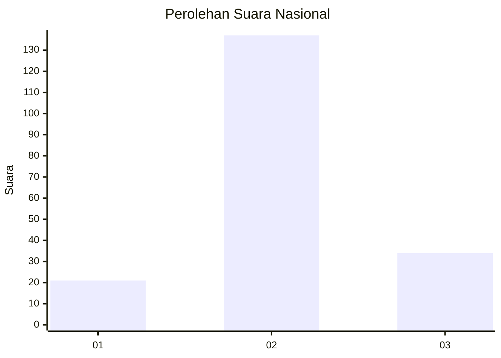
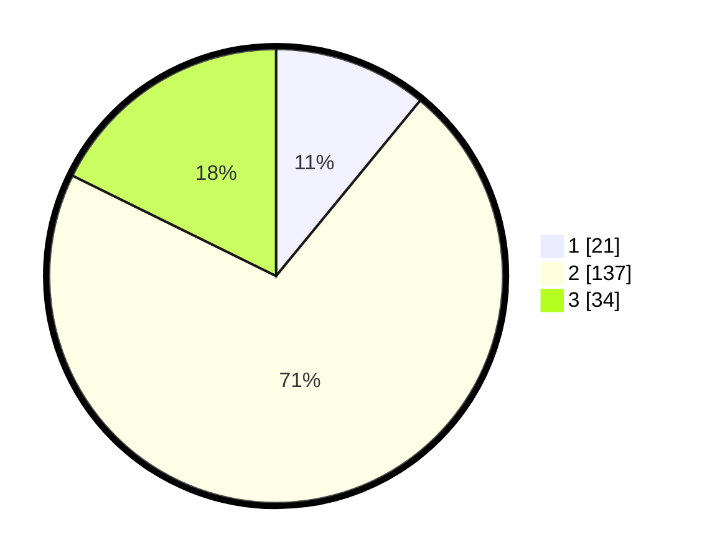

# Hasil

## Grafik

## Tabel

| No. | Nama Paslon    | Suara | Suara (raw) | Persentase |
|:--- |:-------------- | -----:| -----------:| ----------:|
| 1   | ANIES MUHAIMIN | 21    | [21][p-1]   | 10,94      |
| 2   | PRABOWO GIBRAN | 137   | [137][p-2]  | 71,35      |
| 3   | GANJAR MAHFUD  | 34    | [34][p-3]   | 17,71      |

[p-1]: https://github.com/gigit-pemilu/pemilu-2024/blob/main/pilpres/hitung-suara/sub/15-jambi/sub/71-kota-jambi/sub/03-jambi-timur/sub/1001-sijenjang/sub/009-tps/sub/paslon-1.txt
[p-2]: https://github.com/gigit-pemilu/pemilu-2024/blob/main/pilpres/hitung-suara/sub/15-jambi/sub/71-kota-jambi/sub/03-jambi-timur/sub/1001-sijenjang/sub/009-tps/sub/paslon-2.txt
[p-3]: https://github.com/gigit-pemilu/pemilu-2024/blob/main/pilpres/hitung-suara/sub/15-jambi/sub/71-kota-jambi/sub/03-jambi-timur/sub/1001-sijenjang/sub/009-tps/sub/paslon-3.txt

## Foto C Plano

https://sirekap-obj-formc.kpu.go.id/9a2f/pemilu/ppwp/15/71/03/10/01/1571031001009-20240215-072948--1120291c-0a38-473d-b0bc-5de2f3b1134e.jpg

https://sirekap-obj-formc.kpu.go.id/9a2f/pemilu/ppwp/15/71/03/10/01/1571031001009-20240215-073142--4288a9a0-1e9c-425d-89fa-c198984e342f.jpg

https://sirekap-obj-formc.kpu.go.id/9a2f/pemilu/ppwp/15/71/03/10/01/1571031001009-20240215-073233--f1214c26-189f-464f-976d-5611630c4b2b.jpg

## Metadata

| Key        | Value               |
| ---------- | ------------------- |
| Time Stamp | 2024-02-15 16:30:25 |

