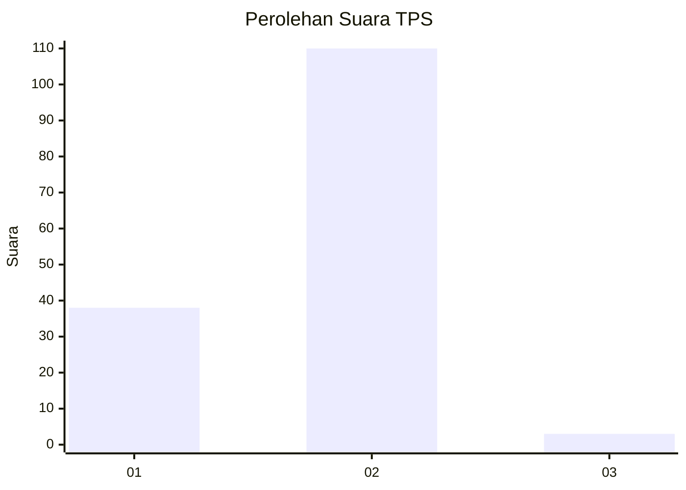
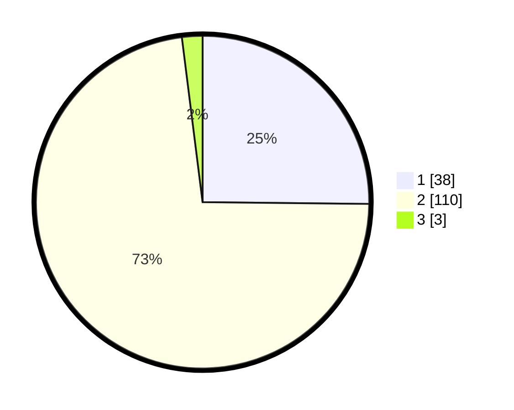

# Hasil

## Grafik

## Tabel

| No. | Nama Paslon    | Suara | Suara (raw) | Persentase |
|:--- |:-------------- | -----:| -----------:| ----------:|
| 1   | ANIES MUHAIMIN | 38    | [38][p-1]   | 25,17      |
| 2   | PRABOWO GIBRAN | 110   | [110][p-2]  | 72,85      |
| 3   | GANJAR MAHFUD  | 3     | [3][p-3]    | 1,99       |

[p-1]: https://github.com/gigit-pemilu/pemilu-2024-15-jambi/blob/main/pilpres/hitung-suara/sub/15-jambi/sub/71-kota-jambi/sub/04-pasar-jambi/sub/1001-beringin/sub/002-tps/sub/paslon-1.txt
[p-2]: https://github.com/gigit-pemilu/pemilu-2024-15-jambi/blob/main/pilpres/hitung-suara/sub/15-jambi/sub/71-kota-jambi/sub/04-pasar-jambi/sub/1001-beringin/sub/002-tps/sub/paslon-2.txt
[p-3]: https://github.com/gigit-pemilu/pemilu-2024-15-jambi/blob/main/pilpres/hitung-suara/sub/15-jambi/sub/71-kota-jambi/sub/04-pasar-jambi/sub/1001-beringin/sub/002-tps/sub/paslon-3.txt

## Foto C Plano

https://sirekap-obj-formc.kpu.go.id/3a40/pemilu/ppwp/15/71/04/10/01/1571041001002-20240215-231315--cd5b8d30-94e0-4380-bb1d-84719166b975.jpg

https://sirekap-obj-formc.kpu.go.id/3a40/pemilu/ppwp/15/71/04/10/01/1571041001002-20240215-231531--d0f4ebdc-18e0-4da9-8f54-84725242f0ad.jpg

https://sirekap-obj-formc.kpu.go.id/3a40/pemilu/ppwp/15/71/04/10/01/1571041001002-20240215-231852--244b630e-bda7-4b93-926e-06f7555a2167.jpg

## Metadata

| Key        | Value               |
| ---------- | ------------------- |
| Time Stamp | 2024-02-15 23:29:50 |

