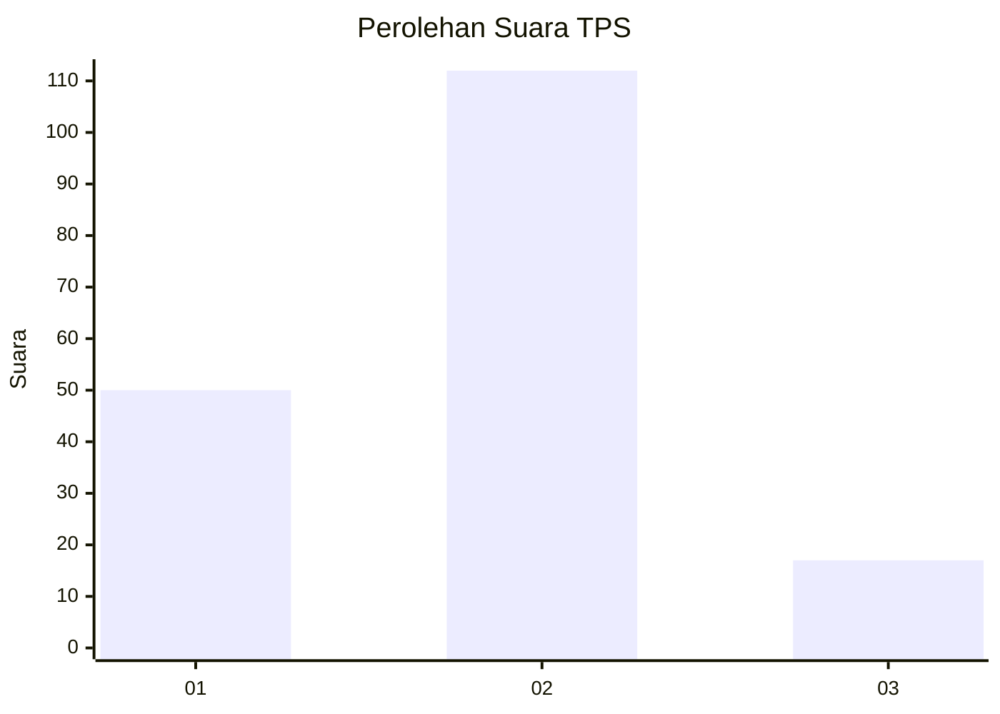
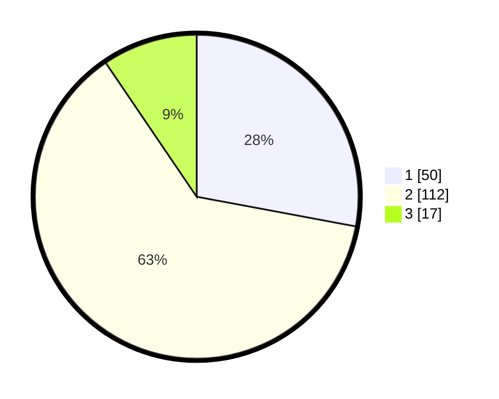

# Hasil

## Grafik

## Tabel

| No. | Nama Paslon    | Suara | Suara (raw) | Persentase |
|:--- |:-------------- | -----:| -----------:| ----------:|
| 1   | ANIES MUHAIMIN | 50    | [50][p-1]   | 27,93      |
| 2   | PRABOWO GIBRAN | 112   | [112][p-2]  | 62,57      |
| 3   | GANJAR MAHFUD  | 17    | [17][p-3]   | 9,50       |

[p-1]: https://github.com/gigit-pemilu/pemilu-2024-15-jambi/blob/main/pilpres/hitung-suara/sub/15-jambi/sub/71-kota-jambi/sub/04-pasar-jambi/sub/1001-beringin/sub/010-tps/sub/paslon-1.txt
[p-2]: https://github.com/gigit-pemilu/pemilu-2024-15-jambi/blob/main/pilpres/hitung-suara/sub/15-jambi/sub/71-kota-jambi/sub/04-pasar-jambi/sub/1001-beringin/sub/010-tps/sub/paslon-2.txt
[p-3]: https://github.com/gigit-pemilu/pemilu-2024-15-jambi/blob/main/pilpres/hitung-suara/sub/15-jambi/sub/71-kota-jambi/sub/04-pasar-jambi/sub/1001-beringin/sub/010-tps/sub/paslon-3.txt

## Foto C Plano

https://sirekap-obj-formc.kpu.go.id/7e39/pemilu/ppwp/15/71/04/10/01/1571041001010-20240215-052555--b15ba49f-30fc-4933-977b-4479817809fd.jpg

https://sirekap-obj-formc.kpu.go.id/7e39/pemilu/ppwp/15/71/04/10/01/1571041001010-20240215-052736--77781e9f-dd65-4800-8e74-151c261c018e.jpg

https://sirekap-obj-formc.kpu.go.id/7e39/pemilu/ppwp/15/71/04/10/01/1571041001010-20240215-052850--e5cce328-6835-4aa9-83b3-e513357d451f.jpg

## Metadata

| Key        | Value               |
| ---------- | ------------------- |
| Time Stamp | 2024-02-16 03:30:26 |

