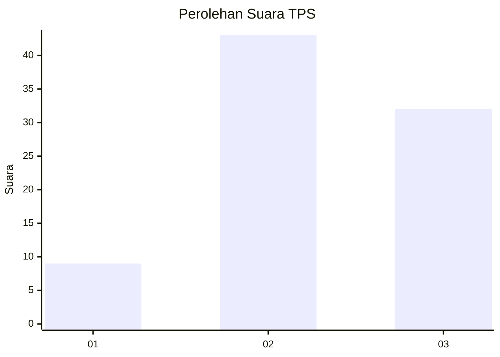
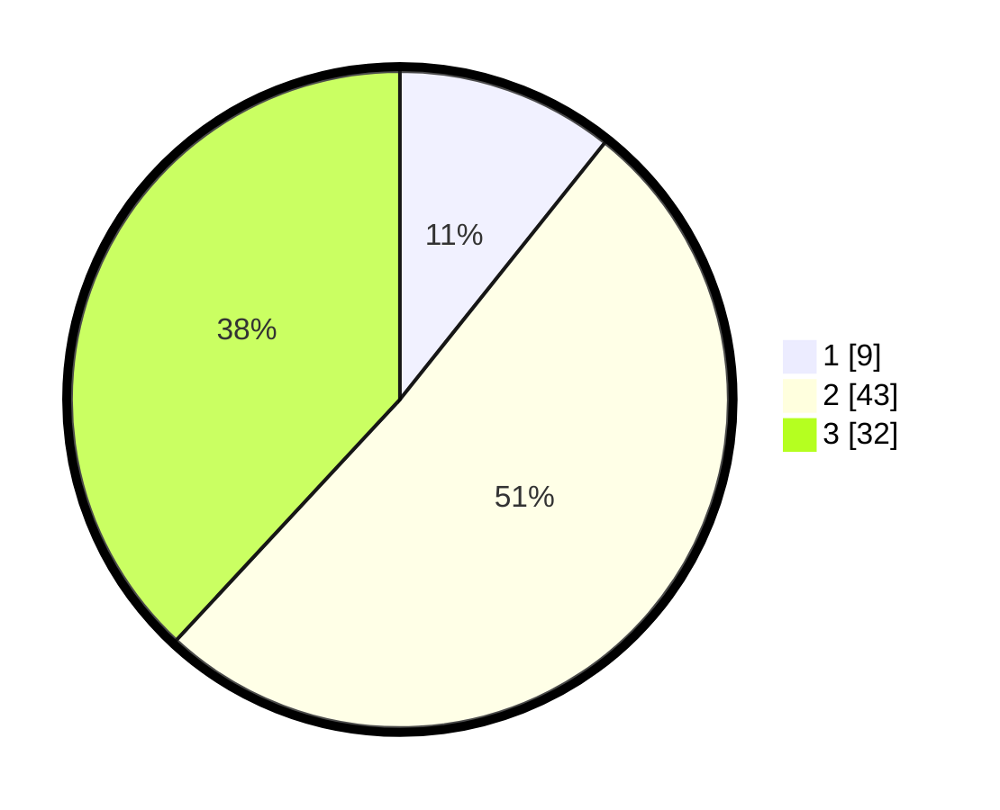

# Hasil

## Grafik

## Tabel

| No. | Nama Paslon    | Suara | Suara (raw) | Persentase |
|:--- |:-------------- | -----:| -----------:| ----------:|
| 1   | ANIES MUHAIMIN | 9     | [9][p-1]    | 10,71      |
| 2   | PRABOWO GIBRAN | 43    | [43][p-2]   | 51,19      |
| 3   | GANJAR MAHFUD  | 32    | [32][p-3]   | 38,10      |

[p-1]: https://github.com/gigit-pemilu/pemilu-2024-15-jambi/blob/main/pilpres/hitung-suara/sub/15-jambi/sub/71-kota-jambi/sub/04-pasar-jambi/sub/1004-sungai-asam/sub/001-tps/sub/paslon-1.txt
[p-2]: https://github.com/gigit-pemilu/pemilu-2024-15-jambi/blob/main/pilpres/hitung-suara/sub/15-jambi/sub/71-kota-jambi/sub/04-pasar-jambi/sub/1004-sungai-asam/sub/001-tps/sub/paslon-2.txt
[p-3]: https://github.com/gigit-pemilu/pemilu-2024-15-jambi/blob/main/pilpres/hitung-suara/sub/15-jambi/sub/71-kota-jambi/sub/04-pasar-jambi/sub/1004-sungai-asam/sub/001-tps/sub/paslon-3.txt

## Foto C Plano

https://sirekap-obj-formc.kpu.go.id/2898/pemilu/ppwp/15/71/04/10/04/1571041004001-20240215-105057--e13d3951-5ccb-4afc-be29-70a8eb4c1e0d.jpg

https://sirekap-obj-formc.kpu.go.id/2898/pemilu/ppwp/15/71/04/10/04/1571041004001-20240215-105113--dc2bf806-f436-40be-96cc-de84d8e68ddf.jpg

https://sirekap-obj-formc.kpu.go.id/2898/pemilu/ppwp/15/71/04/10/04/1571041004001-20240215-105120--f4fca0de-0b64-4535-972a-94c8106ae312.jpg

## Metadata

| Key        | Value               |
| ---------- | ------------------- |
| Time Stamp | 2024-02-15 16:30:25 |

